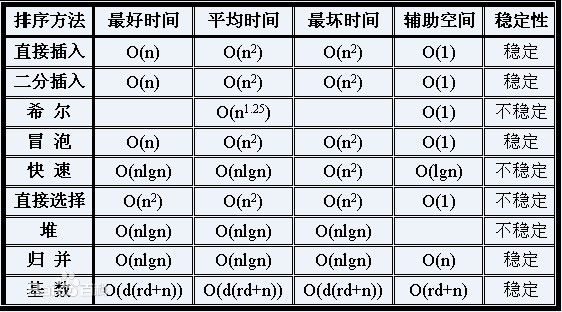

# 选择排序

选择排序是最简单的排序算法，需要两层循环。每次外层循环一次，都将最小的数移动到数组最前面，然后指针前移一个单位，在剩下的数组中再次找到最小的数。

```c
void selection_sort(int *arr, int len)
{
	for(int i = 0; i < len; i++)
	{
		for(int j = i + 1; j < len; j++)
		{
			if(arr[i] > arr[j])
			{
				swap(&arr[i], &arr[j]);
			}
		}
	}
}
```

# 冒泡排序

内层循环执行一遍，就将数组中最大的数“冒泡”到数组最后。

```c
void bubble_sort(int *arr, int len)
{
	for(int i = 0; i < len; i++)
	{
		for(int j = 0; j < len - i - 1; j++)
		{
			if(arr[j] > arr[j + 1])
			{
				swap(&arr[j], &arr[j + 1]);
			}
		}
	}
}
```

# 插入排序

基本思想是遍历一个数组，将后面的数不断按顺序插到前面。

```c
void insertion_sort(int *arr, int len)
{
	for(int i = 1; i < len; i++)
	{
		int temp = arr[i];
		int j = i - 1;
		while(j >= 0 && temp < arr[j])
		{
			arr[j + 1] = arr[j];
			j--;
		}
		arr[j + 1] = temp;
	}
}
```


