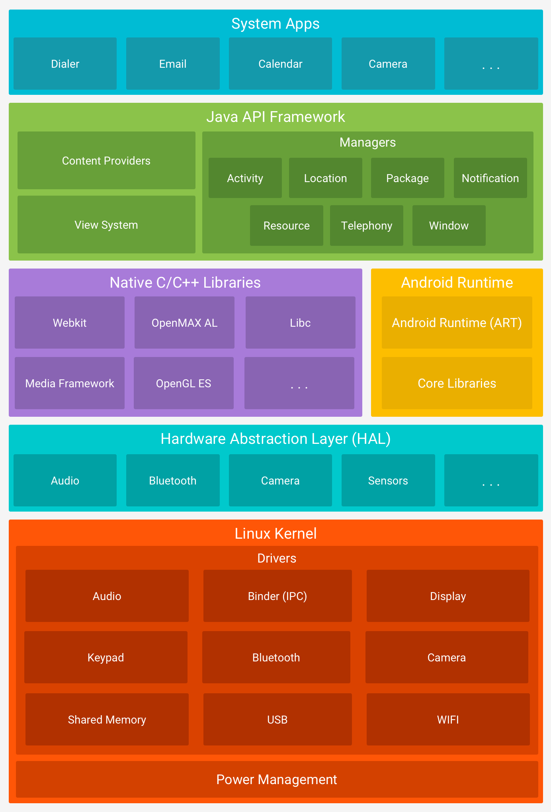
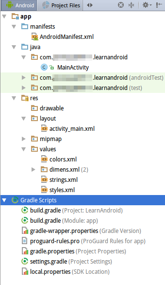

# Android简介

android系统是由安迪鲁宾团队开发的，最初用于数码相机，2005年08月被google收购，现在是最流行的移动设备操作系统，Android2.3是第一个比较稳定的版本，3.0专为平板设计，4.0以后都是比较稳定的版本，4.x以后同时支持手机和平板。

## Android系统架构



Java虚拟机：

* JVM sun公司开发的Java虚拟机
* DVM 因版权问题，安卓没有使用jvm，而是google自己开发了dalvik
* ART 程序在安装时需要预编译读取，将代码转换为机器码，好处:程序运行时，无需时时转换，运行速度快；缺点：安装时间稍长，由于转换机器码，所以占用略高的存储空间。

# AndroidSDK

google提供的开发Android程序需要的工具和类库。可以在 [https://developers.google.cn/](https://developers.google.cn/) 下载。安装后配置tools和plateform-tools目录为环境变量。

```shell
export PATH=$PATH:/opt/Android/Sdk/platform-tools:/opt/Android/Sdk/tools
```

## SDK目录结构

* add-ons：预留的附加目录
* build-tools：构建工具
* docs：文档
* plateforms：不同版本Android的核心jar包
* plateforms-tools：平台相关工具
* sources：源码
* system-images：系统镜像
* tools：开发中使用的一些工具

# AndroidStudio

AndroidStudio和Intellij IDEA用法基本一致。运行需要本机的Java运行时。如果没有指定SDK目录，按提示指定即可。

# Android工程目录结构

AndroidStudio工程目录视图：



* `manifests/AndroidManifest.xml` app的清单文件， 包名，版本号，版本名称，最低运行版本，图标，应用名称，程序的入口activity, 还可以配置应用程序使用的权限信息。
* `java/*` java源代码和测试代码
* `res/drawable` 图片
* `res/layout/*.xml` 布局文件
* `res/mipmap` 和drawable一样也是图片，但是在缩放上会提供优化
* `res/values/dimens` 和长度相关
* `res/values/colors` 颜色相关
* `res/values/strings.xml` 字符串（可以指定多种语言便于国际化）
* `res/values/styles.xml` 样式

# Android项目打包过程

`.java->.class->.dex->.apk->final .apk` 即 编译->dx打包为dex->aapt打包为apk->jarsigner签名，最终.apk安装到手机。

这些步骤用到的工具除了Java编译器都在build-tools里，各种build-tools由AndroidStudio内置的gradle自动调用。我们实际使用时，直接在Android Studio中编译运行，这些工具都会自动调用，并把打包好的apk安装到虚拟机中，非常方便。
