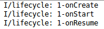
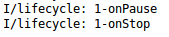
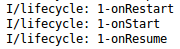
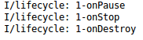
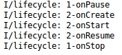
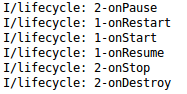

# Activity

Android中，界面对应Activity，相当于桌面客户端中的一个窗口，使用时直接继承Activity类，界面控件的响应逻辑都写在Activity中。使用Activity需要在清单文件中定义。

```xml
<manifest ... >
  <application ... >
      <activity android:name=".ExampleActivity" />
      ...
  </application ... >
  ...
</manifest >
```

## Activity生命周期

Activity提供了一系列生命周期回调函数，也可以叫做生命周期钩子函数。总之，当Activity进入某一生命周期状态时，就会回调对应的函数。

### onCreate()

系统第一次创建这个Activity时回调，一般重写这个方法里完成Activity的初始化，如setContentView()等，这个函数回调完后会回调onStart()。
### onStart()

界面显示前的一些操作。
### onResume()

这个Activity在窗口栈顶，获得用户焦点。也就是说，这个Activity正在和用户进行交互。

### onPause()

界面失去焦点，如用户点击返回键，就会回调onPause()。你应该在这个函数里编写保存用户状态的操作，紧接着会回调onStop()或onRestart()。
### onStop()

界面完全不可见，紧接着会回调onDestroy()或onRestart()。
### onRestart()

stop状态的界面恢复时回调，紧接着调用onStart()。
### onDestroy()

Activity最终的销毁步骤。

看这张图比较好理解：


## 常见生命周期循环

我们在每个声明周期钩子函数中，编写一条向控制台输出的语句，就能很容易的观察Activity的生命周期：

Activity启动



点击home键



从后台恢复



点击back键



activity1切换到activity2



使用back键从activity2退回activity1



## 窗口栈

和桌面应用一样，Android中也是使用窗口栈管理activity的。


### manifest中定义activity窗口栈启动模式（launch mode）

* standard 默认模式，调用一次就会创建一个activity对象放到窗口栈中。
* singleTop 如果被调用的activity已经在栈顶，不会再次创建。
* singleTask activity是单例的，调用时如果不存在就创建，如果存在就把它放在栈顶（该Activity之上的Activity全部弹出）。
* singleInstance 基本同上，但创建的activity位于一个新的窗口栈，很少使用。

这四种启动模式文字描述起来可能不太直观，实际上用两个Activity试一试就能完全理解了。

## Activity之间数据传递

我们知道可以使用显式意图对象启动新的Activity，意图对象中可以封装一些数据用于Activity之间的数据传递。activity之间可以使用extra传递键值对，也可以使用bundle传递基本类型或是实现Serializable或Parcelable接口的复合对象。

使用bundle传递对象示例：

```java
Intent intent = new Intent();
Bundle bundle = new Bundle();
User user = new User("user");
bundle.putSerializable("user", user);
intent.putExtras(bundle);
intent.setClass(this, Main2Activity.class);
startActivity(intent);
```

接收bundle传递的对象：

```java
Bundle bundle = getIntent().getExtras();
User user = (User)bundle.get("user");
```

### Parcelable和Serializable

JavaSE提供了序列化对象的Serializable接口，Android额外提供了Parcelable接口，Parcelable在Android中使用更加高效，建议使用。

实现Parcelabel接口的实体类：

```java
public class Student implements Parcelable
{
	private String name;
	private int age;

	public Student()
	{
	}

	protected Student(Parcel in)
	{
		name = in.readString();
		age = in.readInt();
	}

	@Override
	public void writeToParcel(Parcel dest, int flags)
	{
		dest.writeString(name);
		dest.writeInt(age);
	}

	@Override
	public int describeContents()
	{
		return 0;
	}

	public static final Creator<Student> CREATOR = new Creator<Student>()
	{
		@Override
		public Student createFromParcel(Parcel in)
		{
			return new Student(in);
		}

		@Override
		public Student[] newArray(int size)
		{
			return new Student[size];
		}
	};

	public String getName()
	{
		return name;
	}

	public void setName(String name)
	{
		this.name = name;
	}

	public int getAge()
	{
		return age;
	}

	public void setAge(int age)
	{
		this.age = age;
	}
}
```

实际上如果只包含基本类型，直接在AndroidStudio中使用alt+Enter快捷键就能生成正确的Parcelable接口实现代码。如果包含Date等复杂类型，则要考虑手动编写序列化和反序列化中的类型转换。

### 两种序列化的区别

Parcelable的序列化是手动实现的，速度比Serializable快很多。但传递数据量较少时，使用Serializable也不会感到明显卡顿。

## 被启动的Activity向源Activity回传数据

窗口回传数据这个需求也是比较常见的。

源Activity发送数据：
```java
Intent intent  = new Intent(this, ChatActivity.class);
intent.putExtra("username", username);
LoginActivity.this.startActivityForResult(intent, 1);
```

目的Activity接收数据：
```java
username = getIntent().getStringExtra("username");
```

目的Activity在返回键按下时回传数据：
```java
@Override
public void onBackPressed()
{
  Intent intent = new Intent(this, LoginActivity.class);
  intent.putExtra("username", username + "111");
  this.setResult(1, intent);
  this.finish();
}
```

源Activity接收回传的数据：
```java
@Override
protected void onActivityResult(int requestCode, int resultCode, Intent data)
{
  Toast.makeText(LoginActivity.this, data.getStringExtra("username"), Toast.LENGTH_SHORT).show();
}
```

接收回传数据需要重写`onActivityResult()`方法。
