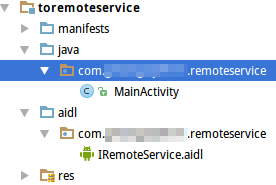

# Service

Android中一些后台任务应该交给Service处理，比如处理大量网络传输，长时间文件操作，播放音乐等。

Service的三种状态：

* **started** 在其他组件中调用`startService()`，对应服务会进入启动状态，执行后台服务。对统一Service类多次调用`startService()`，并不会启动多个Service，但是Service的`onStart()`会被多次调用。

* **bound** 其他组件调用`bindService()`会使Service启动并进入绑定状态，绑定状态的Service可以和多个组件绑定，当所有组件都和这个Service解除绑定后，这个Service销毁。单纯的绑定状态通常用于为其他组件服务，响应其他组件请求（类似服务器和客户端的结构）。

* **started&bound** Service还有一种很常用的使用方式是先start，再bind。例如音乐播放器，我们为了实现关闭Activity音乐也能后台播放，不得不把音乐播放控制写在start创建的Service里。但播放音乐需要开始，暂停，进度条等等控制操作，我们的Activity需要绑定服务才能执行这些操作。Android支持这种操作。但是要注意：销毁Activity时要解绑，否则会产生ServiceConnection leak的问题。Activity创建时可以再重新绑定即可。

一个错误的理解是我们定义的Service组件就是Service的全部执行代码，这会导致很多误会。更恰当的理解是：我们定义的Service类里的函数会在系统对应的后台服务中被回调。

## Service生命周期

官方文档提供的Service生命周期图。


## 清单文件中声明Service

```xml
<manifest ... >
  ...
  <application ... >
      <service android:name=".ExampleService" />
      ...
  </application>
</manifest>
```

* `android:exported`：代表是否能被其他应用隐式调用，其默认值是由service中有无intent-filter决定的，如果有intent-filter，默认值为true，否则为false。为false的情况下，即使有intent-filter匹配，也无法打开，即无法被其他应用隐式调用。
* `android:name`：Service类名
* `android:permission`：权限声明
* `android:process`：是否需要在单独的进程中运行,当设置为`android:process=":remote"`时，代表Service在单独的进程中运行。注意`：`很重要，它的意思是指要在当前进程名称前面附加上当前的包名，所以`remote`和`:remote`不是同一个意思，前者的进程名称为`:remote`，而后者的进程名称为`:包名:remote`。
* `android:isolatedProcess`：设置 true 意味着，服务会在一个特殊的进程下运行，这个进程与系统其他进程分开且没有自己的权限。与其通信的唯一途径是通过服务的API(bind and start)。
* `android:enabled`：是否可以被系统实例化，默认为 true。因为父标签 也有 enable 属性，所以必须两个都为默认值 true 的情况下服务才会被激活，否则不会激活。

## 使用start启动Service

调用`startService()`，传入意图对象启动服务。服务自行调用`stopSelf()`或其他组件调用`stopService()`结束一个服务。由于Service和主线程是同一个线程，因此Service中执行耗时操作时应该创建新的线程。

Service可以继承IntentService或Service类，IntentService继承了Service，继承IntentService较为简单，其回调`onHandleIntent()`时，已经开启了一条新的线程，只需在里面写入业务逻辑即可，处理完成会自动调用`stopSelf()`关闭服务。

### 继承IntentService

IntentService特点：

* 它创建了一个独立的工作线程来处理所有的通过`onStartCommand()`传递给服务的intents。
* 创建了一个工作队列，逐个发送intent给`onHandleIntent()`。
* 不需要主动调用`stopSelf()`来结束服务，在所有的intent被处理完后，系统会自动关闭服务。
* 默认实现的`onBind()`返回`null`。
* 默认实现的`onStartCommand()`的目的是将intent插入到工作队列中。

Intent是专门为了执行后台耗时操作而设计的。

```java
public class HelloIntentService extends IntentService
{

  /**
   * 必须定义构造函数，并在其中调用super()，参数是工作线程的名字
   */
  public HelloIntentService()
  {
      super("HelloIntentService");
  }

  /**
   * 意图处理
   */
  @Override
  protected void onHandleIntent(Intent intent)
  {
      try
      {
          Thread.sleep(5000);
      }
      catch (InterruptedException e)
      {
          Thread.currentThread().interrupt();
      }
  }
}
```

### 继承Service

直接继承Service通常用来实现一些更复杂的需求。比如和绑定（bind）配合使用，有关绑定服务的写法将在后文介绍。

```java
public class MyService extends Service
{
    @Nullable
    @Override
    public IBinder onBind(Intent intent)
    {
        return null;
    }

    /**
     * 服务创建时的回调
     */
    @Override
    public void onCreate()
    {
        System.out.println("onCreate invoke");
        super.onCreate();
    }

    /**
     * 每次通过startService()方法启动Service时都会被回调。
     */
    @Override
    public int onStartCommand(Intent intent, int flags, int startId)
    {
        System.out.println("onStartCommand invoke");
        return super.onStartCommand(intent, flags, startId);
    }

    /**
     * 服务销毁时的回调
     */
    @Override
    public void onDestroy()
    {
        System.out.println("onDestroy invoke");
        super.onDestroy();
    }
}
```

`onStartCommand(Intent intent, int flags, int startId)`返回值：

* `START_NOT_STICKY` 当Service因内存不足而被系统kill后，即使系统内存再次空闲时，系统也不会尝试重新创建此Service。除非程序中再次调用startService启动此Service。
* `START_STICKY` 当Service因内存不足而被系统停止，一段时间后内存再次空闲时，系统将会尝试重新创建此Service，一旦创建成功后将回调onStartCommand()方法，但其中的Intent将是null。
* `START_REDELIVER_INTENT` 当Service因内存不足而被系统kill后，则会重建服务，并通过传递给服务的最后一个 Intent 调用 onStartCommand()，任何挂起 Intent均依次传递。与START_STICKY不同的是，其中的传递的Intent将是非空，是最后一次调用startService中的intent。这个值适用于主动执行应该立即恢复的作业（例如下载文件）的服务。

## 绑定Service

### Binder和ServiceConnection

同一进程中和Service通信，当绑定服务时，服务是由系统实例化的，为了调用服务中的函数，需要这个服务实例的引用，这个操作是由Binder和ServiceConnection配合完成，使用Binder调用服务中函数示例：

MainActivity.java
```java
public class MainActivity extends Activity
{

	//服务对象
	private TestService testService;
	//服务连接对象
	private ServiceConnection serviceConnection = new ServiceConnection()
	{
		/**
		 * bind服务时回调,用于获得Service对象,获得Service对象才能调用其中的方法
		 */
		@Override
		public void onServiceConnected(ComponentName name, IBinder service)
		{
			TestService.MyBinder binder = (TestService.MyBinder) service;
			MainActivity.this.testService = binder.getTestService();
		}

		/**
		 * 服务意外终止时调用
		 */
		@Override
		public void onServiceDisconnected(ComponentName name)
		{
			MainActivity.this.testService = null;
		}
	};

	@Override
	protected void onCreate(Bundle savedInstanceState)
	{
		super.onCreate(savedInstanceState);
		setContentView(R.layout.activity_main);
	}

	public void bindService(View view)
	{
		//绑定服务,serviceConnection中自定义重载的方法被回调
		Intent intent = new Intent(this, TestService.class);
		bindService(intent, serviceConnection, BIND_AUTO_CREATE);
	}

	public void unbindService(View view)
	{
		//解绑服务
		if(testService != null)
		{
			unbindService(serviceConnection);
		}
	}

	public void startService(View view)
	{
		//调用服务中方法
		testService.startTestOperate();
	}

	public void stopService(View view)
	{
		//调用服务中方法
		testService.stopTestOperate();
	}

	public void getCount(View view)
	{
		//调用服务中方法
		int count = testService.getCount();
		Toast.makeText(this, count + "", Toast.LENGTH_SHORT).show();
	}
}
```

TestService.java
```java
public class TestService extends Service
{
	private MyBinder binder = new MyBinder();

	private Thread thread;
	private int count = 0;
	private boolean running = false;

	//可被外部调用的方法
	public void startTestOperate()
	{
		initThread();
		this.running = true;
		this.thread.start();
	}

	//可被外部调用的方法
	public int getCount()
	{
		return this.count;
	}

	//可被外部调用的方法
	public void stopTestOperate()
	{
		this.running = false;
		this.thread = null;
	}

	//初始化服务
	@Override
	public void onCreate()
	{
		super.onCreate();
	}

	private void initThread()
	{
		this.thread = new Thread(new Runnable() {
			@Override
			public void run()
			{
				while(TestService.this.running)
				{
					Log.i("TestService", "do something...");
					TestService.this.count++;
					try
					{
						Thread.sleep(1000);
					}
					catch (InterruptedException e)
					{
						e.printStackTrace();
					}
				}
			}
		});
	}

	@Nullable
	@Override
	public IBinder onBind(Intent intent)
	{
		//绑定服务时返回Binder对象
		return binder;
	}

	@Override
	public boolean onUnbind(Intent intent)
	{
		return super.onUnbind(intent);
	}

	public class MyBinder extends Binder
	{
		//为Binder添加方法,这样才能在Activity中取得Service实例引用
		TestService getTestService()
		{
			return TestService.this;
		}
	}
}
```

总结来说，绑定Service的基本步骤：

1. 编写ServiceConnection的`onServiceConnected()`回调函数，使其可以为当前Activity获得Service实例引用
2. 调用`bindService()`方法绑定服务

* `boolean bindService(Intent intent, ServiceConnection conn, int flags)`：绑定服务，第一个参数是Intent对象，第二个参数是我们继承并改写的ServiceConnection对象，第三个参数是标志位，取`BIND_AUTO_CREATE`表示如果当前Service不存在，就自动实例化；取`0`表示如果当前Service不存在，也不自动实例化。

Service，IBinder，ServiceConnection，这三个对象之间的关系确实挺复杂，难以记住。每次忘了来翻下笔记就好了。

注：`Android开发基础/多媒体应用开发`章节中，音乐播放器也用到了Service，且是先start再bind实现的，也可以作为参考。

## Messenger

和不同进程的Service（远程Service）通信，可以使用Messenger服务。通常在调用其他应用的服务，如支付宝，就会用到远程Service。

MainActivity.java
```java
public class MainActivity extends Activity
{
	//向Service发送消息的Messenger
	private Messenger messenger;
	//处理Service发来的消息的Messenger
	private Messenger replyMessenger = new Messenger(new ResponseHandler());

	private ServiceConnection serviceConnection = new ServiceConnection()
	{
		@Override
		public void onServiceConnected(ComponentName name, IBinder service)
		{
			MainActivity.this.messenger = new Messenger(service);
		}

		@Override
		public void onServiceDisconnected(ComponentName name)
		{
			MainActivity.this.messenger = null;
		}
	};

	@Override
	protected void onCreate(Bundle savedInstanceState)
	{
		super.onCreate(savedInstanceState);
		setContentView(R.layout.activity_main);
	}

	public void bindService(View view)
	{
		Intent intent = new Intent(this, TestService.class);
		bindService(intent, serviceConnection, BIND_AUTO_CREATE);

	}

	public void unbindService(View view)
	{
		unbindService(serviceConnection);
	}

	public void startOperate(View view)
	{
		Message message = Message.obtain(null, TestService.START_OPERATE);
		try
		{
			messenger.send(message);
		}
		catch (RemoteException e)
		{
			e.printStackTrace();
		}
	}


	public void stopOperate(View view)
	{
		Message message = Message.obtain(null, TestService.STOP_OPERATE);
		try
		{
			messenger.send(message);
		}
		catch (RemoteException e)
		{
			e.printStackTrace();
		}
	}


	public void getCount(View view)
	{
		Message message = Message.obtain(null, TestService.GET_COUNT, 0, 0);
		message.replyTo = replyMessenger;
		try
		{
			messenger.send(message);
		}
		catch (RemoteException e)
		{
			e.printStackTrace();
		}
	}

	private class ResponseHandler extends Handler
	{
		@Override
		public void handleMessage(Message msg)
		{
			if(msg.what == TestService.GET_COUNT)
			{
				Toast.makeText(MainActivity.this, msg.getData().getInt("count") + "", Toast.LENGTH_SHORT).show();
			}
			super.handleMessage(msg);
		}
	}
}
```

TestService.java
```java
public class TestService extends Service
{
	public static int START_OPERATE = 1;
	public static int STOP_OPERATE = 2;
	public static int GET_COUNT = 3;

	private Thread thread;
	private int count = 0;
	private boolean running = false;
	//处理发来的消息的Messenger
	private Messenger messenger = new Messenger(new RequestHandler());

	private class RequestHandler extends Handler
	{

		@Override
		public void handleMessage(Message msg)
		{
			if(msg.what == TestService.START_OPERATE)
			{
				initThread();
				TestService.this.running = true;
				TestService.this.thread.start();
			}
			else if(msg.what == TestService.STOP_OPERATE)
			{
				TestService.this.running = false;
				TestService.this.thread = null;
			}
			else if(msg.what == TestService.GET_COUNT)
			{
				Messenger replyMessenger = msg.replyTo;
				Message replyMessage = Message.obtain(null, GET_COUNT);
				Bundle bundle = new Bundle();
				bundle.putInt("count", TestService.this.count);
				replyMessage.setData(bundle);
				try
				{
					replyMessenger.send(replyMessage);
				}
				catch (RemoteException e)
				{
					e.printStackTrace();
				}
			}
			super.handleMessage(msg);
		}
	}

	@Override
	public IBinder onBind(Intent intent)
	{
		return messenger.getBinder();
	}

	//初始化服务
	@Override
	public void onCreate()
	{
		super.onCreate();

	}

	private void initThread()
	{
		this.thread = new Thread(new Runnable() {
			@Override
			public void run()
			{
				while(TestService.this.running)
				{
					Log.i("TestService", "do something...");
					TestService.this.count++;
					try
					{
						Thread.sleep(1000);
					}
					catch (InterruptedException e)
					{
						e.printStackTrace();
					}
				}
			}
		});
	}
}
```

## AIDL

Android中，AIDL是跨进程调用Service的最常用方式。这里演示两个应用跨进程服务调用的代码。

### 提供服务的应用


AndroidManifest.xml
```xml
<?xml version="1.0" encoding="utf-8"?>
<manifest package="com.ciyaz.remoteservice"
		  xmlns:android="http://schemas.android.com/apk/res/android">

	<application
		android:allowBackup="true"
		android:icon="@mipmap/ic_launcher"
		android:label="@string/app_name"
		android:supportsRtl="true"
		android:theme="@style/AppTheme">
		<activity android:name=".MainActivity">
			<intent-filter>
				<action android:name="android.intent.action.MAIN"/>

				<category android:name="android.intent.category.LAUNCHER"/>
			</intent-filter>
		</activity>
		<service android:name=".RemoteService">
			<intent-filter>
				<action android:name="com.ciyaz.remoteservice.IRemoteService" />
			</intent-filter>
		</service>
	</application>

</manifest>
```

RemoteService.java
```java
public class RemoteService extends Service
{
	private IRemoteService.Stub binder = new IRemoteService.Stub()
	{

		@Override
		public int getPid() throws RemoteException
		{
			return Process.myPid();
		}

		@Override
		public void basicTypes(int anInt, long aLong, boolean aBoolean, float aFloat, double aDouble, String aString) throws RemoteException
		{
		}
	};

	@Override
	public IBinder onBind(Intent intent)
	{
		return binder;
	}
}
```

IRemoteService.aidl
```java
interface IRemoteService
{

	int getPid();

    void basicTypes(int anInt, long aLong, boolean aBoolean, float aFloat,
            double aDouble, String aString);
}
```

### 调用服务的应用



MainActivity.java
```java
public class MainActivity extends Activity
{

	IRemoteService iRemoteService;
	private ServiceConnection serviceConnection = new ServiceConnection()
	{
		@Override
		public void onServiceConnected(ComponentName name, IBinder service)
		{
			iRemoteService = IRemoteService.Stub.asInterface(service);
		}

		@Override
		public void onServiceDisconnected(ComponentName name)
		{
			iRemoteService = null;
		}
	};

	@Override
	protected void onCreate(Bundle savedInstanceState)
	{
		super.onCreate(savedInstanceState);
		setContentView(R.layout.activity_main);
	}

	public void bind(View view)
	{
		Intent intent = new Intent("com.ciyaz.remoteservice.IRemoteService");
		boolean result = bindService(intent, serviceConnection, BIND_AUTO_CREATE);
		Toast.makeText(this, result + "", Toast.LENGTH_SHORT).show();
	}

	public void call(View view)
	{
		try
		{
			int pid = iRemoteService.getPid();
			Toast.makeText(this, pid + "", Toast.LENGTH_SHORT).show();
		}
		catch (RemoteException e)
		{
			e.printStackTrace();
		}
	}
}
```

注意：

* 被调用和调用方应用的aidl文件包名应该相同。
* 被调用的service应该在清单文件中配置intent-filter。
