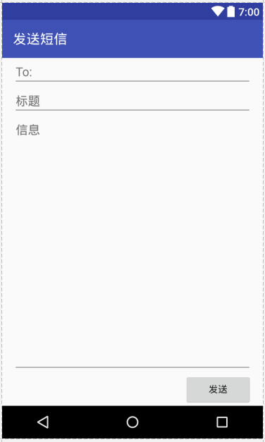
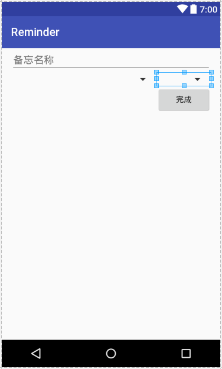
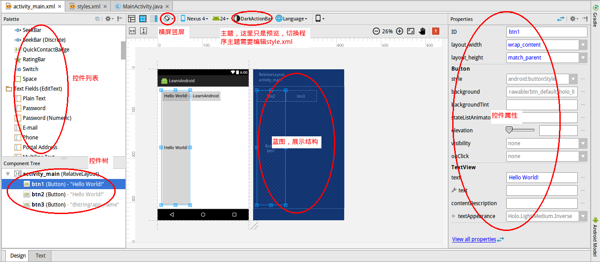

# 布局文件

布局文件存放在`res/layout`下，命名规则：例如MainActivity对应布局文件就叫`activity_main.xml`，一个对话框的布局就叫`dialog_xxx.xml`。创建一个新的Android工程后，Android Studio会自动为我们创建一个布局文件，我们再它的基础上修改就行了。

实际上编写布局文件时，控件、布局的可用选项是非常之多的，这里不可能一一介绍。我们使用Android Studio时，多使用代码提示功能，遇到难解决的问题，先看看文档怎么说。

# 布局

线性布局和相对布局是Android中最常用的两种布局类型。下面我们具体看一看如何编写这两种布局。

## 线性布局

一个空的线性布局代码：
```xml
<LinearLayout xmlns:android="http://schemas.android.com/apk/res/android"
              android:layout_width="match_parent"
              android:layout_height="match_parent"
              android:paddingLeft="16dp"
              android:paddingRight="16dp"
              android:orientation="vertical" >
</LinearLayout>
```

* `orientation`：布局方向 vertical，垂直；horizontal，水平。例如垂直的线性布局，那么控件就是从上到下排列的。

其他属性都很好理解。

线性布局中控件可用的属性：

* `gravity`：对齐方式，子控件相对于当前控件的对齐方式（当前控件是父控件）。
* `layout_gravity`：当前控件相对于父控件的对齐方式（当前控件是子控件）。
* `layout_weight`：这个可以理解为占据剩余高度（或宽度）的权重。具体计算方式请参考文档，个人认为设计的不是很好，这里只说最佳实践：当布局是垂直线性布局时，请把`layout_height`设为0dp，当布局是水平线性布局时，请把`layout_width`设为0dp，否则会产生意想不到的效果。

我们直接看一个具体例子，短信发送界面：

```xml
<?xml version="1.0" encoding="utf-8"?>
<LinearLayout xmlns:android="http://schemas.android.com/apk/res/android"
              android:layout_width="match_parent"
              android:layout_height="match_parent"
              android:paddingLeft="16dp"
              android:paddingRight="16dp"
              android:orientation="vertical">
    <EditText
        android:layout_width="match_parent"
        android:layout_height="wrap_content"
        android:hint="@string/to" />
    <EditText
        android:layout_width="match_parent"
        android:layout_height="wrap_content"
        android:hint="@string/subject" />
    <EditText
        android:layout_width="match_parent"
        android:layout_height="0dp"
        android:layout_weight="1"
        android:gravity="top"
        android:hint="@string/message" />
    <Button
        android:layout_width="100dp"
        android:layout_height="wrap_content"
        android:layout_gravity="end"
        android:text="@string/send" />
</LinearLayout>
```

注意第三个EditText，我们把`layout_height`设置为了`0dp`，然后加上了`android:layout_weight="1"`，表示占据剩余空间的比重为1。由于没有其他控件设置这个属性，因此它就表示该EditText占据全部剩余空间。还要注意它的`gravity`属性，这个属性指定的是该EditText里面的`hint`相对EditText的位置为Top。

除此之外，我们还使用了例如：`@string/send`的形式引用字符串，这些字符串资源配置在了`strings.xml`中。实际上，纯粹面向中文用户的app此处直接写字符串值也没什么问题，这里只是为了说明问题。

渲染结果：



## 相对布局

空的相对布局代码：

```xml
<RelativeLayout xmlns:android="http://schemas.android.com/apk/res/android"
                android:layout_width="match_parent"
                android:layout_height="match_parent"
                android:paddingLeft="16dp"
                android:paddingRight="16dp" >
</RelativeLayout>
```

相对布局控件可用的属性：

* layout_below:位于哪个控件的下方。
* layout_above:位于哪个控件的上方。
* layout_toLeftOf:指定当前控件位于哪个控件的左边。
* layout_toRightOf：指定当前控件位于哪个控件的右边。
* layout_alignParentRight:当前控件基于父窗体的对齐方式。
* layout_centerHorizontal:水平居中。
* layout_centerVertical：垂直居中。
* layout_centerInParent:位于父窗体的中间。

这个相对布局也是十分好理解的，实际上我们就是从一个控件开始，其他控件都指定相对于这个控件如何摆放，之后的控件以此类推，最终形成最后的布局。这种布局比线性布局稍微难用一点，我们需要在编写前大致计划好控件如何摆放，谁第一个放，这样才能做到在不同大小屏幕下显示一致的效果。

相对布局例子：

```xml
<?xml version="1.0" encoding="utf-8"?>
<RelativeLayout xmlns:android="http://schemas.android.com/apk/res/android"
                android:layout_width="match_parent"
                android:layout_height="match_parent"
                android:paddingLeft="16dp"
                android:paddingRight="16dp" >
    <EditText
        android:id="@+id/name"
        android:layout_width="match_parent"
        android:layout_height="wrap_content"
        android:hint="备忘名称" />
    <Spinner
        android:id="@+id/dates"
        android:layout_width="0dp"
        android:layout_height="wrap_content"
        android:layout_below="@id/name"
        android:layout_alignParentLeft="true"
        android:layout_toLeftOf="@+id/times" />
    <Spinner
        android:id="@id/times"
        android:layout_width="96dp"
        android:layout_height="wrap_content"
        android:layout_below="@id/name"
        android:layout_alignParentRight="true" />
    <Button
        android:layout_width="96dp"
        android:layout_height="wrap_content"
        android:layout_below="@id/times"
        android:layout_alignParentRight="true"
        android:text="完成" />
</RelativeLayout>
```

这个布局还是很容易理解的，要注意：因为相对摆放要知道相对的是“谁”，因此我们对某些控件使用类似`@+id/name`的形式，定义了id属性。



### 关于相对布局的技巧补充

相对布局可以说是比较“万能”的布局，凭我经验来说，一遇到其他布局解决不了的问题，就会切换到相对布局进行解决。这里有一个补充的注意点。

现在要求这样一个布局：屏幕上方有一个ListView，下方有一个包含按钮的子布局，要求这个线性布局高度不变，且无论ListView多高，子布局都处于屏幕底部。我们直接看看一个例子代码：

```xml
<RelativeLayout xmlns:android="http://schemas.android.com/apk/res/android"
			  android:layout_width="match_parent"
			  android:layout_height="match_parent">

	<RelativeLayout
		android:id="@+id/rl_bottom_btn_group"
		android:layout_alignParentBottom="true"
		android:layout_width="match_parent"
		android:layout_height="wrap_content"
		android:background="@color/lightGrayBackground"
		android:padding="5dp">
		<Button
			android:id="@+id/btn_create_schedule"
			android:layout_centerHorizontal="true"
			android:text="@string/create_schedule"
			android:layout_width="wrap_content"
			android:layout_height="wrap_content"/>
	</RelativeLayout>

	<ListView
		android:id="@+id/lv_schedule"
		android:layout_marginLeft="5dp"
		android:layout_marginRight="5dp"
		android:layout_width="match_parent"
		android:layout_height="wrap_content"
		android:layout_above="@id/rl_bottom_btn_group"/>

</RelativeLayout>
```

我们为子布局指定了`android:layout_alignParentBottom="true"`，但是如果仅仅是这样的话，会造成子布局把ListView最后一行挡住。如果给子布局设定`layout_below`，那么它就不可能一直处于屏幕底部。此时的解决办法是为上方的ListView指定`layout_above`。但是我们观察代码可以发现我们先定义的子布局，这是因为如果`layout_above`引用了后定义的控件id，gradle构建会报错，我们必须顺序的为控件赋予id才行。


## 帧布局、表格布局、绝对布局

这些应该是用的比较少了，基本不会用到。大部分效果都可以通过线性布局、相对布局和各种控件组合得到。

## 引用资源

在布局xml文件中，经常出现`@`符号，这个符号有两种用途：定义一个控件的资源id供其他地方使用，和引用资源。

* `@+id/xxx` 定义该控件id为xxx
* `@id/xxx` 引用id为xxx的控件
* `@string/xxx` 引用string.xml中定义的字符串。不只是字符串资源，图片资源也是可以这样使用的。

引用资源例子：

activity_main.xml
```xml
<EditText
    android:layout_width="match_parent"
    android:layout_height="wrap_content"
    android:hint="@string/to" />
```

strings.xml
```xml
<resources>
    <string name="app_name">Test01</string>
    <string name="to">To:</string>
    <string name="subject">标题</string>
    <string name="message">信息</string>
    <string name="send">发送</string>
    <string name="send_activity">发送短信</string>
</resources>
```

我们使用`android:hint`定义了这个EditText的提示信息，其值是`@string/to`，这是一个字符串资源，定义在`res/values/strings.xml`中。

# AndroidStudio布局文件编辑器



手写xml时如果忘了控件叫什么名字或者不知道想要的属性是什么，可以在布局编辑器中找一找，布局复杂时可以借助控件树和蓝图便于观察，蓝图和主题预览都是强大的辅助设计工具。
