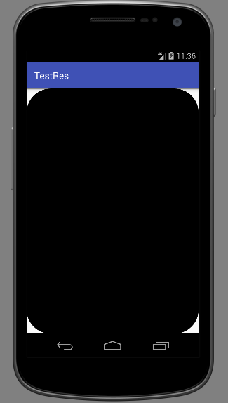

# Android资源文件

包含在GUI程序中一起发布的布局xml文件，i18n使用的资源文件，各种图片，二进制声音、视频等，都算作资源文件。

大部分GUI框架都对自己的资源文件如何存储和调用做出了规范。Android中规定的工程目录结构实际上就规定了资源文件如何存储，Android Studio中默认创建的工程有一个`res`文件夹，这里就是存储资源文件的位置，将应用打包为apk时，Android SDK中的打包工具会自动识别这个文件夹，并正确打包。

## 资源文件和R.java

R.java是自动生成的，我们不能手动修改。下面是默认创建的工程中的R.java文件。

R.java
```java
/* AUTO-GENERATED FILE.  DO NOT MODIFY.
 *
 * This class was automatically generated by the
 * aapt tool from the resource data it found.  It
 * should not be modified by hand.
 */

package com.ciyaz.testres;

public final class R {
  ...
}
```

Android Studio中，我们在`drawable`文件夹内放一个图片，`R.java`里就自动生成这个资源的索引值（一个int类型的十六进制数），这是因为Android Studio自动调用了SDK中的`aapt`工具。

所谓的索引值，实际上就是一个int类型的整数，就像HTML中我们给某个标签设置id一样，使用这种索引值比较方便引用控件对象或者资源对象。我们使用类似`findViewById()`时，传入一个整数就可以某个View对象，非常方便。

注意：

1. 为什么不像HTML一样，用一个字符串作为索引呢？我觉得可能因为一个应用用int类型占用空间总体来说比较小，Java语言可以使用类似`public static int CONST_VAL = 0x00001`这样定义静态全局变量，那么写代码时，程序员的代码完全可以使用`CONST_VAL`，而不用记住`0x00001`这样的数字。
2. 资源是不能随意命名的，比如一个图片`1.png`，我们使用`R.java`进行引用时，不可能使用`R.drawable.1`，因为Java类属性名不能为数字开头。建议使用有意义的名字，比如`ic_launcher.png`。


## Resources对象

Resources类提供了大量的方法能够访问应用的资源文件，可以看做是整个应用的资源文件管理类。

Activity中，可以使用`getResources()`方法获得该对象，Resources对象中有很多`getXxx()`方法，可以获得各种资源文件。

例子：获得drawable对象
```java
package com.ciyaz.testres;

import android.graphics.drawable.Drawable;
import android.support.v7.app.AppCompatActivity;
import android.os.Bundle;
import android.widget.ImageView;

public class MainActivity extends AppCompatActivity
{

	@Override
	protected void onCreate(Bundle savedInstanceState)
	{
		super.onCreate(savedInstanceState);
		setContentView(R.layout.activity_main);

		ImageView imageView = (ImageView) findViewById(R.id.imageView);
		Drawable drawable = getResources().getDrawable(R.drawable.test);
		imageView.setImageDrawable(drawable);
	}
}
```

注：ImageView直接能从资源ID读取图片，实际使用时不需要上述获取Drawable对象的步骤，上面是为了说明Resources对象的作用。

## 在xml中定义资源值

工程目录的`res/values`文件夹下，默认有这样几个文件：


这些xml文件实际上也是资源文件，里面存储的是颜色资源，字符串资源，样式资源，布局文件或Java代码中能通过索引值引用这些资源。以字符串为例，为什么我们要把字符串定义为资源呢？因为在软件工程上，把字符串直接硬编码到Java代码中这种做法不利于扩展维护。

比如新出了一款3A大作游戏，即使没有中文版，汉化的一般也非常很快，因为大厂商的程序员懂得软件工程，知道把字符串定义为资源，民间的汉化人员修改资源文件就行了。有些软件却几乎没法汉化，因为程序员把字符串硬编码进了代码中，而程序又是闭源的。即使能得到程序源码，汉化人员也看不懂啊。

定义字符串资源，我们可以直接写到默认创建的`strings.xml`中，也可以自己创建一个xml文件。

strings.xml
```xml
<resources>
	<string name="app_name">TestRes</string>
</resources>
```

xml资源文件有一个`resources`根节点，里面就是资源值的定义。

布局文件中引用一个字符串资源：
```xml
<TextView
  android:id="@+id/textView"
  android:layout_width="match_parent"
  android:layout_height="wrap_content"
  android:text="@string/app_name"/>
```

可以定义的资源类型：

* 字符串
* 尺寸
* 颜色
* 布尔值
* 整型值
* 上述类型的数组

字符串和颜色资源值比较常用，其余不常用。这里就不一一演示了。

## 图片资源

Android Studio创建工程时，默认为我们创建了`drawable`文件夹，这里面就可以存放图片，向其添加文件后，开发环境会自动为我们更新`R.java`，我们就可以通过xml或Java代码对这个资源进行引用了。

除此之外，还有一个`mipmap`文件夹，这个文件夹里严格区分了各种dpi级别下对应的图片，Android系统会自动选择当前手机dpi下最佳的图片，google建议将应用的启动图标放在`mipmap`下，因为这个图片最可能会应用在各种不同的分辨率下，其余不是很重要的图片则可以放到`drawable`下。


### Bitmap和Drawable

Bitmap表示位图，即一个图像所有像素在内存中的表示。Drawable则是Android提供的一种更抽象的图像资源。

Drawable内存占用小，使用方便，我们通常使用Drawable，Bitmap则更适合对位图数据的数据进行各种处理时使用。网络下载的图像或者从文件系统加载的图像，由于也是向内存中加载位图数据，Bitmap提供了方便的从流中加载的工具类，因此也通常先要获得Bitmap对象。

#### 从二进制数据中加载位图

```java
Bitmap BitmapFactory.decodeFile(String pathName)
```

BitmapFactory提供了从流(stream)，文件，字节数组，资源ID中加载位图的方法，其返回值都是Bitmap对象。将Bitmap转换成字节数组也是十分方便的。

#### Bitmap转Drawable

```java
BitmapDrawable bitmapDrawable = new BitmapDrawable(getResources(), bitmap);
```

BitmapDrawable是Drawable的子类。

#### 从资源ID加载Bitmap

```java
Bitmap bitmap = BitmapFactory.decodeResource(getResources(), R.mipmap.ic_launcher);
```

直接使用BitmapFactory提供的API即可实现从资源ID加载bitmap。但是资源必须也是位图才行。

#### Drawable对象转Bitmap

情况一
```java
BitmapDrawable drawable = (BitmapDrawable) getResources().getDrawable(R.mipmap.ic_launcher);
Bitmap bitmap = drawable.getBitmap();
```

当Drawble本来就是BitmapDrawable时（比如上面代码，显然我们加载的是一个位图），直接将其强制类型转换为BitmapDrawable，然后使用`getBitmap()`方法即可。

情况二
```java
Drawable drawable = getResources().getDrawable(R.drawable.mrect);
drawable.setBounds(0, 0, 50, 50);
Bitmap bitmap = Bitmap.createBitmap(50, 50, Bitmap.Config.ARGB_8888);
Canvas canvas = new Canvas(bitmap);
drawable.draw(canvas);
```

我们没法从Drawable对象获得其ResourceID，Drawable类也没有提供直接转换为Bitmap的API（BitmapDrawable提供了转Bitmap的API，Drawable未提供因为并不是所有的Drawable都是位图，比如下面介绍的Shape），因此我们只能绕一个弯，先把Drawable画在Canvas上，再提取Canavas上的位图。

## 图形（Shape）资源

图形资源可以使用xml定义标准的几何体，如矩形，椭圆等。这个xml具体内容是很多的，我们也不可能一下子就记住，用到时查阅文档即可。下面例子定义一个圆角矩形：

drawable/my_rectangle.xml
```xml
<?xml version="1.0" encoding="utf-8"?>
<shape xmlns:android="http://schemas.android.com/apk/res/android"
	   android:shape="rectangle">
	<corners android:radius="50dp"/>
	<solid android:color="#000000"/>
</shape>
```

activity_main.xml
```xml
<?xml version="1.0" encoding="utf-8"?>
<LinearLayout xmlns:android="http://schemas.android.com/apk/res/android"
			  xmlns:app="http://schemas.android.com/apk/res-auto"
			  android:layout_width="match_parent"
			  android:layout_height="match_parent"
			  android:paddingLeft="16dp"
			  android:paddingRight="16dp"
			  android:orientation="vertical"
	android:background="@drawable/my_rectangle">
</LinearLayout>
```



注意：使用xml定义的是图形，而不是图片，也就是说它属于矢量图，没有固定的大小，但是会随着容器的缩放对每个像素进行即时的计算。

## 动画资源

将在后续章节`14-动画效果`讲述。
