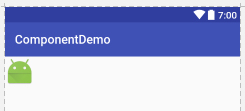
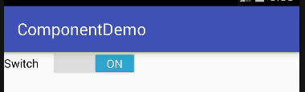

# 基础控件详解

本篇笔记主要记录Android中，内置的基础控件。我们构建基本的图形界面时，会经常用到它们。

注意：由于Android版本号升的很快，新的控件不断添加进来，旧的控件可能被淘汰，所以本篇笔记介绍的某些内容可能已经过时了，具体最新的情况请参考google提供的开发文档。每个控件可调节的属性可能都非常多，我们也不可能一一介绍，这里只是介绍一些常用的属性。

高效的使用工具能够避免做无用功：有关下面介绍的控件的XML定义，不需要记住，用到时，直接从Android Studio的设计器拖拽，然后再在布局文件上修改即可。如果需要某个xml节点具体的属性，在该xml节点上按自动提示快捷键，编辑器就会提示我们怎样写。

## TextView

在其他GUI框架中也可能叫Label之类的，就是一个显示字符串的控件。

TextView的XML定义：
```xml
<TextView
  android:id="@+id/textView"
  android:layout_width="wrap_content"
  android:layout_height="wrap_content"
  android:text="Hello, world!"/>
```

效果：


* `android:textSize`：字符串显示的字号
* `android:textColor`：字符串显示的颜色

## ImageView

ImageView是用来专门显示图片的控件。我们可以直接用`android:src`属性静态的指定一个图片，也可以从网络动态的加载图片，但是要注意：网络是耗时操作，要和UI线程分开。

ImageView的XML定义：
```xml
<ImageView
  android:id="@+id/imageView"
  android:layout_width="wrap_content"
  android:layout_height="wrap_content"
  android:src="@mipmap/ic_launcher"
  android:contentDescription="image view"/>
```

这里我们直接使用的`ic_launcher`的图片。

效果：



## EditText

编辑框，在其他GUI框架中可能叫TextField，TextArea等。EditText既支持单行输入，也支持多行输入。

EditText的XML定义：

```xml
<EditText
  android:id="@+id/editText"
  android:layout_width="wrap_content"
  android:layout_height="wrap_content"
  android:ems="10"
  android:hint="Name"/>
```

效果：


* `android:ems`：编辑框的长度（可容纳的字符数）
* `android:hint`：编辑框的提示字符
* `android:text`：编辑框的内容
* `android:inputType`：这个属性指定输入的字符串类型，比如是邮件格式，或者日期格式等，编辑框会自动过滤一些输入。具体取值请参考文档。

## Button

按钮这个控件可以说是最常用的了。

Button的XML定义：

```xml
<Button
  android:id="@+id/button"
  android:layout_width="wrap_content"
  android:layout_height="wrap_content"
  android:text="Button"/>
```

效果：


Button类实际上是继承TextView的，我们可能要调节一下按钮上的文字字号等，这和TextView的操作是一样的。

* `android:onClick`：这个属性指定了按钮点击的回调函数。其回调函数必须是这种形式的：

```java
public void handleBtn1(View v)
{
}
```

即有一个参数`View`。这个参数表示被设置监听器的组件，这里也就是这个按钮。

我们还可以直接为Button对象设置事件监听器：

```java
button.setOnClickListener(new View.OnClickListener() {
  @Override
  public void onClick(View v)
  {  
  }
});
```

使用哪种方式都可以，但是第一种比较简洁。

## ImageButton

ImageButton是图片按钮。

ImageButton的XML定义：

```xml
<ImageButton
  android:id="@+id/imageButton"
  android:layout_width="wrap_content"
  android:layout_height="wrap_content"
  android:src="@mipmap/ic_launcher"
  android:contentDescription="ImageButton"/>
```

效果：


这里我们给ImageButton指定了一张ic_launcher图片。

* `android:src`：指定ImageButton显示的图片
* `android:contentDescription`：图片按钮的文本描述，虽然不是必选属性，也一般不会显示出来，但是建议加上，这和HTML中``便签里的字符串是一个道理

## ToggleButton

ToggleButton就是类似开关的意思，不过Android中MaterialDesign风格的ToggleButton可能和大多人想象的不太一样。

```xml
<ToggleButton
  android:id="@+id/toggleButton"
  android:layout_width="wrap_content"
  android:layout_height="wrap_content"
  android:text="ToggleButton"/>
```

关闭效果：


开启效果：


* `android:textOn`：开启时的按钮上的文字，不指定默认是`ON`
* `android:textOff`：开启时的按钮上的文字，不指定默认是`OFF`

## Switch

Switch也是一种开关。其实Switch和ToggleButton作用是一样的。

Switch的XML定义：
```xml
<Switch
  android:id="@+id/switch1"
  android:layout_width="wrap_content"
  android:layout_height="wrap_content"
  android:text="Switch"/>
```

效果：



## RadioGroup和RadioButton

RadioButton是单选按钮，单选按钮通常都是以单选按钮组的形式出现的。

RadioGroup的XML定义例子：

```xml
<RadioGroup
  android:layout_width="wrap_content"
  android:layout_height="wrap_content"
  android:orientation="vertical">

  <RadioButton
    android:id="@+id/radioButton1"
    android:layout_width="wrap_content"
    android:layout_height="wrap_content"
    android:layout_weight="1"
    android:text="RadioButton"/>

  <RadioButton
    android:id="@+id/radioButton2"
    android:layout_width="wrap_content"
    android:layout_height="wrap_content"
    android:layout_weight="1"
    android:text="RadioButton"/>

  <RadioButton
    android:id="@+id/radioButton3"
    android:layout_width="wrap_content"
    android:layout_height="wrap_content"
    android:layout_weight="1"
    android:text="RadioButton"/>
</RadioGroup>
```

效果：


注意：RadioGroup是继承LinearLayout的，因此它也可以使用LinearLayout中的特性，比如`android:orientation`，控件的`android:layout_weight`。

下面是读取单选按钮组的选择信息例子程序：

布局文件 activity_main.xml
```xml
<?xml version="1.0" encoding="utf-8"?>
<RelativeLayout xmlns:app="http://schemas.android.com/apk/res-auto"
				android:layout_width="match_parent"
				android:layout_height="match_parent"
				xmlns:android="http://schemas.android.com/apk/res/android">

	<RadioGroup
		android:layout_width="wrap_content"
		android:layout_height="wrap_content"
		android:orientation="vertical"
		android:id="@+id/radioGroup">

		<RadioButton
			android:id="@+id/radioButton1"
			android:layout_width="wrap_content"
			android:layout_height="wrap_content"
			android:layout_weight="1"
			android:text="RadioButton1"/>

		<RadioButton
			android:id="@+id/radioButton2"
			android:layout_width="wrap_content"
			android:layout_height="wrap_content"
			android:layout_weight="1"
			android:text="RadioButton2"/>
	</RadioGroup>

	<TextView
		android:id="@+id/textView"
		android:layout_width="wrap_content"
		android:layout_height="wrap_content"
		android:layout_alignParentStart="true"
		android:layout_below="@id/radioGroup"
		android:layout_marginStart="23dp"
		android:layout_marginTop="27dp"
		android:text=""/>
</RelativeLayout>
```

Activity代码 MainActivity.java
```java
package com.ciyaz.componentdemo;

import android.support.annotation.IdRes;
import android.support.v7.app.AppCompatActivity;
import android.os.Bundle;
import android.widget.RadioGroup;
import android.widget.TextView;

public class MainActivity extends AppCompatActivity
{

	@Override
	protected void onCreate(Bundle savedInstanceState)
	{
		super.onCreate(savedInstanceState);
		setContentView(R.layout.activity_main);

		final TextView textView = (TextView) findViewById(R.id.textView);
		RadioGroup radioGroup = (RadioGroup) findViewById(R.id.radioGroup);
		radioGroup.setOnCheckedChangeListener(new RadioGroup.OnCheckedChangeListener() {
			@Override
			public void onCheckedChanged(RadioGroup group, @IdRes int checkedId)
			{
				switch (checkedId)
				{
					case R.id.radioButton1:
						textView.setText("RadioButton1");
						break;
					case R.id.radioButton2:
						textView.setText("RadioButton2");
						break;
				}
			}
		});
	}
}
```

注意读取单选按钮值的方法：对`RadioGroup`设置`OnCheckedChangeListener`，并在其中读取当前被选择的`RadioButton`的值。

运行效果：


## CheckBox

CheckBox是复选框。


CheckBox的XML定义：
```xml
<CheckBox
  android:id="@+id/checkBox"
  android:layout_width="wrap_content"
  android:layout_height="wrap_content"
  android:text="CheckBox"/>
```

* `android:text`复选框的文字


## Spinner

Spinner是下拉选择框。

Spinner的XML定义：

activity_main.xml
```xml
<Spinner
  android:id="@+id/spinner"
  android:layout_width="match_parent"
  android:layout_height="wrap_content"
  android:entries="@array/countries"/>
```

arrays.xml
```xml
<?xml version="1.0" encoding="utf-8"?>
<resources>
	<string-array name="countries">
		<item>China</item>
		<item>Japan</item>
		<item>Korea</item>
	</string-array>
</resources>
```

这里我们通过xml资源指定了Spinner的内容。`arrays.xml`专门用于保存数组形式的资源（resources），里面包含`<string-array>`。这种方式适合下拉框内容不变时使用。

* `android:entries`：指定下拉框的内容

我们也可以通过Java代码的形式指定Spinner的内容，这种方式适合下拉框内容是动态加载时。下面的例子中，点击按钮一下，就会为Spinner添加一个元素。在Spinner中选择元素后，会动态的改变TextView的值为Spinner选定的元素：

布局文件
```xml
<?xml version="1.0" encoding="utf-8"?>
<RelativeLayout xmlns:app="http://schemas.android.com/apk/res-auto"
				android:layout_width="match_parent"
				android:layout_height="match_parent"
				xmlns:android="http://schemas.android.com/apk/res/android">

	<Button
		android:id="@+id/button"
		android:layout_width="wrap_content"
		android:layout_height="wrap_content"
		android:onClick="handleBtn1"
		android:text="Add"/>

	<Spinner
		android:id="@+id/spinner"
		android:layout_below="@id/button"
		android:layout_width="match_parent"
		android:layout_height="wrap_content"/>

	<TextView
		android:id="@+id/textView"
		android:layout_width="wrap_content"
		android:layout_height="wrap_content"
		android:layout_below="@id/spinner"
		android:text="default"/>

</RelativeLayout>
```

布局文件中定义了三个控件，一个按钮用来给Spinner添加元素，一个Spinner供用户选择，TextView则会显示出用户选择的值。

Activity代码
```java
package com.ciyaz.componentdemo;

import android.support.v7.app.AppCompatActivity;
import android.os.Bundle;
import android.view.View;
import android.widget.AdapterView;
import android.widget.ArrayAdapter;
import android.widget.Spinner;
import android.widget.TextView;

import java.util.ArrayList;
import java.util.List;

public class MainActivity extends AppCompatActivity
{

	private List<String> stringList;
	private int clickCount = 0;

	@Override
	protected void onCreate(Bundle savedInstanceState)
	{
		super.onCreate(savedInstanceState);
		setContentView(R.layout.activity_main);

		final TextView textView = (TextView) findViewById(R.id.textView);

		Spinner spinner = (Spinner) findViewById(R.id.spinner);
		stringList = new ArrayList<>();
		stringList.add("default");
		ArrayAdapter<String> stringArrayAdapter = new ArrayAdapter<String>(this, android.R.layout.simple_spinner_item, stringList);
		stringArrayAdapter.setDropDownViewResource(android.R.layout.simple_spinner_dropdown_item);
		spinner.setAdapter(stringArrayAdapter);

		spinner.setOnItemSelectedListener(new AdapterView.OnItemSelectedListener() {
			@Override
			public void onItemSelected(AdapterView<?> parent, View view, int position, long id)
			{
				textView.setText(parent.getItemAtPosition(position).toString());
			}

			@Override
			public void onNothingSelected(AdapterView<?> parent)
			{
			}
		});
	}

	public void handleBtn1(View v)
	{
		stringList.add(clickCount + "");
		clickCount++;
	}
}
```

上面的代码中，我们要注意通过ArrayAdaptor动态向Spinner添加值的代码。这里千万要注意：必须给ArrayAdaptor关联的数组`stringList`添加一个默认值，也就是说Spinner必须有一个默认值。否则会触发一个神奇的bug，导致Spinner无法选择任何值。

我们还通过`setOnItemSelectedListener`为Spinner指定了一个事件监听器，当Spinner中的某个值被选择时，它的值就会被加载到TextView中。

运行效果：


