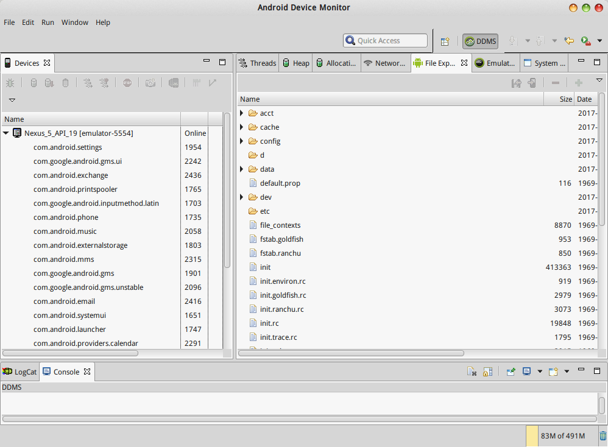
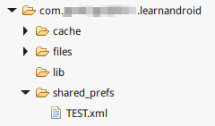
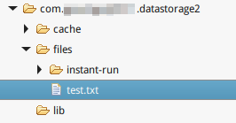

# Android文件结构

Android文件结构和Linux比较相似，打开DDMS可以通过File explorer查看Android的文件结构，还能进行导入导出文件等操作。在Android Studio中，可以通过Tools->Android->Android Device Monitor打开DDMS。



注：实际上这个DDMS还是从旧版的eclipse ADT里移植过来的，所以界面不太一致，功能上也显得有点冲突，不知道Google以后会不会重做这个插件。

## 几个重要的目录

### /data

* data 此文件夹是系统用来存放应用数据的，其中包含的文件夹都以应用包名命名，例如com.android.music等。应用目录内包含lib、files（应用文件）、cache（缓存）。缓存可能被垃圾清理软件清理掉，不能存放重要的配置文件，重要的（删除不影响用户正常使用的）文件应该放在files中。
* app 安装的应用apk，里面存放了应用的apk或odex。

### /system

* xbin：为系统管理员准备的系统管理工具。类似Linux的/sbin，用户一般不会用到。
* framework：JAVA平台的核心文件。包括.jar和.odex文件。
* fonts：字体库文件的存放目录。
* etc：系统中配置文件，类似Linux的/etc。
* build.prop：属性文件，在Android系统中.prop文件很重要，记录了系统的设置和改变，类似于/etc中的文件。
* media：系统的ogg格式铃声，分为 notifications（通知）、ui（界面）、alarms（警告）和ringtones（铃声）。
* bin：存放用户常用的工具程序，shell中执行的很多命令来自这里，类似Linux的/bin和/usr/bin。
* usr：用户的配置文件，如键盘布局、共享、时区文件等等。
* priv-app：系统自带基础程序的apk和odex，比如拨号器。
* app：系统自带程序的apk和odex，比如计算器。
* lost+found：yaffs文件系统固有的，类似回收站的文件夹，只要是yaffs文件系统都会有。
* vendor：和OpenGL显示相关的几个类库。
* lib：各种共享库（.so）文件。类似linux的/lib。

### /sdcard和/storage/sdcard

这两个都是SD卡，/sdcard是一个软链接，SD卡的内容更类似于Linux的/home，存储一些music，movie之类的。

备注：

* odex是被优化过的JAVA程序文件，体积通常是.jar的4倍左右。执行效率比.jar高。
* Android中应用的执行是要加载apk或odex的，和数据区/data/data是已安装应用程序的两个部分，两者分开存储。

# 文件IO

下面我们就正式看一看如何使用代码，在Android应用中读写文件。

## SharedPreferences

SharedPreferences可以用于存储应用的键值对数据，其作用就像JavaSE的`java.util.Properties`。由于读写非常容易，我们可以用它存储用户对应用的配置等信息。

```java
public class MainActivity extends Activity
{

	@Override
	protected void onCreate(Bundle savedInstanceState)
	{
		super.onCreate(savedInstanceState);
		setContentView(R.layout.activity_main);
	}

	/**
	 * save按钮点击
	 */
	public void save(View v)
	{
		//SharedPreferences
		//name 名称 mode 模式
		SharedPreferences sharedPreferences = getSharedPreferences("TEST", MODE_PRIVATE);
		//获得SharedPreferences编辑器
		SharedPreferences.Editor editor = sharedPreferences.edit();

		editor.putString("name", "admin");
		editor.putString("password", "123");
		//提交
		editor.apply();
	}

	/**
	 * read按钮点击
	 */
	public void read(View v)
	{
		SharedPreferences sharedPreferences = getSharedPreferences("TEST", MODE_PRIVATE);
		//读取SharedPreferences
		//key 键值 defValue 如果键不存在返回的默认值
		String name = sharedPreferences.getString("name", null);
		String password = sharedPreferences.getString("password", null);
		//用吐司显示
		Toast.makeText(this, name + "\n" + password, Toast.LENGTH_SHORT).show();
	}
}
```

使用SharedPreferences的流程：

1. 调用getSharedPreferences()获得SharedPreferences对象，需要指定SharedPreferences对象名。一个应用可以有多个SharedPreferences，调用getSharedPreferences()时如果该SharedPreferences不存在，就自动创建一个。模式一般选MODE_PRIVATE，只允许本应用读写。
2. 调用sharedPreferences.edit()获得编辑器对象。
3. 向编辑器写入数据。
4. 提交。apply()是异步提交，commit()是同步提交，实际上不会往SharedPreferences写太多数据，这两个函数效果是一样的，但IO时间比较长时，就应该用apply()了。

读取SharedPreferences流程：

1. 调用getSharedPreferences()获得SharedPreferences对象。
2. 调用sharedPreferences.getString/getInt等，传入键，获得对应数据。

sharedPreferences的存储路径如图：



我们可以看到，实际上SharedPreferences文件是一个xml文件，而JavaSE的Properties则是`.properties`文件，里面编写的就指键值对。

## 内部存储

### 读写文件

应用程序能读写的内部存储就是`/data/data/应用包名/`下的空间，Android每个应用对应Linux的一个用户，每个应用之间不能互相读写别人的数据。如果一个应用把用户登录的token存储到了SharedPreferences中，另一个应用能自由读取的话，那就太危险了。

```java
public void save(View v)
{
	try
	{
		OutputStream outputStream = openFileOutput("test.txt", MODE_PRIVATE);
		outputStream.write("hello".getBytes());
		outputStream.close();
	}
	catch (Exception e)
	{
		e.printStackTrace();
	}
}
```

使用openFileOutput()函数可以获得文件的输出流，mode可以指定读写的模式。其余和Java的文件IO方式全部相同。

文件存储位置：



### 读取自带资源文件

如果apk需要自带一些自定义类型的资源文件（可能是文本或二进制），在android studio的工程目录中可以放在res/raw/中，使用下列代码读取。但raw资源不能写入，因为它们存储在打包好的apk中。

```java
//获得输入流
InputStream inputStream = getResources().openRawResource(R.raw.a);
//读取并显示文本
BufferedReader bufferedReader = new BufferedReader(new InputStreamReader(inputStream));
Toast.makeText(this, bufferedReader.readLine(), Toast.LENGTH_SHORT).show();
inputStream.close();
```

注：这和JavaSE编写桌面应用是一个套路，我们把资源如图标，点击声音等，打包进jar文件（实际就是zip压缩格式），他们是只读的。而针对用户生成的配置文件等，由于还要由应用进行读写操作，它们通常放在用户目录，例如Linux下通常在用户目录创建一个隐藏文件：`/home/<username>/.xxxapp`。

### 读写缓存文件（cache）

使用`getCacheDir()`获得应用数据文件夹的缓存目录，使用Java的文件IO读写即可。缓存只能存放临时文件，因为它们可能被用户的清理工具删除。

### 一些有用的函数

* `getFilesDir()`  获取/data/data/应用包名/files/的绝对路径。
* `getDir()`  获得/data/data/应用包名/下一个文件夹的File对象，例如`getDir("aaa", MODE_PRIVATE)`，如果app_aaa不存在，系统就会自动创建app_aaa这个文件夹。注意app_前缀。
* `deleteFile()`  删除/data/data/应用包名/files/下的一个文件。

## 外部存储

对于一些老式手机，外部存储意味着单独插入的闪存卡，没有插卡就不存在外部存储。而对于较新的手机，内部存储和外部存储则共享一个磁盘空间。其实，显然后者更合理。

外部存储的数据任何应用都能读写。读写sd卡的应用需要添加权限：

```xml
<manifest ...>
    <uses-permission android:name="android.permission.WRITE_EXTERNAL_STORAGE" />
    ...
</manifest>
```

### 检查SD卡读写权限

```java
/* 检查SD卡是否有读写权限 */
public boolean isExternalStorageWritable() {
	String state = Environment.getExternalStorageState();
	if (Environment.MEDIA_MOUNTED.equals(state)) {
		return true;
	}
	return false;
}

/* 检查SD卡是否有读权限 */
public boolean isExternalStorageReadable() {
	String state = Environment.getExternalStorageState();
	if (Environment.MEDIA_MOUNTED.equals(state) ||
			Environment.MEDIA_MOUNTED_READ_ONLY.equals(state)) {
		return true;
	}
	return false;
}
```

### 读写SD卡

#### 可被媒体库扫描到的路径

```java
File file = new File(Environment.getExternalStoragePublicDirectory(Environment.DIRECTORY_MUSIC), "test.ogg");
```

调用Environment.getExternalStoragePublicDirectory()函数可以获得对应公共媒体库的外部存储路径，例如上述代码获得了“音乐”的存储路径，例如sdcard/Music，这个存储路径会被系统的音乐应用扫描到。还有很多其他媒体库类型可以选用。

#### 应用自己的路径

```java
File sdcard = getExternalFilesDir(null);
```

调用getExternalFilesDir()会返回sdcard/Android/data/应用包名/files/这个文件夹，存储在这里不会被系统媒体库扫描到，但是其他应用依然拥有这个目录的读写权限。参数和getExternalStoragePublicDirectory一样可以传入媒体类型，得到的路径例如sdcard/Android/data/应用包名/files/Music，但依然不会被系统媒体库读取。

#### SD卡根目录

```java
File sdcard = Environment.getExternalStorageDirectory();
```

调用Environment.getExternalStorageDirectory()可以直接获得sdcard/路径。
