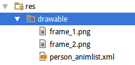
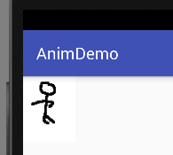

# 动画效果

这篇笔记记录Android开发中，如何使用动画效果。Android中，动画分为帧动画，补间动画，和属性动画。

## 帧动画

帧动画比较好理解，就是一张图像作为动画的一帧，多张图像连续播放，视觉上看起来画面就像在动一样。

### 使用XML定义帧动画资源

我们直接看一个例子。首先我们应该准备若干张图片，放在`res/drawable`下，作为动画的帧。然后在`res/drawable`下，创建一个`person_animlist.xml`。



person_animlist.xml
```xml
<?xml version="1.0" encoding="utf-8"?>
<animation-list xmlns:android="http://schemas.android.com/apk/res/android" android:oneshot="false">
	<item android:drawable="@drawable/frame_1" android:duration="60" />
	<item android:drawable="@drawable/frame_2" android:duration="60" />
</animation-list>
```

* `animation-list` 定义了帧动画资源，可以通过通过Android中标准的资源引用方式进行引用。
* `android:oneshot` 表示是否只播放一次，如果为`true`则只播放一次。
* `item` 节点定义了帧，其中引用了帧图片的资源。
* `android:duration` 表示持续时间。

注意：定义帧动画的xml文件必须放在`res/drawable`下，否则Android Studio会报错。旧版的书籍可能放在`res/anim`下，在新版的Android Studio中是不行的了。

activity_main.xml
```xml
<?xml version="1.0" encoding="utf-8"?>
<RelativeLayout xmlns:android="http://schemas.android.com/apk/res/android"
				android:layout_width="match_parent"
				android:layout_height="match_parent">

	<ImageView
		android:id="@+id/imageView"
		android:layout_width="wrap_content"
		android:layout_height="wrap_content"
		android:src="@drawable/person_animlist"/>

</RelativeLayout>
```

在布局文件中，我们放置了一个`ImageView`，`src`属性引用了动画资源。

运行效果：



注：图片实际上是动的。

### 启动和停止帧动画

这里我们加两个按钮，用来启动和停止帧动画。

布局文件略，MainActivity.java
```java
package com.ciyaz.animdemo;

import android.graphics.drawable.AnimationDrawable;
import android.support.v7.app.AppCompatActivity;
import android.os.Bundle;
import android.view.View;
import android.widget.ImageView;

public class MainActivity extends AppCompatActivity
{

	private AnimationDrawable animationDrawable;

	@Override
	protected void onCreate(Bundle savedInstanceState)
	{
		super.onCreate(savedInstanceState);
		setContentView(R.layout.activity_main);

		ImageView imageView = (ImageView) findViewById(R.id.imageView);
		this.animationDrawable = (AnimationDrawable) imageView.getDrawable();
	}

	public void startAnim(View view)
	{
		this.animationDrawable.start();
	}

	public void stopAnim(View view)
	{
		this.animationDrawable.stop();
	}
}
```

这里我们直接获得一个`AnimationDrawable`对象，这个对象就代表帧动画，它有`start()`和`stop()`方法，表示动画的启动和停止。

AnimationDrawable有`addFrame()`方法，可以添加帧图像，因此我们也完全可以自己实例化`AnimationDrawable`，将其赋予`ImageView`，不过实际上没什么必要，帧动画实际上更像是一种能动的drawable，将帧动画以XML形式定义为资源，软件结构上比较合理。

## 补间动画

Android中，补间动画定义了4种效果：

* 透明度 alpha
* 缩放 scale
* 旋转 rotate
* 平移 translate

同时这四种效果还可以组合使用：

* 组合动画 set

补间动画建议使用Java代码创建。使用XML创建也是可以的，但是代码量也不少，Java代码中需要用`AnimationUtils.loadAnimation()`加载补间动画资源，这里就不详细介绍了。

### 使用补间动画例子

这里我们看一个例子，对一个按钮执行补间动画。

```java
package com.ciyaz.animdemo;

import android.graphics.drawable.AnimationDrawable;
import android.support.v7.app.AppCompatActivity;
import android.os.Bundle;
import android.view.View;
import android.view.animation.AlphaAnimation;
import android.view.animation.Animation;
import android.widget.Button;
import android.widget.ImageView;
import android.widget.Toast;

public class MainActivity extends AppCompatActivity
{
	@Override
	protected void onCreate(Bundle savedInstanceState)
	{
		super.onCreate(savedInstanceState);
		setContentView(R.layout.activity_main);

		Animation alphaAnim = new AlphaAnimation(0, 1);
		alphaAnim.setDuration(2000);
		Button button = (Button) findViewById(R.id.btn);
		button.startAnimation(alphaAnim);
	}

	public void click(View view)
	{
		Toast.makeText(this, "click", Toast.LENGTH_SHORT).show();
	}
}
```

* `AlphaAnimation (float fromAlpha, float toAlpha)` 创建透明度补间动画

我们实例化了一个`AlphaAnimation`对象，然后设置其一些参数，最后在一个`View`（这里就是一个Button）上调用`startAnimation()`执行补间动画。

其他的补间动画都差不多用法，参数一看就明白了，这里就不多说了。

### 补间动画的终止状态

对于补间动画的终止状态，有两点需要特别注意。

首先，补间动画的终止状态如果未设置保持动画最终状态，那么动画运行完成后，`View`还是会恢复到运行动画之前的状态。比如前面的例子，如果把动画效果改为：`Animation alphaAnim = new AlphaAnimation(1, 0);`，那么看到的效果是按钮alpha值不断变小，最终按钮消失，但是最后按钮又突然出现了。

我们可以设置`alphaAnim.setFillAfter(True)`，实现补间动画运行结束状态的保持。

但是我们一点按钮，按钮还是会出现的，这是没办法的。

再看一个`TranslateAnimation`的问题：

```java
Animation transAnim = new TranslateAnimation(0, 150, 0, 0);
transAnim.setDuration(2000);
transAnim.setFillAfter(true);

Button button = (Button) findViewById(R.id.btn);
button.startAnimation(transAnim);
```

我们运行之后，按钮确实是移动了，但是我们在按钮停止的位置怎么点按钮都是不好使的，因为按钮点击的触发位置并没有一起移动，我们点击原来的按钮位置，按钮才会响应，并且界面上的按钮还会跳回去，用户体验非常不好。总结来说，就是：补间动画的TranslateAnimation会临时改变一个View的绘制位置，但是并没有改变布局上该控件的真实位置。

因此总结来说，补间动画适合用于展示图片（比如ImageView）上，不适合按钮等。适合应用于Splash画面等场景。

### 组合补间动画

这里我们组合Alpha和Translate动画：

```java
package com.ciyaz.animdemo;

import android.graphics.drawable.AnimationDrawable;
import android.support.v7.app.AppCompatActivity;
import android.os.Bundle;
import android.view.View;
import android.view.animation.AlphaAnimation;
import android.view.animation.Animation;
import android.view.animation.AnimationSet;
import android.view.animation.TranslateAnimation;
import android.widget.Button;
import android.widget.ImageView;
import android.widget.Toast;

public class MainActivity extends AppCompatActivity
{

	@Override
	protected void onCreate(Bundle savedInstanceState)
	{
		super.onCreate(savedInstanceState);
		setContentView(R.layout.activity_main);


		Animation transAnim = new TranslateAnimation(0, 150, 0, 0);
		transAnim.setDuration(2000);

		Animation alphaAnim = new AlphaAnimation(1, 0);
		alphaAnim.setDuration(2000);

		AnimationSet animationSet = new AnimationSet(false);
		animationSet.addAnimation(alphaAnim);
		animationSet.addAnimation(transAnim);
		animationSet.setFillAfter(true);

		Button button = (Button) findViewById(R.id.btn);
		button.startAnimation(animationSet);
	}

	public void click(View view)
	{
		Toast.makeText(this, "click", Toast.LENGTH_SHORT).show();
	}
}
```

这里我们使用了`AnimationSet`这个类，将多个动画对象组合到一起，实现了组合的补间动画。

### 动画插补器（Interpolator）

学过美术动画方面知识的话，肯定就知道上面的动画效果少些东西，比如`TranslateAnimation`中，能不能指定一个加速度，实现类似在重力效果下下坠的情况，这需要用到动画插补器，Android中内置了几种插补器，基本满足和GUI设计中常用的效果（当然这里不是游戏开发或动画制作，不需要太复杂的插补器）。

* `AccelerateInterpolator` 加速，开始时慢中间加速
* `DecelerateInterpolator` 减速，开始时快然后减速
* `AccelerateDecelerateInterolator` 先加速后减速，开始结束时慢，中间加速
* `AnticipateInterpolator` 反向，先向相反方向改变一段再加速播放
* `AnticipateOvershootInterpolator` 反向加超越，先向相反方向改变，再加速播放，会超出目的值然后缓慢移动至目的值
* `BounceInterpolator` 跳跃，快到目的值时值会跳跃，如目的值100，后面的值可能依次为85，77，70，80，90，100
* `CycleIinterpolator` 循环，动画循环一定次数，值的改变为一正弦函数：Math.sin(2* mCycles* Math.PI* input)
* `LinearInterpolator` 线性，线性均匀改变
* `OvershootInterpolator` 超越，最后超出目的值然后缓慢改变到目的值

使用内置的插补器非常简单，只需要把插补器指定给动画对象就行了：

```java
package com.ciyaz.animdemo;

import android.graphics.drawable.AnimationDrawable;
import android.support.v7.app.AppCompatActivity;
import android.os.Bundle;
import android.view.View;
import android.view.animation.AlphaAnimation;
import android.view.animation.Animation;
import android.view.animation.AnimationSet;
import android.view.animation.TranslateAnimation;
import android.widget.Button;
import android.widget.ImageView;
import android.widget.Toast;

public class MainActivity extends AppCompatActivity
{

	@Override
	protected void onCreate(Bundle savedInstanceState)
	{
		super.onCreate(savedInstanceState);
		setContentView(R.layout.activity_main);


		Animation transAnim = new TranslateAnimation(0, 150, 0, 0);
		transAnim.setDuration(2000);

		Animation alphaAnim = new AlphaAnimation(1, 0);
		alphaAnim.setDuration(2000);

		AnimationSet animationSet = new AnimationSet(true);
		animationSet.setInterpolator(this, android.R.anim.accelerate_interpolator);
		animationSet.addAnimation(alphaAnim);
		animationSet.addAnimation(transAnim);
		animationSet.setFillAfter(true);

		Button button = (Button) findViewById(R.id.btn);
		button.startAnimation(animationSet);
	}

	public void click(View view)
	{
		Toast.makeText(this, "click", Toast.LENGTH_SHORT).show();
	}
}
```

* `setInterpolator()` 指定动画插补器

### 动画监听器

动画运行时，有几个监听器作为回调函数：

```java
animationSet.setAnimationListener(new Animation.AnimationListener()
{
  @Override
  public void onAnimationStart(Animation animation)
  {
    //动画开始
  }

  @Override
  public void onAnimationEnd(Animation animation)
  {
    //动画结束
  }

  @Override
  public void onAnimationRepeat(Animation animation)
  {
    //动画重复开始
  }
});
```

## 属性动画

早起Android只提供了补间动画，后来因为上述的各种缺点，再加上效果单一，它不能满足一些情况下的要求，安卓3.0时又提供了属性动画。当然，使用起来也是更加复杂，所以这里我们只是简单的介绍一下属性动画，更复杂的情况请参考官方文档。

```java
package com.ciyaz.animdemo;

import android.animation.ObjectAnimator;
import android.graphics.drawable.AnimationDrawable;
import android.support.v7.app.AppCompatActivity;
import android.os.Bundle;
import android.view.View;
import android.view.animation.AlphaAnimation;
import android.view.animation.Animation;
import android.view.animation.AnimationSet;
import android.view.animation.TranslateAnimation;
import android.widget.Button;
import android.widget.ImageView;
import android.widget.Toast;

public class MainActivity extends AppCompatActivity
{

	@Override
	protected void onCreate(Bundle savedInstanceState)
	{
		super.onCreate(savedInstanceState);
		setContentView(R.layout.activity_main);


		Button button = (Button) findViewById(R.id.btn);
		ObjectAnimator translateAnim = ObjectAnimator.ofFloat(button, "translationX", 0f, 100f);
		translateAnim.setDuration(2000);
		translateAnim.start();

	}

	public void click(View view)
	{
		Toast.makeText(this, "click", Toast.LENGTH_SHORT).show();
	}
}
```

上面实现了平移属性动画，我们使用了`ObjectAnimator`，设置了`translationX`属性。这和补间动画是不同的，我们设置的是View的`translationX`，也就是说我们改变的是View的真正的属性，而不是绘制位置。因此，我们点击改变位置的按钮，也是能够响应的，当然从视觉效果上来说，它也是“补间”的动画。

### 组合属性动画

使用`AnimatorSet`可以实现组合动画：

```java
package com.ciyaz.animdemo;

import android.animation.AnimatorSet;
import android.animation.ObjectAnimator;
import android.graphics.drawable.AnimationDrawable;
import android.support.v7.app.AppCompatActivity;
import android.os.Bundle;
import android.view.View;
import android.view.animation.AlphaAnimation;
import android.view.animation.Animation;
import android.view.animation.AnimationSet;
import android.view.animation.TranslateAnimation;
import android.widget.Button;
import android.widget.ImageView;
import android.widget.Toast;

public class MainActivity extends AppCompatActivity
{

	@Override
	protected void onCreate(Bundle savedInstanceState)
	{
		super.onCreate(savedInstanceState);
		setContentView(R.layout.activity_main);


		Button button = (Button) findViewById(R.id.btn);

		ObjectAnimator translateAnim = ObjectAnimator.ofFloat(button, "translationX", 0f, 100f);
		translateAnim.setDuration(2000);

		ObjectAnimator alphaAnim = ObjectAnimator.ofFloat(button, "alpha", 0f, 1f);
		alphaAnim.setDuration(2000);

		AnimatorSet animatorSet = new AnimatorSet();
		animatorSet.playTogether(translateAnim, alphaAnim);
		animatorSet.start();
	}

	public void click(View view)
	{
		Toast.makeText(this, "click", Toast.LENGTH_SHORT).show();
	}
}
```

我们使用`animatorSet.playTogether()`可以实现组合动画，也可以使用`animatorSet.playSequentially(translateAnim, alphaAnim);`实现序列播放。

### 属性动画监听器

```java
animatorSet.addListener(new Animator.AnimatorListener() {
	@Override
	public void onAnimationStart(Animator animation)
	{
		//动画开始
	}

	@Override
	public void onAnimationEnd(Animator animation)
	{
		//动画结束
	}

	@Override
	public void onAnimationCancel(Animator animation)
	{
		//动画中途取消
	}

	@Override
	public void onAnimationRepeat(Animator animation)
	{
		//动画重复播放
	}
});
```

和补间动画差不多，但是这里多了一个`onAnimationCancel()`。

## 总结

不可否认Android中动画效果API的设计就十分混乱，属性动画也是比较难用，这是历史原因造成的，实际上很复杂的动画效果用的不多，大部分情况下我们合理的使用上述三种动画，就能达到满意的视觉效果。
