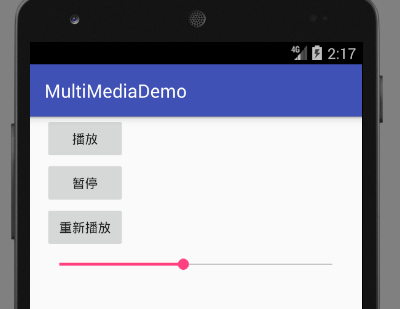

# 多媒体应用开发

Android内置了常见的音频、视频的编解码器，我们只需要调用相关的API就能实现音频、视频的播放，甚至通过麦克风和摄像头进行音频、视频的录制，非常方便。

## 多媒体文件和编码

我们常说的`.mp3`，`.wav`都是多媒体文件格式，这种文件可能既包含音频又包含视频，甚至带有一些脚本，我们可以称他们为“容器”。而编码是指音频和视频真正的压缩编码算法，如H.264，VP8等。同样是一个`.mp4`文件，它们完全可以使用不同的视频压缩编码。如果你得设备恰好只支持其中一种编码算法（可能是由于专利费的问题），如果不了解文件格式和编码的关系，就会觉得有的MP4文件可以播放，有的却不能播放很奇怪。

Android的多媒体文件格式支持：[https://developer.android.com/guide/topics/media/media-formats.html](https://developer.android.com/guide/topics/media/media-formats.html)

幸运的是Android支持了大部分常见的编码和文件格式。

## 使用MediaPlayer播放音频

`MediaPlayer`是Android中用来播放音视频的工具类。它最常用的控制方法有三个：

* start()：开始播放
* stop()：停止播放
* pause()：暂停播放

除此之外，从网络或文件系统加载音视频时，可能需要预先将音频文件缓冲到内存：

* prepare() 同步加载，适合较小的本地文件
* prepareAsync() 异步加载，不会阻塞UI线程，prepare完成事件可以设置监听器

`MediaPlayer`提供了`MediaPlayer.create()`静态方法，可以从资源ID或URI加载多媒体文件，该方法每次都会返回新的MediaPlayer实例。如果程序需要用一个MediaPlayer播放多个多媒体文件，还可以使用`setDataSource()`方法，从文件描述符或URI加载。

除此之外，MediaPlayer还提供了一些事件监听器，这些就不一一列举了，用到时查阅文档即可。

MediaPlayer状态机：


### 音乐播放器例子

下面的音乐播放器例子实现了音乐的播放，暂停，从头播放，和一个seekBar实现的进度条。

```java
package com.ciyaz.multimediademo;

import android.media.MediaPlayer;
import android.support.v7.app.AppCompatActivity;
import android.os.Bundle;
import android.view.View;
import android.widget.SeekBar;

import java.util.Timer;
import java.util.TimerTask;

public class MainActivity extends AppCompatActivity
{
	private SeekBar seekBar;

	private MediaPlayer mediaPlayer;
	private Timer timer;

	@Override
	protected void onCreate(Bundle savedInstanceState)
	{
		super.onCreate(savedInstanceState);
		setContentView(R.layout.activity_main);

		mediaPlayer = MediaPlayer.create(this, R.raw.test_audio);

		seekBar = (SeekBar) findViewById(R.id.sb);
		seekBar.setMax(mediaPlayer.getDuration());
		seekBar.setOnSeekBarChangeListener(new SeekBar.OnSeekBarChangeListener() {
			@Override
			public void onProgressChanged(SeekBar seekBar, int i, boolean b)
			{
			}

			@Override
			public void onStartTrackingTouch(SeekBar seekBar)
			{
			}

			@Override
			public void onStopTrackingTouch(SeekBar seekBar)
			{
				mediaPlayer.seekTo(seekBar.getProgress());
			}
		});
	}

	public void play(View view)
	{
		mediaPlayer.start();
		timer = new Timer();

		TimerTask timerTask = new TimerTask() {
			@Override
			public void run()
			{
				int currentProgress = MainActivity.this.mediaPlayer.getCurrentPosition();
				MainActivity.this.seekBar.setProgress(currentProgress);
			}
		};
		timer.schedule(timerTask, 0, 500);
	}

	public void pause(View view)
	{
		mediaPlayer.pause();
		timer.cancel();
	}

	public void replay(View view)
	{
		mediaPlayer.seekTo(0);
	}
}
```

我们主要关注进度条的实现。这里用一个定时计划任务，每个500ms更新一次seekBar的位置，同时为seekBar设置了拖动监听器，监听“拖动结束”这个事件。为什么不监听“progressChanged”呢？因为代码中也对seekBar进行时时更新，这个更新会反应到这个progressChanged事件上，如果监听此事件，实测seekBar会不停的抖动，声音也会一起抖动，其实`onProgressChanged()`第三个参数可以用来判断该进度改变是不是用户拖动引起的，但还是直接监听“stopTrackingTouch”比较方便。

注：seekBar可以在子线程更新UI，比较方便。

运行效果：



### 使用后台服务的音乐播放器

实际上播放音乐过程中，用户肯定不会一直留在当前Activity，而是会边听音乐边切出去看别的东西。下面例子结合了Service，实现了后台音乐播放，和Activity对Service的绑定、控制以及解绑。用户点击播放后，销毁当前Activity音乐也会在后台播放，重新回到该Activity后，还可以重新取得播放器的控制。

MainActivity.java
```java
package com.ciyaz.multimediademo;

import android.content.ComponentName;
import android.content.Intent;
import android.content.ServiceConnection;
import android.os.IBinder;
import android.support.v7.app.AppCompatActivity;
import android.os.Bundle;
import android.view.View;

public class MainActivity extends AppCompatActivity
{

	private AudioPlayerService audioPlayerService;
	private ServiceConnection serviceConnection;

	@Override
	protected void onCreate(Bundle savedInstanceState)
	{
		super.onCreate(savedInstanceState);
		setContentView(R.layout.activity_main);

		this.serviceConnection = new ServiceConnection() {
			@Override
			public void onServiceConnected(ComponentName componentName, IBinder iBinder)
			{
				AudioPlayerService.AudioPlayerBinder binder = (AudioPlayerService.AudioPlayerBinder) iBinder;
				MainActivity.this.audioPlayerService = binder.getAudioPlayerService();
			}

			@Override
			public void onServiceDisconnected(ComponentName componentName)
			{
				MainActivity.this.audioPlayerService = null;
			}
		};

		//开启Service保证其能长期运行
		Intent intent = new Intent(this,AudioPlayerService.class);
		startService(intent);

		//绑定到该Service
		bindService(intent, serviceConnection, BIND_AUTO_CREATE);
	}

	@Override
	protected void onDestroy()
	{
		super.onDestroy();

		//Activity销毁时解绑服务
		unbindService(serviceConnection);
	}

	public void play(View view)
	{
		audioPlayerService.play();
	}

	public void pause(View view)
	{
		audioPlayerService.pause();
	}

	public void replay(View view)
	{
		audioPlayerService.replay();
	}
}
```

AudioPlayerService.java
```java
package com.ciyaz.multimediademo;

import android.app.IntentService;
import android.app.Service;
import android.content.Intent;
import android.content.Context;
import android.media.MediaPlayer;
import android.os.Binder;
import android.os.IBinder;
import android.support.annotation.Nullable;

public class AudioPlayerService extends Service
{

	private AudioPlayerBinder binder = new AudioPlayerBinder();
	private MediaPlayer mediaPlayer;

	public void play()
	{
		mediaPlayer.start();
	}

	public void pause()
	{
		mediaPlayer.pause();
	}

	public void replay()
	{
		mediaPlayer.seekTo(0);
	}

	@Nullable
	@Override
	public IBinder onBind(Intent intent)
	{
		mediaPlayer = MediaPlayer.create(this, R.raw.test_audio);
		return binder;
	}

	public class AudioPlayerBinder extends Binder
	{
		AudioPlayerService getAudioPlayerService()
		{
			return AudioPlayerService.this;
		}
	}
}
```

上面例子使用的是Service的start&bind状态。有关Service的知识可以参考`Android开发基础/组件-Service`。

### 音效控制

Android提供了一系列AudioEffect工具类，能够实现均衡器，重低音，音场，显示音乐波形等。下面例子最好在实机中调试，以取得最好的效果，模拟器中似乎不起作用。

#### 回声抑制 自动增益控制 噪音抑制

这三个功能用于录音。

* AcousticEchoCanceler 回声抑制，也叫自动回音消除，用于录制音频时消除回声（主要指由电路延时产生的回声信号）。
* AutomaticGainControl 自动增益控制指根据声音强度自动调整引号增益，使得无论大声说话还是小声说话都能听得清。
* NoiseSuppressor 噪音抑制指消除信号噪声。

```java
public void enableAcousticEchoCanceler(View view)
{
  if(AcousticEchoCanceler.isAvailable())
  {
    AcousticEchoCanceler acousticEchoCanceler = AcousticEchoCanceler.create(mediaPlayer.getAudioSessionId());
    acousticEchoCanceler.setEnabled(true);

    Log.v("audioPlayer", "回声抑制已启用");
  }
  else
  {
    Log.v("audioPlayer", "回声抑制不支持");
  }
}
```

这三个功能启用的代码相同，如上面所示。可能有的设备不支持其中某个功能，我们需要使用`isAvailable()`进行判断。

#### BassBoost 重低音控制

重低音其实是指电子音乐里加强音频中的低音部分(100HZ以下，包括次声波，人虽然听不见但综合来看还是有一定效果)。因为人耳对低音是不敏感的，所以需要较强的低音来产生刺激的效果。真正的具备重低音效果的音响设备造价昂贵，而且为了取得震撼的效果，功率都比较大。人耳能够听到约20-20000Hz的声波，现代人普遍上限和下限都达不到这个值（可能是城市环境影响）。安卓手机的扬声器或是耳机可能因为造价和材料原因，也远远发不出20Hz的低音，只有一些高级耳机才能真正获得重低音的效果。

我在我的红米Note上使用原厂耳机测试时，感觉把重低音拉到最大还是有一些效果的。

启用重低音
```java
private void initBassBoost()
{
  final BassBoost bassBoost = new BassBoost(0, mediaPlayer.getAudioSessionId());
  bassBoost.setEnabled(true);

  SeekBar bassBoostSeekBar = (SeekBar) findViewById(R.id.sb_bassboost);
  bassBoostSeekBar.setMax(1000);
  bassBoostSeekBar.setOnSeekBarChangeListener(new SeekBar.OnSeekBarChangeListener() {
    @Override
    public void onProgressChanged(SeekBar seekBar, int progress, boolean fromUser)
    {
      bassBoost.setStrength((short) progress);
    }

    @Override
    public void onStartTrackingTouch(SeekBar seekBar)
    {
    }

    @Override
    public void onStopTrackingTouch(SeekBar seekBar)
    {
    }
  });
}
```

上面代码中使用了一个seekBar配合调节重低音的`strength`值。

#### Equalizer 均衡器

均衡器本来是一种能够分别调节各种频率电信号放大量的电子设备，当然在音频处理中，也可以用软件来实现。通过调节均衡器，能够补偿扬声器和声场的缺陷，使得声音更加真实。通用均衡器只支持几种固定频率的调节。

设置均衡器代码，我不是很懂音频处理，该段代码修改自书上
```java
private void initEqualizer()
{
  final Equalizer equalizer = new Equalizer(0, mediaPlayer.getAudioSessionId());
  equalizer.setEnabled(true);

  //获得均衡器支持的最小值和最大值
  final short minEQLevel = equalizer.getBandLevelRange()[0];
  short maxEQLevel = equalizer.getBandLevelRange()[1];
  //获得均衡器支持的所有频率
  short brands = equalizer.getNumberOfBands();

  LinearLayout layout = (LinearLayout) findViewById(R.id.ll_equalizer);
  for(short i = 0; i < brands; i++)
  {
    //显示频率的TextView
    TextView eqTextView = new TextView(this);
    eqTextView.setLayoutParams(new ViewGroup.LayoutParams(ViewGroup.LayoutParams.MATCH_PARENT, ViewGroup.LayoutParams.WRAP_CONTENT));
    eqTextView.setGravity(Gravity.CENTER_HORIZONTAL);

    //设置均衡器控制的频率
    eqTextView.setText((equalizer.getCenterFreq(i) / 1000) + "Hz");
    layout.addView(eqTextView);

    //创建一个水平排列组件的LinearLayout
    LinearLayout tmpLayout = new LinearLayout(this);
    tmpLayout.setOrientation(LinearLayout.HORIZONTAL);

    //创建显示均衡器最小值的TextView
    TextView minDbTextView = new TextView(this);
    minDbTextView.setLayoutParams(new ViewGroup.LayoutParams(ViewGroup.LayoutParams.WRAP_CONTENT, ViewGroup.LayoutParams.WRAP_CONTENT));
    //显示均衡器最小值
    minDbTextView.setText((minEQLevel / 100) + "dB");

    //创建显示均衡器最大值的TextView
    TextView maxDbTextView = new TextView(this);
    minDbTextView.setLayoutParams(new ViewGroup.LayoutParams(ViewGroup.LayoutParams.WRAP_CONTENT, ViewGroup.LayoutParams.WRAP_CONTENT));
    //显示均衡器最小值
    minDbTextView.setText((maxEQLevel / 100) + "dB");

    //定义seekBar作为调整工具
    SeekBar eqSeekBar = new SeekBar(this);
    LinearLayout.LayoutParams layoutParams = new LinearLayout.LayoutParams(ViewGroup.LayoutParams.MATCH_PARENT, ViewGroup.LayoutParams.WRAP_CONTENT);
    layoutParams.weight = 1;
    eqSeekBar.setLayoutParams(layoutParams);
    eqSeekBar.setMax(maxEQLevel - minEQLevel);
    eqSeekBar.setProgress(equalizer.getBandLevel(i));
    final short brand = i;
    eqSeekBar.setOnSeekBarChangeListener(new SeekBar.OnSeekBarChangeListener() {
      @Override
      public void onProgressChanged(SeekBar seekBar, int progress, boolean fromUser)
      {
        equalizer.setBandLevel(brand, (short) (progress + minEQLevel));
      }

      @Override
      public void onStartTrackingTouch(SeekBar seekBar)
      {
      }

      @Override
      public void onStopTrackingTouch(SeekBar seekBar)
      {
      }
    });

    //用三个组件填充线性布局
    tmpLayout.addView(minDbTextView);
    tmpLayout.addView(eqSeekBar);
    tmpLayout.addView(maxDbTextView);

    layout.addView(tmpLayout);
  }
}
```

#### 音场控制器

音场的概念起源于美国，它的英语为“Sound Stage”，主要是指舞台上乐队的排列位置和形状，包括长、宽、高，是一个三维空间的概念。对于音响器材来说，音场实际上就是指您的器材所再生的乐队所排列的形状。由于受到频率响应曲线分布不均匀以及音箱指向性的影响（比如房间的宽度大于深度或者深度大于宽度），音响所播出来的声场实际上或多或少与原录音时的情形是有差异的。声场技术就是让展现在聆听者面前或环绕四周的那种三维的空间感和录音时尽量一致的技术，是对录音现场、还音系统以及编码、解码的规范。

Android提供了集中预设的音场供我们使用。

```java
private void initPresetReverb()
{
  final PresetReverb presetReverb = new PresetReverb(0, mediaPlayer.getAudioSessionId());
  presetReverb.setEnabled(true);
  final List<Short> reverbNameList = new ArrayList<>();
  List<String> reverbVals = new ArrayList<>();
  for(short i = 0; i < equalizer.getNumberOfPresets(); i++)
  {
    reverbNameList.add(i);
    reverbVals.add(equalizer.getPresetName(i));
  }
  Spinner spinner = (Spinner) findViewById(R.id.sp_presetreverb);
  spinner.setAdapter(new ArrayAdapter<String>(MainActivity.this, android.R.layout.simple_spinner_item, reverbVals));
  spinner.setOnItemSelectedListener(new AdapterView.OnItemSelectedListener() {
    @Override
    public void onItemSelected(AdapterView<?> adapterView, View view, int i, long l)
    {
      presetReverb.setPreset(reverbNameList.get(i));
    }

    @Override
    public void onNothingSelected(AdapterView<?> adapterView)
    {
    }
  });
}
```

上面代码中使用一个Spinner实现了音场的选择。实测时，有些预设音场虽然能显示出名字，但是手机实际上并不支持，选择会报错。

#### 音频示波器 Visualizer

注：实测该API在实机和模拟器上都不好使，返回错误类型为`error -1 未知错误`，暂时无法排错。

报错为：
```
Cannot initialize Visualizer engine, error: -1
```

当前开发平台：LinuxMint17.2（Ubuntu14.04） Java 1.8.0_91 Android Studio 2.3.3 compileSDKVersion 26 buildToolsVersion 26.0.0 minSDKVersion 16 targetSDKVersion 26

运行平台：模拟器 Android 4.4.2 实机 Android 4.4.4

代码参考书上P505。

## 使用SoundPool播放短音效

MediaPlayer资源占用高，不支持多个音频同时播放，因此适合做音乐播放器，而开发中常常需要大量短音效，尤其是游戏程序，这时可以使用SoundPool。下面直接看一个使用SoundPool的例子。

```java
package com.ciyaz.multimediademo;

import android.media.AudioManager;
import android.media.SoundPool;
import android.support.v7.app.AppCompatActivity;
import android.os.Bundle;
import android.view.View;

import java.util.HashMap;
import java.util.Map;

public class SoundPoolActivity extends AppCompatActivity
{

	private Map<Integer, Integer> soundMap = new HashMap<>();
	private SoundPool soundPool;

	@Override
	protected void onCreate(Bundle savedInstanceState)
	{
		super.onCreate(savedInstanceState);
		setContentView(R.layout.activity_sound_pool);

		initSoundPool();
	}

	private void initSoundPool()
	{
		soundPool = new SoundPool(3, AudioManager.STREAM_NOTIFICATION, 0);
		soundMap.put(1, soundPool.load(this, R.raw.sound1, 1));
		soundMap.put(2, soundPool.load(this, R.raw.sound2, 1));
		soundMap.put(3, soundPool.load(this, R.raw.sound3, 1));
	}

	public void sound1(View view)
	{
		soundPool.play(soundMap.get(1), 1, 1, 0, 0, 1);
	}
	public void sound2(View view)
	{
		soundPool.play(soundMap.get(2), 1, 1, 0, 0, 1);
	}
	public void sound3(View view)
	{
		soundPool.play(soundMap.get(3), 1, 1, 0, 0, 1);
	}
}
```

首先初始化`SoundPool`，构造器第一个参数是音频文件个数，第二个参数是音频类型，第三个参数暂时没有用，使用0即可。

音频类型参数可以指导SonndPool选择最优化的工作模式，可选类型：
```
STREAM_ALARM        The audio stream for alarms
STREAM_DTMF         The audio stream for DTMF Tones
STREAM_MUSIC        The audio stream for music playback
STREAM_NOTIFICATION The audio stream for notifications
STREAM_RING         The audio stream for the phone ring
STREAM_SYSTEM       The audio stream for system sounds
STREAM_VOICE_CALL   The audio stream for phone calls
```

加载音频：
```java
int load(Context context, int resId, int priority)
```

注意加载音频返回值是音频ID，引用音频我们需要一个资源ID（resID），我们自己使用音频一般都需要自定义一个ID，比如音频1，音频2...这三个ID不要搞混。我们可以用一个HashMap把自定义的ID和音频ID关联起来，这样引用时比较方便。

播放音频：
```java
int play(int soundID, float leftVolume, float rightVolume, int priority, int loop, float rate)
```

参数分别是音频ID，左声道音量（0.0-1.0），右声道音量，优先级（全部取0即可），是否循环播放（0不循环，-1永远循环），播放速率（可选0.5,1,2）。

注：实际上使用构造器创建SoundPool已经`deprecated`了，但是新的API要求运行的 `minSDKVersion > 21` (Android 5.0)，现阶段这是不可能做到的。

## 使用VideoView播放视频

Android封装了一个VideoView可以直接用来播放视频，非常方便。下面直接看播放视频的例子。

```java
package com.ciyaz.multimediademo;

import android.support.v7.app.AppCompatActivity;
import android.os.Bundle;
import android.widget.MediaController;
import android.widget.VideoView;

public class VideoViewActivity extends AppCompatActivity
{

	@Override
	protected void onCreate(Bundle savedInstanceState)
	{
		super.onCreate(savedInstanceState);
		setContentView(R.layout.activity_video_view);

		//内置的播放控制界面
		MediaController mediaController = new MediaController(this);

		//初始化VideoView
		VideoView videoView = (VideoView) findViewById(R.id.vv_main);
		videoView.setVideoPath("/storage/sdcard1/video.mp4");
		videoView.setMediaController(mediaController);
		mediaController.setMediaPlayer(videoView);
		//使VideoView获取焦点
		videoView.requestFocus();

	}
}
```

注意添加读取SD卡权限：<uses-permission android:name="android.permission.READ_EXTERNAL_STORAGE"/>

运行效果：


为了显示效果，可以让Activity全屏横屏(landscape)显示，将父布局设为黑色背景。图中就比较简略了。除此之外，如果Activity销毁，现在也没法记住播放进度，所以可改进的地方还有很多。

注：MediaController会自动隐藏，所以截图没有截上。只要一触摸VideoView，MediaController就能显示出来。

除了使用VideoView，还可以直接使用MediaPlayer和SurfaceView进行视频播放，这里就不介绍了。
