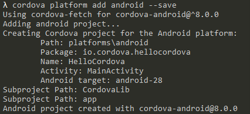
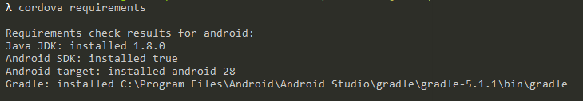
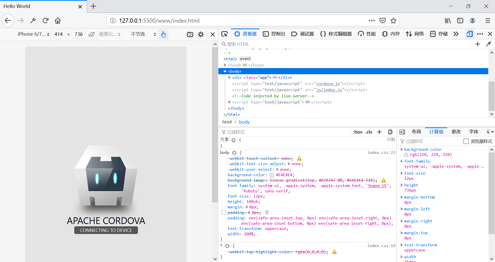
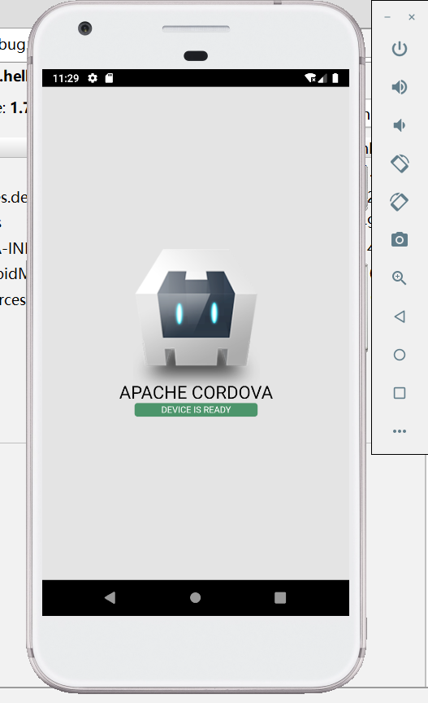

# Cordova简介和环境搭建

随着JavaScript生态的发展，Web技术栈变得越来越庞大，技术普及程度高而且开发者众多。而在客户端领域如果使用原生技术开发，如Android就需要专门的Java和Android框架的工程师，移植到IOS还要另外一波人再写一套代码，从想法到产品的这个过程会耗费更多的人力物力，不符合互联网的趋势。在这种情况下，诞生了很多能让我们使用Web技术栈开发客户端应用的技术，比如Electron（桌面端）和Cordova（移动端）。

Cordova能够让我们用Web相关的技术开发移动端APP，说白了其实就是给网页套一层Webview，工程可以打包为APK（Android下）发布到应用商店给用户安装，而且最大的好处是在Android/IOS平台上不用写两份一样功能的代码，节省了宝贵的时间。

这里我们就简单了解一下Cordova这个技术，由于我不喜欢苹果公司的产品，因此后续内容都是以Android平台为例。

## 工程创建

首先我们要确保JDK和Android SDK已经正确安装，并正确配置了环境变量。针对JDK，目前我们还是需要JDK8，最新版本的JDK11是无法兼容的。针对Android SDK，要注意我们要配置好SDK目录的`ANDROID_HOME`，并把SDK目录中`tools`和`platform-tools`加入环境变量。除此之外，既然是基于Web的技术栈，我们肯定要安装好Node，这里就不多介绍了。

安装Cordova：
```
npm install -g cordova
```

创建项目：
```
cordova create <项目名>
```



我们看到这里默认使用的是API28，我们在Android Studio的SDK Manager中需要安装有对应的版本。

添加Android平台支持：
```
cordova platform add android --save
```

检查开发组件是否安装完全：
```
cordova requirements
```



## 开发环境设置

开发环境并不需要什么特别的设置，和Web开发一样，一般使用VSCode就可以了，开发时可以用Live Server插件进行预览和热更新。



## 构建APK

```
cordova build android
```

构建结果位于`platforms\android\app\build\outputs\apk\debug`，我们可以把生成的APK用AVD运行观察效果。


