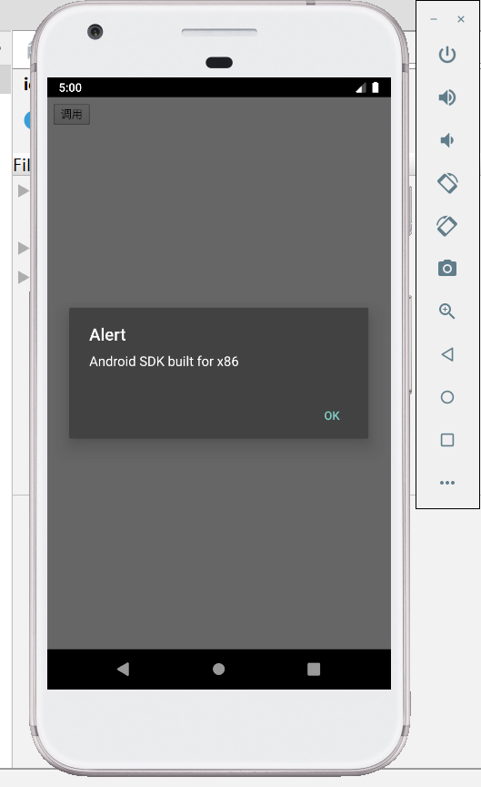

# 插件的使用

前面说过，Cordova的作用其实就是把网页封装成APP，但是我们知道APP相比Web应用，最大的优势就是能够很方便的调用一些原生接口，而浏览器平台需要靠谱通用性和安全性，很多原生功能是无法做到的。Cordova中，调用原生接口比较方便的途径是使用已经写好的插件，这些插件其实就是把原生接口注入JavaScript引擎供WebView中的页面调用，而且它们是跨平台的。

我们这里以Device插件为例，简单介绍如何在Cordova中使用插件。

## 安装插件

Device插件能够获取一些系统、硬件相关的信息，其实没什么实际用处，我们这里仅仅是用作演示，下面是该插件的文档。

[Device插件文档](https://cordova.apache.org/docs/en/latest/reference/cordova-plugin-device/index.html)

安装插件非常简单：

```
cordova plugin add cordova-plugin-device --save
```

安装好后，我们可以在项目的`plugins`目录看到多出一些文件来，其中就是该插件的源码。

## cordova.js

这里有一个比较坑的地方，默认创建工程的`index.html`中没有提到`cordova.js`，插件文档中也没有说明。我们的`index.html`或是任何需要调用插件API的页面必须引入`cordova.js`，否则插件API是无法注入的。

```html
<script src="cordova.js"></script>
```

## 调用插件

据文档所说，Device插件会注册一个全局对象`device`，我们调用它就可以获得各种各样的信息。由于我们仅仅是测试，这里直接把JavaScript代码放在HTML中：

index.html
```html
<body>
    <button onclick="foo()">调用</button>
    <script>
        function foo() {
            alert(device.model);
        }
    </script>
</body>
```

## 运行


