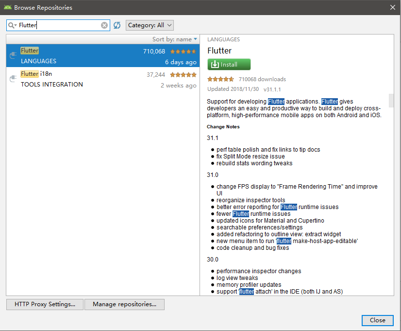
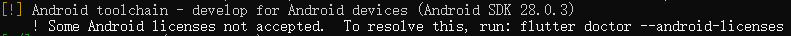
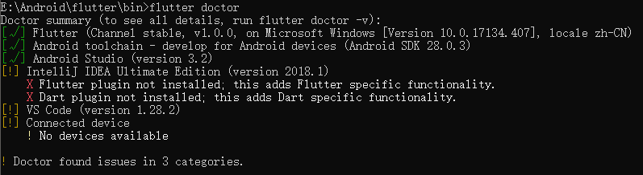
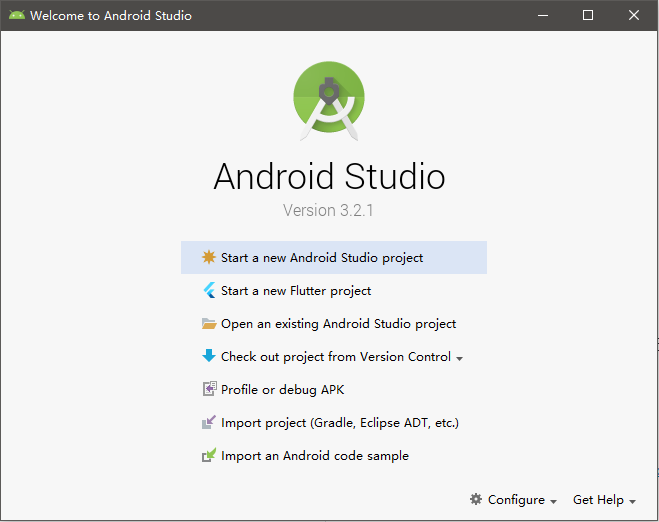
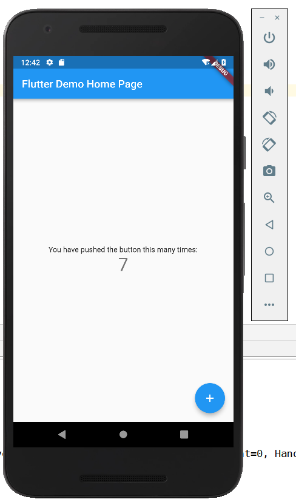
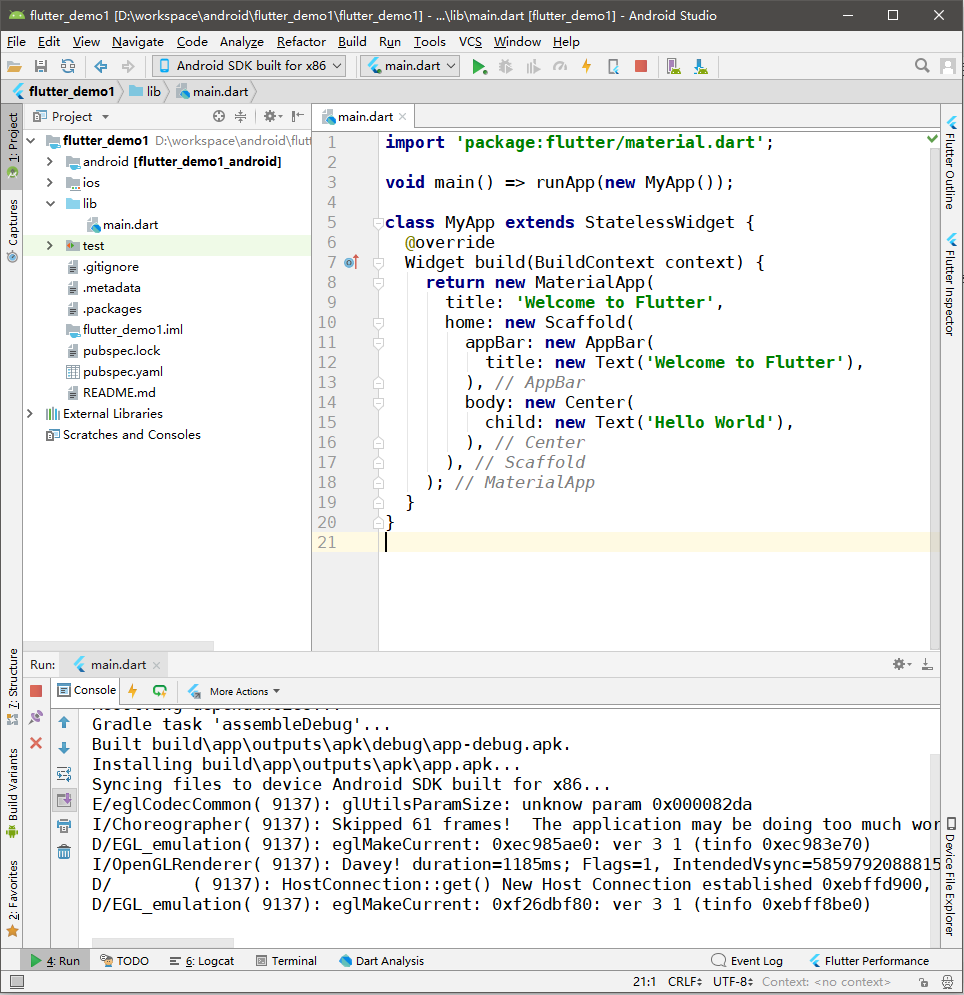
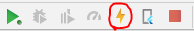
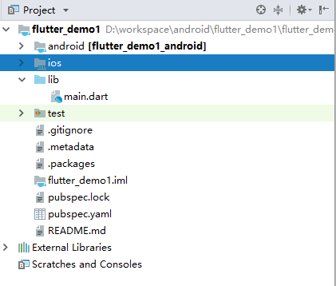

# Flutter简介和环境搭建


Flutter是谷歌推出的一款移动端图形界面开发框架，用于构建跨平台（Android、IOS）的GUI应用程序，目前（2018年11月）已经推出了v1.0版本，受到了广泛的关注。

Flutter的优点：

1. 开发者使用Dart语言，其能编译为原生代码，而不是组件映射或是利用WebView渲染，因此理论上性能比同类技术稍好
2. 自带Android Material风格和IOS Cupertino风格主题控件
3. Android Studio为Flutter框架提供完整的支持

Flutter的缺点：

1. Flutter的嵌套代码可读性极差，写成后极难修改，不利于代码后期维护
2. 糟糕的布局设计，Flutter的布局是基于组件的，复杂布局需要大量组件嵌套和组件的参数设定
3. 没有一个页面设计工具（能够预览和拖拽组件），对设计人员不利
4. 虽然Dart和Java/JavaScript大部分很像，但是开发人员依然不得不花精力学习一下这个冷门语言的其余部分
5. 尽管Flutter和React很像，但是前端开发人员依然必须花大力气学习Android/IOS原生应用开发的知识，否则很难使用Flutter完整的做出实际产品
6. Flutter和React Native一样，离原生开发框架所能实现的功能差的还是非常远的，实际开发中依然要熟悉两个平台，编写两套代码，以实现比较基础的功能（除非你的应用极其简单，或者只有纯业务逻辑）
7. Dart是个相对冷门的语言，生态和流行的语言差距太大

Flutter的同类技术：

1. React native
2. Cordova + AngularIonic等Web技术

尽管Flutter有诸多缺点，但是目前Flutter还非常年轻，许多最初很垃圾的设计比如PHP、JavaScript，发展至今虽然不能说完美，甚至还有许多历史遗留问题，但是依然取得了很大的成功。此外，Flutter参考了诸多同类技术的特点进行设计，因此Flutter是一个相当现代化的UI框架，值得我们体验一下。

本系列笔记参考Flutter官方的教程，前置知识为Android开发相关的内容（因为会用到Android Studio，还会涉及很多相关的概念），此外如果你用过React等前端组件化框架，学习Flutter会非常轻松。

## Flutter环境搭建

我们这里基于Android Studio进行开发，因此需要先准备好最新版的Android Studio，以及Android SDK、AVD等相关组件，并配置好环境变量，这些配置可以参考`Android开发基础`相关章节的内容。

在Android Studio中安装Flutter框架和Dart语言的插件。



下载FlutterSDK，地址：[https://flutter.io/docs/development/tools/sdk/archive#windows](https://flutter.io/docs/development/tools/sdk/archive#windows)，下载得到一个zip压缩包（Linux是.tar.xz），解压后将`你的FlutterSDK目录\flutter\bin`加入环境变量中。

我们可以在cmd（或终端）中运行`flutter doctor`，该命令会检查我们还缺什么环境没有配置，这里我们发现还要手动同意一些License，如下图。



执行`flutter doctor --android-licenses`，选择`y`同意条款，选择`n`拒绝。再次执行`flutter doctor`后，我们会发现我们需要的组件已经安装完成了。



## “试驾”Flutter

这里我们使用Android Studio开发工具，可以直接选择创建一个Flutter工程，创建的流程和Android Java工程基本一样的。



工程为我们默认创建了一个源代码文件，它在`lib/main.dart`下，我们可以开启AVD运行一下。



编写一个Hello,world程序：

```javascript
import 'package:flutter/material.dart';

void main() => runApp(new MyApp());

class MyApp extends StatelessWidget {
  @override
  Widget build(BuildContext context) {
    return new MaterialApp(
      title: 'Welcome to Flutter',
      home: new Scaffold(
        appBar: new AppBar(
          title: new Text('Welcome to Flutter'),
        ),
        body: new Center(
          child: new Text('Hello World'),
        ),
      ),
    );
  }
}
```

我也不是很熟悉Dart语言，这里根据官方教程对代码做出几个说明：

1. `void main() => runApp(new MyApp())`：这是Dart中对单行函数的简写，和JavaScript的Lambda表达式写法差不多。
2. `MaterialApp`：上面代码创建了一个Material Design风格的APP，Flutter内置提供了一套Material Design组件。
3. `Widget build(BuildContext context);`：这个函数比较像React的`render()`，只不过里面不是JSX，而是嵌套定义的组件对象。
4. `StatelessWidget`：我们知道React有“无状态组件”，这里是一个意思，就是不维护状态的组件，它的状态数据可能由父组件维护，也可能没有任何状态数据，仅仅展示静态的内容。
5. `Scaffold`：这是一个Material组件，观察它的属性我们就会发现，这个Scaffold组件就是一个应用页面的“大框”，里面包含着appBar、body应用主体组件树等内容。
6. `Center`：这居然也是一个Widget，用途是将内部的Text组件对齐到屏幕中心。在Flutter中，一切都是Widget，布局也是。

注意，下面图中你会发现行尾会有几个注释，这是编辑器自动给加上的，并不属于源码文本，且无法删除，我很不习惯这种注释，想删除却不行还以为出bug了，这个垃圾设计不得不吐槽一下。



编写代码的时候，可以点击热部署按钮进行预览：



## Flutter工程目录结构



* android：Android平台的原生代码，如果我们有些功能必须用原生代码实现，可以写在这里
* ios：IOS平台的原生代码
* lib：Flutter的Dart源代码，我们主要编写的内容在这里
* test：测试代码
* pubspec.yaml：项目描述文件，相当于npm的package.json，我们依赖的Dart包可以在这里添加，然后在该文件上`右键->Flutter->Flutter Packages Get`
