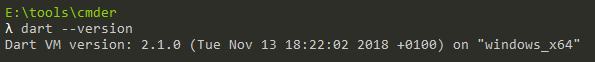
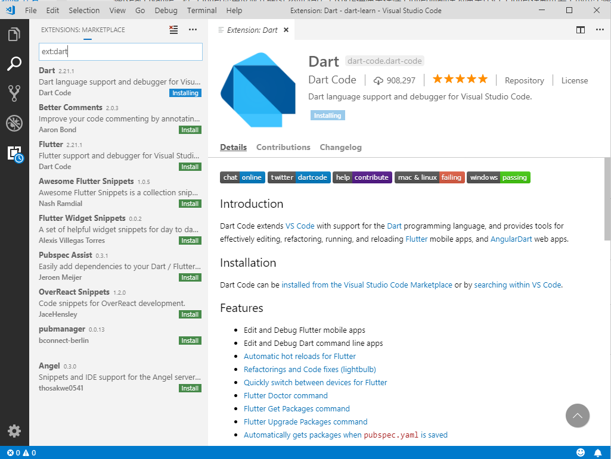

# Dart语言快速入门

Dart语言是Google开发的一款面向对象的强类型语言，它试图取代JavaScript，Google曾经尝试在Chrome中嵌入DartVM，但是随着JavaScript像坐了火箭一样快速发展，开发者并不买账Dart，最终Dart像CofeeScript、TypeScript一样，沦为了JavaScript开发者的另一种可选项，在前端开发中Dart可以编译为JavaScript，现在Dart基本已经凉凉。

但是，Google新出的这个Flutter是基于Dart的，这里我们就简单学习一下这个Dart语言。学习Dart前，默认你已经对Java和JavaScript这两门语言非常熟悉了，Dart语言类似这两个语言的结合体。

## 安装DartSDK

要使用Dart，我们需要安装DartSDK，就像Java开发需要JDK一样。以Windows系统为例，在下面链接中，找到`Install Wizard`，其中包含DartVM、dart2js编译器、pub包管理工具等，下载安装完成后，会自动配置好环境变量。

[https://webdev.dartlang.org/tools/sdk](https://webdev.dartlang.org/tools/sdk)



## 代码编辑器

我们可以选择Visual Studio Code编辑Dart代码，但是需要安装一个Dart插件。



## 入口函数

和C语言一样，Dart需要一个`main()`入口函数：

```javascript
void main() {
  print("Hello, world!");
}
```

```
PS D:\workspace\dart-learn> dart demo1.dart
Hello, world!
```

Flutter中也一样，每个应用必须有一个入口点`main()`。

## 打印到控制台

Dart使用`print()`函数进行打印输出，和Java一样，这个操作会默认调用参数的`toString()`方法。

```
print(Object object) → void
```

`print()`可以使用变量占位符：

```javascript
void main() {
  String name = "Tom";
  print("Hello, my name is $name");
}
```

## 静态类型

Dart是静态类型语言，但是支持类型推断，我们要合理使用类型推断，避免导致代码可读性变差。

下面代码中，我们使用`var`定义了变量，但是Dart可以自动将name变量的类型推断为`String`，我们可以使用`is`操作符检查一个变量的类型：

```javascript
void main() {
  var name = "Tom";
  print(name is String);
}
```

输出结果为`true`。

Dart中，未初始化的对象值为`null`，但在Java中这会直接报错。

```javascript
void main() {
  var name;
  print(name);
}
```

输出结果为`null`。

注：在Android Studio中实际使用Flutter时，如果将变量初始化为`null`，会报一个语法警告`Don't explicitly initialize variables to null`，Dart官网的“Effective Dart”中是这么解释的：
```
In Dart, a variable or field that is not explicitly initialized automatically gets initialized to null. This is reliably specified by the language. There’s no concept of “uninitialized memory” in Dart. Adding = null is redundant and unneeded.

Dart语言中没有未初始化内存这个概念，添加 = null是多余的而且不必要的
```
[https://www.dartlang.org/guides/language/effective-dart/usage#dont-explicitly-initialize-variables-to-null](https://www.dartlang.org/guides/language/effective-dart/usage#dont-explicitly-initialize-variables-to-null)

这个特性就比较诡异了，不符合一般人的习惯，我们还是显示初始化一下比较好，然而Android Studio中似乎没法把语法检查关掉，但也不影响我们写代码。

## 布尔类型和判断

Dart是强类型语言，因此`if()`等语句的表达式结果必须是`bool`类型，像`if(1)`这种写法是不允许的。在Dart中，只有布尔值`true`被视为true，注意和JavaScript进行区别。显然，JavaScript中各种奇奇怪怪的类型转换是极其糟糕的设计。

```javascript
void main() {
  if(true) {
    print("true");
  }
}
```

输出结果为`true`。

## 函数

Dart中定义函数和类C语法的语言写法都一样：

```javascript
int add(int i, int j) {
  return i + j;
}

void main() {
  print(add(1, 2));
}
```

输出结果为`3`。

注意Dart是强类型语言，但因为可以类型推断，你可以不写明函数的返回值，然而你最好不要那么做，指定其参数和返回值的类型，以免调用函数时感到迷惑。

省略函数的参数和返回值类型（不要这么做）：
```javascript
add(i, j) {
  return i + j;
}
```

上面的`add`函数还可以简化，类似JavaScript的箭头函数：
```javascript
int add(int i, int j) => i + j;
```

箭头函数可以用来创建匿名函数：
```javascript
void main() {
  List arr = [1, 2, 3];
  arr.forEach((i) => print(i.toString()));
}
```

然而箭头函数创建的匿名函数并不支持大括号实现多行，我们只能这样写：
```javascript
void main() {
  List arr = [1, 2, 3];
  arr.forEach((i) {
    print("aaa");
    print(i.toString());
  });
}
```

## 类定义

下面例子定义了一个`Student`类，并覆盖了其`toString()`方法。

```javascript
class Student {
  Student(String name, int age) {
    this.name = name;
    this.age = age;
  }

  @override
  String toString() {
    return "{name: " + name + ", age: " + age.toString() + "}";
  }

  String name;
  int age;
}

void main() {
  Student tom = new Student("Tom", 12);
  print(tom);
}
```

构造函数可以进一步简化：
```javascript
Student(this.name, this.age);
```

`new`关键字可以省略，注意，Dart和C/C++不同，省略`new`仅仅是一种简单写法，而不是创建“栈上对象”。

```javascript
void main() {
  // 看起来比较诡异，我们不要这样写
  Student tom = Student("Tom", 12);
  print(tom);
}
```

## 解构赋值

Dart支持类似JavaScript的解构赋值，能够优化函数调用时的传参方式：

```javascript
void printStudent({String firstName, String lastName}) {
  print("Hello, I am $firstName·$lastName");
}

void main() {
  printStudent(firstName: "Tom", lastName: "Baker");
}
```

## 模块化

所有`.dart`源代码文件中，函数、类都是默认导出的，我们可以使用`import`语法进行导入。

```javascript
import "demo1.dart";

void main() {
  foo();
}
```

Dart中没有什么访问控制修饰符，约定上我们使用下划线`_`开头的命名的函数名、类名或成员变量代表它是私有的，不应该被直接访问的。

## 异步编程

JavaScript的ES7中有async/await写法，Dart借鉴了这一写法。Dart中有一个Future对象（类似JavaScript的Promise），我们同样也可以使用async/await写法。

```javascript
Future<String> foo() {
  return Future.delayed(const Duration(seconds: 3), () => "Hello, world!");
}

void asyncDemo() async {
  String str = await foo();
  print(str);
}

void main() {
  asyncDemo();
}
```
