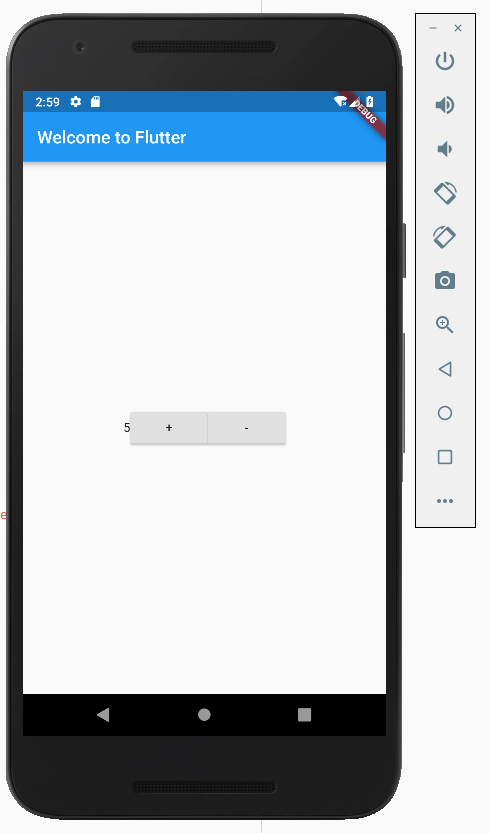

# Widget组件

Flutter中，组件分为无状态组件`StatelessWidget`和有状态组件`StatefulWidget`，我们编写的自定义组件都是继承于这两个类的。

* `StatelessWidget`：组件不维护状态信息
* `StatefulWidget`：组件维护状态信息，用户交互会触发状态数据的改变，状态数据改变会反映到图形界面上

编写Flutter程序时，我们要记住，Flutter中所有的东西都是组件，按钮、文本、甚至布局等都是组件，这和React差不多，用法也差不多。

## 无状态组件

下面是一个无状态组件的例子，它仅仅是展示一个`Hello World`字符串。

```javascript
import 'package:flutter/material.dart';

void main() => runApp(new MyApp());

class MyApp extends StatelessWidget {
  @override
  Widget build(BuildContext context) {
    return new MaterialApp(
      title: 'Welcome to Flutter',
      home: new Scaffold(
        appBar: new AppBar(
          title: new Text('Welcome to Flutter'),
        ),
        body: new Center(
          child: new Text('Hello World'),
        ),
      ),
    );
  }
}
```

静态组件有一个`build()`方法，返回值是另一个组件（或组件树）。

## 有状态组件

下面例子是一个经典的“计数器”，点击`+`按钮，数字加一，点击`-`按钮，数字减一。

```javascript
import 'package:flutter/material.dart';

void main() => runApp(new MyApp());

class MyApp extends StatelessWidget {
  @override
  Widget build(BuildContext context) {
    return new MaterialApp(
      title: 'Welcome to Flutter',
      home: new Scaffold(
        appBar: new AppBar(
          title: new Text('Welcome to Flutter'),
        ),
        body: new Center(
          child: new Counter(),
        ),
      ),
    );
  }
}

class Counter extends StatefulWidget {
  @override
  createState() => new CounterState();
}

class CounterState extends State<Counter> {
  int count = 0;

  void increase() {
    print("increase");
    setState(() {
      count++;
    });
  }

  void decrease() {
    print("decrease");
    setState(() {
      count--;
    });
  }

  @override
  Widget build(BuildContext context) {
    return new Center(
      child: new Row(
        mainAxisAlignment: MainAxisAlignment.center,
        children: <Widget>[
          new Text(count.toString()),
          new RaisedButton(
            onPressed: increase,
            child: new Text("+"),
          ),
          new RaisedButton(
            onPressed: decrease,
            child: new Text("-"),
          )
        ],
      ),
    );
  }
}
```

上面代码乍一看就比较复杂了，实际上我也感觉Flutter的可读性比较差，各种括号嵌套。

`MyApp`是一个无状态组件，它的功能就是一个框，容纳我们编写的组件树实现的应用业务逻辑，我们真正编写的东西实际上是`Scaffold`内`body`中的内容。`Counter`是我们定义的一个有状态组件，Flutter中有状态组件和状态类是分离的，状态类需要继承`State<>`。

修改状态：和React一样，我们必须使用`setState()`来修改状态数据，这会触发界面上状态数据对应的页面效果的更新，它的参数是一个匿名函数，我们在里面操作了`count`成员变量

`RaisedButton`是按钮组件，它的构造函数的第一个参数`onPressed`是一个回调函数，我们将其指定为`increase`和`decrease`，`child`参数则是按钮上显示的文字。

运行结果：



## 组件的构造函数

### 实现父子组件之间的数据传递

使用React时我们知道，组件有state和props，Flutter的组件构造函数就相当于`props`，父组件可能维护了一些状态信息，并通过构造函数将状态数据传递给了子组件，那么当父组件中该状态信息更新时，子组件中对应的数据也会更新。有了“props”，那么父子组件之间的方法调用当然也就是可以实现的了。

我们改进一下上面计数器的例子，将计数用的`Text`组件再包装一层，效果和上面是完全一样的。

父组件：
```javascript
class CounterState extends State<Counter> {
  int count = 0;

  void increase() {
    print("increase");
    setState(() {
      count++;
    });
  }

  void decrease() {
    print("decrease");
    setState(() {
      count--;
    });
  }

  @override
  Widget build(BuildContext context) {
    return new Center(
      child: new Row(
        mainAxisAlignment: MainAxisAlignment.center,
        children: <Widget>[
          // 这里实例化子组件
          new NumText(
            text: count.toString(),
          ),
          new RaisedButton(
            onPressed: increase,
            child: new Text("+"),
          ),
          new RaisedButton(
            onPressed: decrease,
            child: new Text("-"),
          )
        ],
      ),
    );
  }
}
```

子组件：
```javascript
class NumText extends StatelessWidget {
  NumText({this.text});

  final String text;

  @override
  Widget build(BuildContext context) {
    return new Text(text);
  }
}
```

### 实现父子组件之间的方法调用

这里我们再次修改上面计数器的例子，把按钮封装成为一个子组件。

父组件：
```javascript
class CounterState extends State<Counter> {
  int count = 0;

  void increase() {
    print("increase");
    setState(() {
      count++;
    });
  }

  void decrease() {
    print("decrease");
    setState(() {
      count--;
    });
  }

  @override
  Widget build(BuildContext context) {
    return new Center(
      child: new Row(
        mainAxisAlignment: MainAxisAlignment.center,
        children: <Widget>[
          new NumText(
            text: count.toString(),
          ),
          // 这里实例化子组件
          new IncreaseButton(
            onPress: increase,
          ),
          new RaisedButton(
            onPressed: decrease,
            child: new Text("-"),
          )
        ],
      ),
    );
  }
}
```

子组件：
```javascript
class IncreaseButton extends StatelessWidget {
  IncreaseButton({this.onPress});

  final VoidCallback onPress;

  @override
  Widget build(BuildContext context) {
    return RaisedButton(
      onPressed: this.onPress,
      child: new Text("+"),
    );
  }
}
```

注意：子组件中，`onPress`是`VoidCallback`类型，Dart是一种强类型语言，但是不同于Java蹩脚的回调设计，Dart提供了像`VoidCallback`这种类型，它代表没有返回值的回调函数。

## Widget的生命周期

这里我们主要了解一下`StatefulWidget`的生命周期。

### initState

组件初始化。我们可以在这里编写组件初始化相关的代码，比如初始化状态数据。

### didChangeDependencies

组件的状态数据改变的时候回调。

### didUpdateWidget

组件状态改变时回调。

### deactivate

dispose之前回调。

### dispose

组件销毁时回调。我们一般在这里编写组件销毁时，需要进行的操作。
