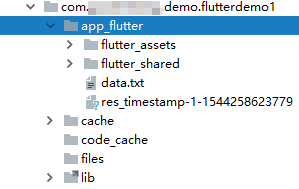

# 文件IO

Flutter是一个跨平台的框架，但文件IO属于相对底层的功能，好在Flutter中有现成的库可供我们使用。

## Android中的应用目录结构

这里我们简单复习一下Android中，开发应用时我们都关注哪些目录：

* 应用目录：`/data/data/包名/`，每个应用都有一个应用目录，存储该应用的所有数据，一个应用只对自己的应用目录有访问权限
  * SharedPreferences：位于`应用目录/shared_prefs/`，Android中类似Java平台下`.properties`文件的地位，主要保存一些简单的配置信息
  * 缓存目录：位于`应用目录/cache/`，它存储的都是可以随时删除的临时文件
* 外置存储：历史原因，老式手机具有外置闪存卡，因此具有外置存储这么一个目录，它相当于Windows电脑的D盘、E盘等非系统盘，在新款手机中，外置存储并不是一个物理存储器或是磁盘分区，只是一个和内置存储共用空间的目录（你熟悉Linux的话就知道我在说什么了）

在Flutter下也是一样的，尽管我们可以编写原生代码然后通过Dart进行调用，但是已经有库帮我们把这些操作封装好了。

## Flutter读写文件

### 需要的库

* `PathProvider`：该库封装了移动端平台的文件目录，Flutter是跨平台的，因此在Android和IOS上，目录结构不一样，但是这个库屏蔽了这些底层知识
* `dart:io`：该库能够操作文件

添加在`dependencies`下添加`path_provider`依赖：
```yaml
dependencies:
  flutter:
    sdk: flutter
  path_provider:
```

添加完成后，点击`Packages Get`，依赖会自动下载。

### 读写文件例子代码

下面例子中，演示和如何写入文件和读取文件，文件位于应用目录中。

```javascript
import 'dart:io';
import 'dart:async';
import 'package:flutter/material.dart';
import 'package:path_provider/path_provider.dart';

void main() => runApp(new MyApp());

class MyApp extends StatelessWidget {
  @override
  Widget build(BuildContext context) {
    return new MaterialApp(
      title: "文件IO测试",
      home: new Scaffold(
        appBar: new AppBar(
          title: new Text("文件IO测试"),
        ),
        body: new IoDemoPage(),
      ),
    );
  }
}

class IoDemoPage extends StatefulWidget {
  @override
  State<StatefulWidget> createState() {
    return new IoDemoPageState();
  }
}

class IoDemoPageState extends State<IoDemoPage> {
  String _data = "123";

  void _writeDataToFile() async {
    File f = await _getLocalFile();
    await f.writeAsString("hello");
  }

  void _readDataFromFile() async {
    File f = await _getLocalFile();
    String content = await f.readAsString();
    setState(() {
      this._data = content;
    });
  }

  Future<File> _getLocalFile() async {
    String dir = (await getApplicationDocumentsDirectory()).path;
    return new File('$dir/data.txt');
  }

  @override
  Widget build(BuildContext context) {
    print(this._data);
    return new Column(
      children: <Widget>[
        new Text(this._data),
        new RaisedButton(
          onPressed: _writeDataToFile,
          child: new Text("写入文件"),
        ),
        new RaisedButton(
          onPressed: _readDataFromFile,
          child: new Text("读取文件"),
        )
      ],
    );
  }
}
```

我们可以打开Android Studio的`Device File Explorer`功能，查看我们写入的文件`data.txt`在哪里：



### 操作SharedPreferences

实际上，操作SharedPreferences也有封装好的库，我们可以在包管理器中添加`shared_preferences`依赖，这里就不具体演示其操作了。

### 操作Sqlite数据库

我们在Android开发中，Sqlite数据库是很常用的，Flutter也具有该功能的封装库，依赖是`sqflite`，API和Android原生框架大致相同，这里就不多演示了，注意Flutter中大量应用了`async/await`异步写法，不熟悉的同学不要把自己搞蒙了。
