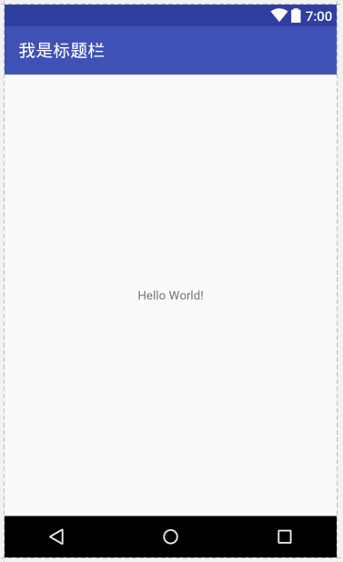

# Activity去掉标题

Android Studio默认创建的Activity有一个标题栏，它叫做ActionBar，我们有时候需要Activity全屏显示，比如Splash页面，这时就需要去掉这个ActionBar。


## 无效的方法1 设置Activity无标题栏

```java
@Override
protected void onCreate(Bundle savedInstanceState)
{
  super.onCreate(savedInstanceState);
  requestWindowFeature(Window.FEATURE_NO_TITLE);
  setContentView(R.layout.activity_main);
}
```

使用`requestWindowFeature(Window.FEATURE_NO_TITLE)`，可以要求Activity隐藏标题栏（TitleBar）。注意`requestWindowFeature()`必须在`setContentView()`之前调用，否则会报错。

但是，新版的AndroidStudio该方法已经不好使了。因为现在我们创建的Activity会使用默认的AppCompat主题，且我们的Activity继承AppCompatActivity，它默认隐藏TitleBar，显示ActionBar。此情况下，如果把继承的`AppCompatActivity`改成`Activity`，默认主题下就根本没有TitleBar，无需设置。但是我们不应该这样做，`AppCompatActivity`提供了更多的兼容新特性。

## 有效的方法2 设置Activity的无标题style

AndroidManifest.xml
```xml
<activity android:name=".MainActivity" android:theme="@style/Theme.AppCompat.Light.NoActionBar">
  <intent-filter>
    <action android:name="android.intent.action.MAIN"/>

    <category android:name="android.intent.category.LAUNCHER"/>
  </intent-filter>
</activity>
```

我们为这个Activity单独设置了`android:theme="@style/Theme.AppCompat.Light.NoActionBar"`，注意我们现在因为使用了`AppCompatActivity`，因此只能使用`AppCompat`系列的theme，使用其他theme会报错，这样ActionBar就成功隐藏了。

注意：ActionBar是Android3.3提出的，实际上TitleBar只能表示一个应用图标和应用标题，ActionBar在TitleBar基础上，可以加上按钮控件，用来支持额外的功能。
