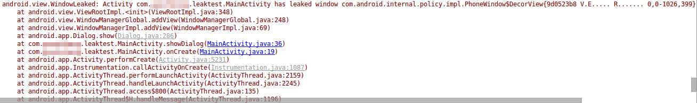

# WindowLeaked

开发过程中，偶然发现了这个错误，报错如图：



经过查阅资料，发现了导致这种错误的原因，这里记录一下。

## 原因

当一个Activity的弹出窗口没有被调用`dismiss()`，该Activity就被销毁时，就会出现这个WindowLeaked（窗体泄露）。下面使用代码模拟一下这个现象：

```java
package com.ciyaz.leaktest;

import android.content.DialogInterface;
import android.support.v7.app.AlertDialog;
import android.support.v7.app.AppCompatActivity;
import android.os.Bundle;

import java.util.Timer;
import java.util.TimerTask;

public class MainActivity extends AppCompatActivity
{

	@Override
	protected void onCreate(Bundle savedInstanceState)
	{
		super.onCreate(savedInstanceState);
		setContentView(R.layout.activity_main);
		showDialog();
		autoCloseActivity();
	}

	private void showDialog()
	{
		//创建一个对话框
		AlertDialog.Builder builder = new AlertDialog.Builder(this);
		AlertDialog alertDialog = builder
				.setTitle("测试Dialog")
				.setPositiveButton("退出", new DialogInterface.OnClickListener() {
					@Override
					public void onClick(DialogInterface dialogInterface, int i)
					{
					}
				})
				.create();
		alertDialog.show();
	}

	//5秒后关闭Activity
	private void autoCloseActivity()
	{
		Timer timer = new Timer();
		TimerTask timerTask = new TimerTask() {
			@Override
			public void run()
			{
				MainActivity.this.finish();
			}
		};
		timer.schedule(timerTask, 5000);
	}
}
```

代码中，我们使用定时任务在Activity启动5秒后调用`finish()`销毁这个Activity，但是这个Activity启动时还弹出了一个`AlertDialog`，如果这个`AlertDialog`在Activity销毁之前没有被正确关闭，就会产生`WindowLeaked`。

在实际项目中，这种情况并不常见，因为一般没有存在弹出窗口的情况下销毁Activity，我遇到这个情况是因为Activity调用的一个网络方法报错，没有正确处理，导致系统销毁了Activity，但是Activity还启动了弹窗，因此发现了这个问题。
