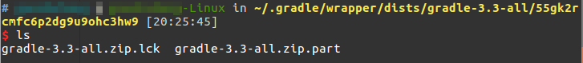

# Android Studio 创建新项目一只卡在building

新装的系统，第一次使用Android Studio时，可能就会发生这种情况，`Building xxx Gradle project info`，等了好久也没动静。

## 问题原因

这个问题并不是每次新装Android Studio都出现，有时候网络不稳定，就可能导致gradle无法下载。

如图所示，显然这个`gradle-3.3-all`没有下载完全。

## 解决方法

手动下载地址：

[http://services.gradle.org/distributions/](http://services.gradle.org/distributions/)

手动下载后，不需要解压，直接替换掉Android Studio无法自动下载的部分，放到例如`~/.gradle/wrapper/dist/gradle-3.3-all/55gk2rcmfc6p2dg9u9ohc3hw9/`的目录下即可。重新启动Android Studio，当构建工程时，就会自动解压下载的`zip`文件，并自动创建一个`gradle-3.3-all.zip.ok`文件。
