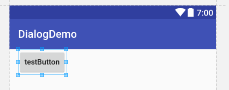

# 按钮上英文全是大写字母

按钮控件默认情况下，text属性中的英文全是大写字母，可能英文国家比较习惯这样。

```xml
<Button
  android:layout_width="wrap_content"
  android:layout_height="wrap_content"
  android:text="testButton"
  android:textAllCaps="false"/>
```

只要加上`android:textAllCaps="false"`就可以正常显示大小写字母了。


