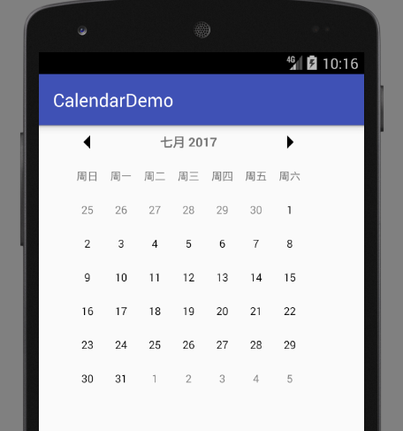

# 自带CalendarView太丑

现在开发APP一般都是兼容到API 14（Android4.0）的，Google提供的CalendarView控件却是从4.0到8.0，一个版本一个样，根本不统一，而且4.0的CalendarView极丑。

[Github找到的CalendarView](https://github.com/prolificinteractive/material-calendarview)

gradle:`compile 'com.prolificinteractive:material-calendarview:1.4.3'`

布局文件
```xml
<com.prolificinteractive.materialcalendarview.MaterialCalendarView
  android:layout_width="300dp"
  android:layout_height="300dp"
  app:mcv_showOtherDates="all"
  app:mcv_selectionColor="@color/colorPrimary"/>
```

监听器和自带的CalendarView相同。


