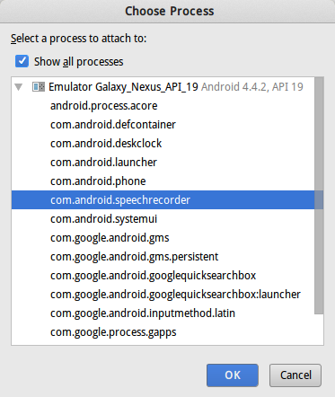
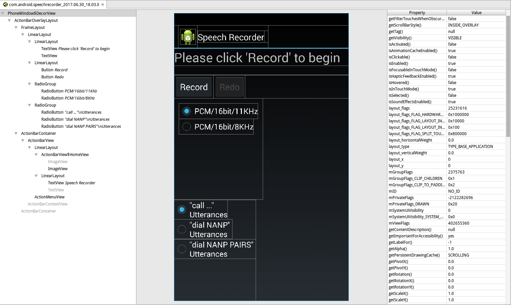
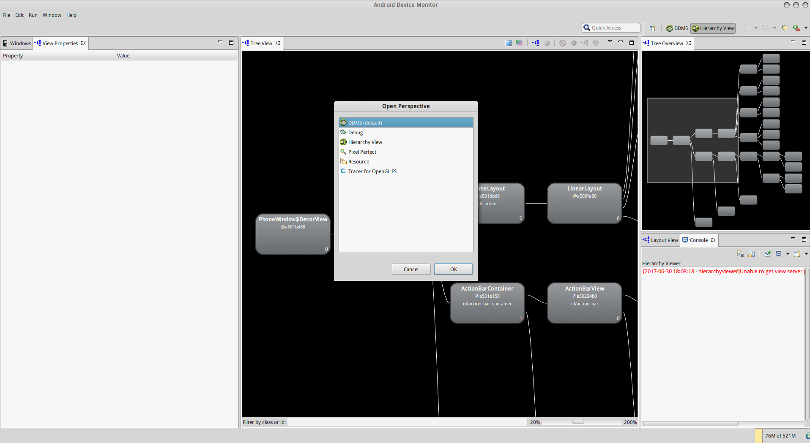

# Layout Inspector 布局查看器

之前我们有一个Hierarchy Viewer，位于sdk目录的tools下，这个程序可以查看一个运行着的进程的Activity布局。但是现在这个工具已经从SDK中移除了，Google推荐使用Layout Inspector取代原来的功能。

Layout Inspector功能位于Android Studio中，`Tools`->`Android`->`Layout Inspector`。

打开后，可以选择一个进程附加上去。

我们以系统自带的Speech Recorder为例。

左侧以一个Tree View的形式展示控件树，中间是控件预览，右侧是当前选中控件的全部属性。

## 原来的Hierarchy Viewer在哪？？

Hierarchy Viewer并没有真的移除，实际上Google只是移除了其在SDK目录下的启动文件，我们在DDMS的Perspective中，可以找到原来的Hierarchy Viewer。不过包括DDMS在内，Google应该都在将这些原来基于eclipse的工具向Intellij IDEA平台迁移，估计没准以后DDMS也会移除的。

