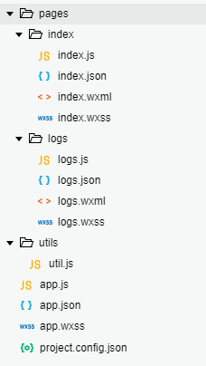

# 微信小程序开发环境搭建

微信小程序自从上线以来就获得了广泛关注，而且事实证明这是一个相当成功的项目。微信小程序依托微信和微信支付的巨大用户量，如今主要应用在这么几个方面：

1. 个体经营店铺开发微信小程序，作为自己的门户程序和在线支付工具
2. 投票、调查问卷等网站提供微信小程序移动触点接入，让自己网站的用户体验无缝嵌入微信
3. 一些管理系统提供微信小程序的移动触点接入，方便管理员使用
4. 小游戏，尤其是适合朋友之间、家庭聚会等场合玩的益智小游戏

无论如何，微信是一个十分封闭的生态，一切都要受到腾讯公司的监管，如果全世界的人都像我们开发者一样追求开源和自由，微信小程序不会有人去用的。然而，事实却不是这样，大多数普通人，甚至刚学会如何用手机的大爷大妈，他们只是需要一个拿来就能用，点两下就出结果的软件。微信这样一个近乎于基础设施的存在，让腾讯公司手握巨大的用户资源，小程序能流行也就顺理成章了。

本系列笔记简要介绍微信小程序环境搭建、开发要点等内容，官网的文档非常详尽，如果有Android开发和现代化前端开发的基础，基本花上半小时把文档过一遍就可以着手开发了。

## 微信公众平台开发者账号申请

进入以下链接，选择注册，按照提示操作。

[https://mp.weixin.qq.com/](https://mp.weixin.qq.com/)

注：申请微信公众平台开发者账号需要你的实名信息、身份证号，开发的程序会受到审核和监管。

## 测试号申请

开发过程中，我们可以申请一个测试号，测试号便于调试和测试部署，但是不能对公众发布。

[https://developers.weixin.qq.com/sandbox](https://developers.weixin.qq.com/sandbox)

申请成功后，我们会得到测试号的AppID和AppSecret。

## 微信开发者工具

微信小程序团队开发了一款IDE，感觉就是魔改Chrome里运行了一个魔改VSCode，能够方便小程序的开发，集成了代码编写、Chrome调试工具、微信小程序模拟器、打包功能。

[https://developers.weixin.qq.com/miniprogram/dev/devtools/download.html](https://developers.weixin.qq.com/miniprogram/dev/devtools/download.html)

注：这个工具貌似还有些bug，我就遇到几次代码打不开的情况，不过不影响开发。

## 项目目录结构



* `app.js`：调用`App()`，指定一些全局逻辑
* `app.wxss`：全局wxss样式表文件
* `app.json`：全局配置
* `project.config.json`：IDE配置，便于在不同电脑上快速配置相同的开发环境
* `pages`：这个目录中存放的是小程序的页面，每个页面对应一个文件夹
  * `pages/<页面名>/<页面名>.wxml`：页面的wxml布局文件
  * `pages/<页面名>/<页面名>.wxss`：页面的wxss样式表文件，在`app.wxss`基础上覆盖
  * `pages/<页面名>/<页面名>.js`：页面的业务逻辑
  * `pages/<页面名>/<页面名>.json`：页面的配置，在`app.json`基础上覆盖
* `utils`：工具函数目录

## 小程序的执行流程简介

### 小程序启动

微信中打开小程序，小程序的代码会下载到用户手机中，然后首页就会加载。

这里我们观察一下`app.json`，其中`pages`字段配置的第一个页面就是“首页”，`window`字段配置的是微信小程序外框的颜色等信息，微信小程序加载会受到这些配置信息影响。

app.json
```json
{
  "pages":[
    "pages/index/index",
    "pages/logs/logs"
  ],
  "window":{
    "backgroundTextStyle":"light",
    "navigationBarBackgroundColor": "#fff",
    "navigationBarTitleText": "WeChat",
    "navigationBarTextStyle":"black"
  }
}
```

### 页面

每个页面都由布局文件（wxml）、样式表文件（wxss）、逻辑代码（js）、配置文件（json）组成。下面是`pages/logs/logs.js`，其中调用了`Page()`初始化了页面，`onLoad()`就是页面加载时的执行逻辑。

```javascript
//logs.js
const util = require('../../utils/util.js')

Page({
  data: {
    logs: []
  },
  onLoad: function () {
    this.setData({
      logs: (wx.getStorageSync('logs') || []).map(log => {
        return util.formatTime(new Date(log))
      })
    })
  }
})
```

### 组件

在布局文件`wxml`中，每个XML节点都是基于组件的，而不像html是基于DOM树的，使用起来更加方便。

logs.wxml
```xml
<!--logs.wxml-->
<view class="container log-list">
  <block wx:for="{{logs}}" wx:for-item="log">
    <text class="log-item">{{index + 1}}. {{log}}</text>
  </block>
</view>
```

### API

微信小程序的众多能力都以API的形式提供，例如获取用户信息、微信支付等功能，

## Hello World

我们创建项目时，已经创建了一个基础工程，它包含`index`和`logs`两个页面，我们可以在模拟器中预览，也可以在自己手机上预览。

这里我们写一个简单的例子，创建一个页面，显示地图，要求地图上的地理位置是该用户当前的地理位置。

在`onLoad()`中插入如下代码，获取用户的地理位置信息，然后调用`setData()`使得页面能够获取到该数据：
```javascript
wx.getLocation({
  type: 'wgs84',
  success: (res) => {
    var latitude = res.latitude // 纬度
    var longitude = res.longitude // 经度

    this.setData({
      latitude,
      longitude
    });
  }
})
```

在wxml文件中，加入`<map>`组件，并设置其经纬度：
```xml
<map latitude="{{latitude}}" longitude="{{longitude}}"></map>
```
