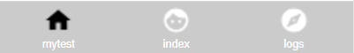

# 全局和单页配置

前面我们观察项目结构时可以发现，微信小程序项目中有一个全局配置`app.json`，每个页面文件夹中，还有一个单页面配置`<页面名>.json`。一些不属于我们页面本身的元素，而是属于微信框架的可配置选项，需要在这些配置文件中定义。

这些配置大部分比较简单，无非是调个颜色、字体之类，我们这里介绍几个最为常用的，其余的查看文档即可。

## 全局配置

### pages

创建项目后，默认生成了两个页面，`index`和`logs`。

app.json
```json
"pages":[
  "pages/index/index",
  "pages/logs/logs"
],
```

如果我们想要新加一个页面，直接在`app.json`中加一个配置，保存时，相关的路径会自动为我们创建。

另外要注意的是，`pages`中配置的第一个页面就是小程序的首页。

### window

window配置用于修配小程序外框颜色、字体等信息。创建项目后，默认生成的配置如下：

```json
"window":{
  "backgroundTextStyle":"light",
  "navigationBarBackgroundColor": "#fff",
  "navigationBarTitleText": "WeChat",
  "navigationBarTextStyle":"black"
}
```

这些配置分别指定了：

* 下拉loading颜色为浅色主题（默认没有效果，是因为没启用下拉刷新）
* 导航栏背景色为白色
* 导航栏标题显示`WeChat`
* 导航栏文字颜色为黑色

默认还有很多常用配置，比如`enablePullDownRefresh`指定是否可以下拉刷新页面等，这里就不多做介绍了。

### tabBar

`tabBar`指定的是底部Tab栏，下面是一个TabBar的配置例子，具体每个配置项的作用都非常好懂，这里就不多说了。

```json
"tabBar": {
  "color": "#FFFFFF",
  "backgroundColor": "#cbcbcb",
  "borderStyle": "white",
  "list": [
    {
      "pagePath": "pages/mytest/mytest",
      "text": "mytest",
      "iconPath": "icons/baseline_home_white_18dp.png",
      "selectedIconPath": "icons/baseline_home_black_18dp.png"
    },
    {
      "pagePath": "pages/index/index",
      "text": "index",
      "iconPath": "icons/baseline_face_white_18dp.png",
      "selectedIconPath": "icons/baseline_face_black_18dp.png"
    },
    {
      "pagePath": "pages/logs/logs",
      "text": "logs",
      "iconPath": "icons/baseline_explore_white_18dp.png",
      "selectedIconPath": "icons/baseline_explore_black_18dp.png"
    }
  ]
}
```

注意`list`的配置，其中配置的内容就是TabBar中每个按钮，`list`至少包含两个元素，否则会报错。



## 页面配置

页面配置非常简单，许多都和全局配置相同，这里不多介绍，具体参考文档。
