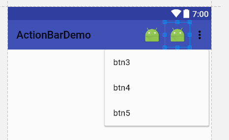
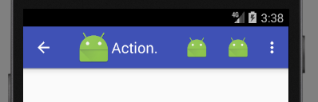

# ActionBar 增强版标题栏

Android程序最上方，有一行标题栏，最初叫做TitleBar，它只能容纳一个图标和当前Activity的标题字符串。后来，Android3.0引入了ActionBar替代TitleBar。ActionBar不仅可以容纳应用的图标和标题，还能容纳若干了按钮。这些按钮的行为可以自定义。可以作为设置按钮或是导航链接按钮可以放在ActionBar中，非常方便。

## 最简单的ActionBar例子

res/menu/menu_main.xml
```xml
<?xml version="1.0" encoding="utf-8"?>
<menu xmlns:android="http://schemas.android.com/apk/res/android"
	  xmlns:app="http://schemas.android.com/apk/res-auto">
	<item
		android:id="@+id/it_1"
		android:icon="@mipmap/ic_launcher"
		android:title="btn1"
		app:showAsAction="always"/>
	<item
		android:id="@+id/it_2"
		android:icon="@mipmap/ic_launcher"
		android:title="btn2"
		app:showAsAction="always"/>
	<item
		android:id="@+id/it_3"
		android:icon="@mipmap/ic_launcher"
		android:title="btn3"
		app:showAsAction="never"/>
	<item
		android:id="@+id/it_4"
		android:icon="@mipmap/ic_launcher"
		android:title="btn4"
		app:showAsAction="never"/>
	<item
		android:id="@+id/it_5"
		android:icon="@mipmap/ic_launcher"
		android:title="btn5"
		app:showAsAction="never"/>
</menu>
```

使用ActionBar需要定义一个布局文件，这个xml文件放在`res/menu/`中，这个目录Android Studio没有自动创建。文件中，根节点是`<menu>`，包含若干`<item>`作为我们设置的按钮。

ActionBar上可以定义任意个按钮，但是显然ActionBar的位置是有限的，如果显示不下，一些按钮就会以三个点的形式省略，点击会显示被省略按钮的下拉列表。显示在ActionBar上的按钮展示icon，被省略显示在一个下拉列表中的按钮展示title。

* `android:icon`：按钮图标
* `android:title`：按钮文字

* `app:showAsAction`：always表示总是显示在ActionBar上，never表示总是被省略，ifRoom表示如果空间不足就会被省略。

MainActivity.java
```java
package com.ciyaz.actionbardemo;

import android.support.v7.app.AppCompatActivity;
import android.os.Bundle;
import android.view.Menu;
import android.view.MenuInflater;
import android.view.MenuItem;
import android.widget.Toast;

public class MainActivity extends AppCompatActivity
{

	@Override
	protected void onCreate(Bundle savedInstanceState)
	{
		super.onCreate(savedInstanceState);
		setContentView(R.layout.activity_main);
	}

  /**
	 * 填充ActionBar的布局文件
	 */
	@Override
	public boolean onCreateOptionsMenu(Menu menu)
	{
		MenuInflater menuInflater = getMenuInflater();
		menuInflater.inflate(R.menu.menu_main, menu);
		return super.onCreateOptionsMenu(menu);
	}

	@Override
	public boolean onOptionsItemSelected(MenuItem item)
	{
    //响应ActionBar按钮的点击事件，参数是item的ID
		switch (item.getItemId())
		{
			case R.id.it_1:
				showMessage("btn1");
				return true;
			case R.id.it_2:
				showMessage("btn2");
				return true;
			case R.id.it_3:
				showMessage("btn3");
				return true;
			case R.id.it_4:
				showMessage("btn4");
				return true;
			case R.id.it_5:
				showMessage("btn5");
				return true;
			default:
				return super.onOptionsItemSelected(item);
		}
	}

	private void showMessage(String message)
	{
		Toast.makeText(this, message, Toast.LENGTH_SHORT).show();
	}
}
```

如果需要使用ActionBar，Activity中需要做一些初始化的工作。首先重写`onCreateOptionsMenu()`方法，填充`menu_main.xml`布局文件，然后重写`onOptionsItemSelected()`方法，实现按钮的点击响应。

预览效果：



## ActionBar上的返回（Home）按钮

ActionBar左侧可以有该Activity的图标和文字标题，我们还能设置一个返回按钮。如下代码所示：

MainActivity.java
```java
@Override
protected void onCreate(Bundle savedInstanceState)
{
  super.onCreate(savedInstanceState);
  setContentView(R.layout.activity_main);

  //获取v7包AppCompat兼容的ActionBar对象
  ActionBar actionBar = getSupportActionBar();
  //显示标题
  actionBar.setDisplayShowTitleEnabled(true);
  //显示图标
  actionBar.setDisplayShowHomeEnabled(true);
  actionBar.setLogo(R.mipmap.ic_launcher);
  actionBar.setDisplayUseLogoEnabled(true);
  //显示后退按钮
  actionBar.setDisplayHomeAsUpEnabled(true);
}
```

捕捉ActionBar返回按钮的点击事件：

```java
case android.R.id.home:
  break;
```

返回按钮效果：



实际上，从图中我们可以看出，新的v7支持包中的supportActionBar如果连同HOME按钮，带上应用图标和标题，显得十分拥挤，并不好看。

## 设置返回（Home）按钮图标

实际上这个按钮不一定作为返回按钮使用，我们可以把它安排成一个侧滑菜单按钮，或者其他的功能，但是此时`←`这个按钮图标显然是不合适的。下面代码可以覆盖默认的Home按钮图标：

```java
actionBar.setHomeAsUpIndicator(R.mipmap.ic_launcher);
```

参数是一个图片的资源ID。一般侧滑面板的展开图标都使用三个横线来表示。
