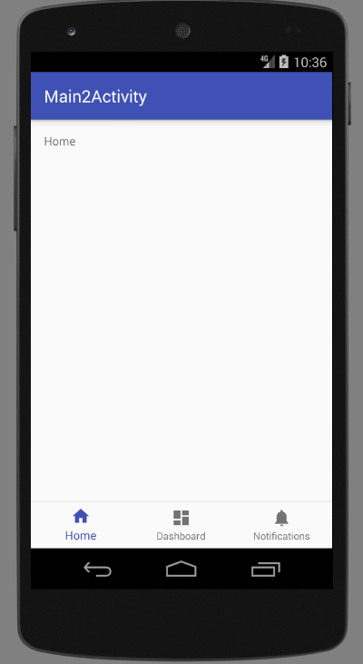

# BottomNavigationView 底部导航栏

底部导航栏在Android APP中，应用十分广泛，最简单的例子就是微信下方的四个导航按钮，当然可能腾讯并不是使用BottomNavigationView实现的。Google的Meterial Design Support Library中，包含了底部导航栏控件`BottomNavigationView`，结合Fragment或者ViewPager就能实现标签页效果。不过在使用我也发现这个官方提供的控件可定制化程度不是很高，有时候还得我们自己实现底部导航栏。

## 添加design库依赖

```java
compile 'com.android.support:design:26.+'
```

注意：design库版本要和compileSDK版本保持一致。

## 创建一个Bottom Navigation Activity

实际上Android Studio中，我们甚至可以直接创建一个Bottom Navigation Activity。这里我们直接自动创建一个，然后分析一下其代码。

activity_bottom_view.xml
```xml
<?xml version="1.0" encoding="utf-8"?>
<LinearLayout
	android:id="@+id/container"
	xmlns:android="http://schemas.android.com/apk/res/android"
	xmlns:app="http://schemas.android.com/apk/res-auto"
	xmlns:tools="http://schemas.android.com/tools"
	android:layout_width="match_parent"
	android:layout_height="match_parent"
	android:orientation="vertical"
	tools:context="com.ciyaz.bottomnavdemo.BottomViewActivity">

	<FrameLayout
		android:id="@+id/content"
		android:layout_width="match_parent"
		android:layout_height="0dp"
		android:layout_weight="1">

		<TextView
			android:id="@+id/message"
			android:layout_width="match_parent"
			android:layout_height="wrap_content"
			android:layout_marginBottom="@dimen/activity_vertical_margin"
			android:layout_marginLeft="@dimen/activity_horizontal_margin"
			android:layout_marginRight="@dimen/activity_horizontal_margin"
			android:layout_marginTop="@dimen/activity_vertical_margin"
			android:text="@string/title_home"/>

	</FrameLayout>

	<android.support.design.widget.BottomNavigationView
		android:id="@+id/navigation"
		android:layout_width="match_parent"
		android:layout_height="wrap_content"
		android:layout_gravity="bottom"
		android:background="?android:attr/windowBackground"
		app:menu="@menu/navigation"/>

</LinearLayout>
```

我们在布局文件中，编写了一个`BottomNavigationView`，注意上边的`FrameLayout`，如果我们使用`BottomNavigationView`结合`Fragment`，我们就需要在这个布局中填充。但是一定要记住这几个属性：`android:layout_height="0dp"`，`android:layout_weight="1"`，否则下方的`BottomNavigationView`就无法显示了。

BottomViewActivity.java
```java
package com.ciyaz.bottomnavdemo;

import android.os.Bundle;
import android.support.annotation.NonNull;
import android.support.design.widget.BottomNavigationView;
import android.support.v7.app.AppCompatActivity;
import android.view.MenuItem;
import android.widget.TextView;

public class BottomViewActivity extends AppCompatActivity
{

	private TextView mTextMessage;

	private BottomNavigationView.OnNavigationItemSelectedListener mOnNavigationItemSelectedListener = new BottomNavigationView.OnNavigationItemSelectedListener()
	{

		@Override
		public boolean onNavigationItemSelected(@NonNull MenuItem item)
		{
			switch (item.getItemId())
			{
				case R.id.navigation_home:
					mTextMessage.setText(R.string.title_home);
					return true;
				case R.id.navigation_dashboard:
					mTextMessage.setText(R.string.title_dashboard);
					return true;
				case R.id.navigation_notifications:
					mTextMessage.setText(R.string.title_notifications);
					return true;
			}
			return false;
		}

	};

	@Override
	protected void onCreate(Bundle savedInstanceState)
	{
		super.onCreate(savedInstanceState);
		setContentView(R.layout.activity_bottom_view);

		mTextMessage = (TextView) findViewById(R.id.message);
		BottomNavigationView navigation = (BottomNavigationView) findViewById(R.id.navigation);
		navigation.setOnNavigationItemSelectedListener(mOnNavigationItemSelectedListener);
	}

}
```

实际上我们需要配置的就是导航栏的点击监听器，代码比较容易理解，这里就不多做解释了。自动创建的Activity代码比较简单，它没有用Fragment也没用ViewPager，而是直接改变了一个TextView的值，我们实际开发中不会这样做的。

res/menu/navigation.xml
```xml
<?xml version="1.0" encoding="utf-8"?>
<menu xmlns:android="http://schemas.android.com/apk/res/android">

	<item
		android:id="@+id/navigation_home"
		android:icon="@drawable/ic_home_black_24dp"
		android:title="@string/title_home"/>

	<item
		android:id="@+id/navigation_dashboard"
		android:icon="@drawable/ic_dashboard_black_24dp"
		android:title="@string/title_dashboard"/>

	<item
		android:id="@+id/navigation_notifications"
		android:icon="@drawable/ic_notifications_black_24dp"
		android:title="@string/title_notifications"/>

</menu>
```

这个文件是`BottomNavigationView`的菜单项目，这里我们定义了三个选项，注意每个`item`的id属性，它在导航栏的事件监听中会用到。

运行效果：



## 几个调整颜色的xml属性

BottomNavigationView可配置的地方不多，有几个xml属性可以配置颜色：

```
android:background 导航条的背景颜色
app:itemTextColor 导航图标的文字颜色
app:itemIconTint 导航图标的颜色
```

## 导航按钮的shifting特效

导航按钮个数>3个时，按钮点击会默认添加一个shifting特效，个人认为非常丑，在stackoverflow上找到如下代码，可以通过反射强制去掉这个特效：

```java
package com.ciyaz.bottomnavdemo;

import android.support.design.internal.BottomNavigationItemView;
import android.support.design.internal.BottomNavigationMenuView;
import android.support.design.widget.BottomNavigationView;
import android.util.Log;

import java.lang.reflect.Field;

public class BottomNavigationViewHelper
{
	public static void disableShiftMode(BottomNavigationView view)
	{
		BottomNavigationMenuView menuView = (BottomNavigationMenuView) view.getChildAt(0);
		try
		{
			Field shiftingMode = menuView.getClass().getDeclaredField("mShiftingMode");
			shiftingMode.setAccessible(true);
			shiftingMode.setBoolean(menuView, false);
			shiftingMode.setAccessible(false);
			for (int i = 0; i < menuView.getChildCount(); i++)
			{
				BottomNavigationItemView item = (BottomNavigationItemView) menuView.getChildAt(i);
				//noinspection RestrictedApi
				item.setShiftingMode(false);
				// set once again checked value, so view will be updated
				//noinspection RestrictedApi
				item.setChecked(item.getItemData().isChecked());
			}
		}
		catch (NoSuchFieldException e)
		{
			Log.e("BNVHelper", "Unable to get shift mode field", e);
		}
		catch (IllegalAccessException e)
		{
			Log.e("BNVHelper", "Unable to change value of shift mode", e);
		}
	}
}
```
