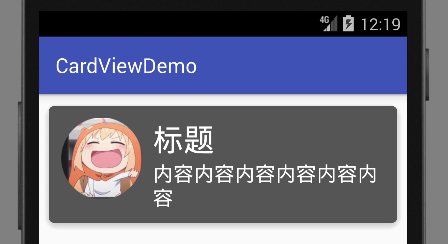

# CardView 卡片组件

CardView是Google提出Material Design后，抽象出的一种控件。就像它的名字一样，Card，外观就像放在桌面上的一张硬纸板做的卡片一样。一个卡片可以代表界面上的一组模块，包含若干图片，文字，按钮等。我们可以参考很多界面成熟的app，看看它们是怎样使用卡片的。

Android5.0中，加入了CardView控件，低于5.0版本我们可以使用v7兼容包提供的CardView。虽然Android Studio新建工程后默认引入了v7兼容包，但是没有CardView，这个控件要单独引入项目依赖：

```java
compile 'com.android.support:cardview-v7:26.+'
```

## CardView常用属性

矩形卡片的圆角
```
app:cardCornerRadius="5dp"
```

卡片背景色
```
app:cardBackgroundColor="#555555"
```

阴影深度（Z轴偏移）
```
app:cardElevation="5dp"
```

内边距
```
app:contentPadding="10dp"
```

## 简单的卡片组件例子

```xml
<?xml version="1.0" encoding="utf-8"?>
<LinearLayout xmlns:android="http://schemas.android.com/apk/res/android"
			  android:layout_width="match_parent"
			  android:layout_height="match_parent"
			  xmlns:app="http://schemas.android.com/apk/res-auto"
			  android:padding="5dp"
			  android:orientation="vertical">
	<android.support.v7.widget.CardView
		android:layout_width="match_parent"
		android:layout_height="wrap_content"
		app:cardCornerRadius="5dp"
		app:cardElevation="5dp"
		app:cardBackgroundColor="#555555">
		<RelativeLayout
			android:layout_width="wrap_content"
			android:layout_height="wrap_content"
			android:padding="10dp">
			<ImageView
				android:id="@+id/iv_icon"
				android:layout_width="80dp"
				android:layout_height="80dp"
				android:src="@drawable/circle"/>
			<TextView
				android:id="@+id/tv_title"
				android:layout_width="wrap_content"
				android:layout_height="wrap_content"
				android:text="标题"
				android:textSize="30sp"
				android:textColor="#ffffff"
				android:layout_toRightOf="@id/iv_icon"
				android:layout_marginLeft="10dp"/>
			<TextView
				android:id="@+id/tv_content"
				android:layout_width="wrap_content"
				android:layout_height="wrap_content"
				android:text="内容内容内容内容内容内容"
				android:textSize="20sp"
				android:textColor="#ffffff"
				android:layout_toRightOf="@id/iv_icon"
				android:layout_below="@id/tv_title"
				android:layout_marginLeft="10dp"/>
		</RelativeLayout>
	</android.support.v7.widget.CardView>
</LinearLayout>
```

CardView继承于FrameLayout，这里我们在CardView中嵌入了一个相对布局，添加了图片和两行文字。

注：这里为了美观和方便，图片本来就是用的圆形的，实际使用中，“头像”应该是将矩形图片转换成圆形显示。

运行效果：


