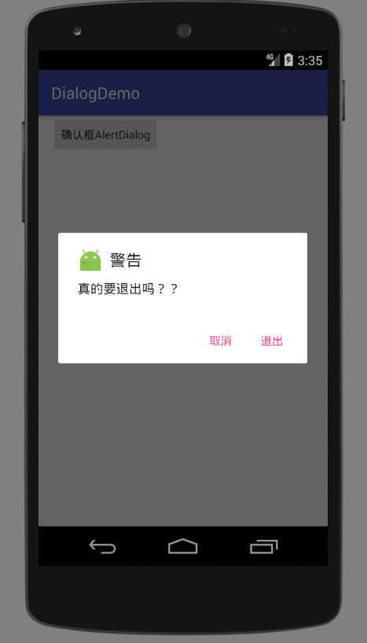
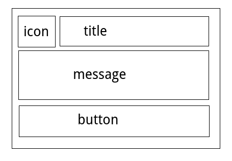
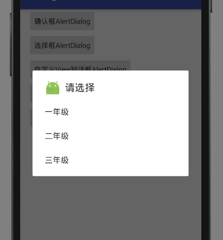
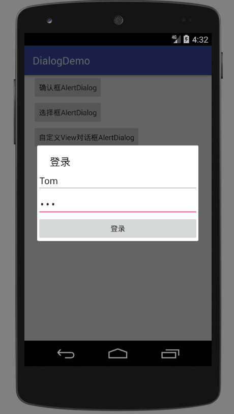
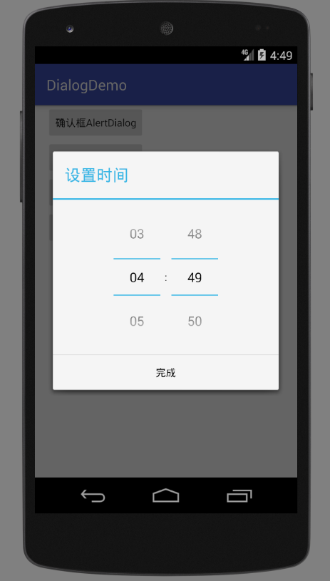
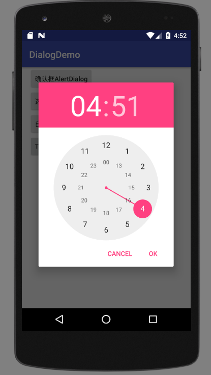
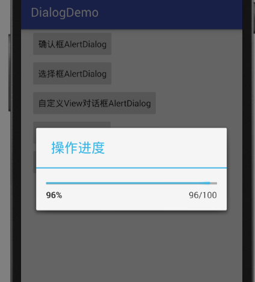

# Dialog 对话框

Android提供了四中常用的对话框：

* AlertDialog 警告对话框，最为常用
* ProgressDialog 进度对话框，是对进度条的包装
* DatePickerDialog 日期选择对话框，是对DatePicker的包装
* TimePickerDialog 时间选择对话框，是对TimePicker的包装

ProgressDialog，DatePickerDialog，TimePickerDialog是AlertDialog的子类。我们直接从常用的对话框例子出发，学习如何使用各种对话框。

## 包含两个按钮的确认对话框

对话框最常见的一种使用场景就是用来操作确认。比如，点击退出时，弹出对话框，询问用户是否真的退出。下面例子编写一个包含两个按钮和提示信息的确认对话框。该例子使用AlertDialog。

```java
package com.ciyaz.dialogdemo;

import android.content.DialogInterface;
import android.support.v7.app.AlertDialog;
import android.support.v7.app.AppCompatActivity;
import android.os.Bundle;
import android.util.Log;
import android.view.View;

public class MainActivity extends AppCompatActivity
{

	@Override
	protected void onCreate(Bundle savedInstanceState)
	{
		super.onCreate(savedInstanceState);
		setContentView(R.layout.activity_main);
	}

	public void showConfirmDialog(View view)
	{
		//创建builder
		AlertDialog.Builder builder = new AlertDialog.Builder(this);
		//配置对话框
		AlertDialog alertDialog = builder
				//图标
				.setIcon(R.mipmap.ic_launcher)
				//标题
				.setTitle("警告")
				//文字信息
				.setMessage("真的要退出吗？？")
				//确定按钮
				.setPositiveButton("退出", new DialogInterface.OnClickListener() {
					@Override
					public void onClick(DialogInterface dialogInterface, int i)
					{
						Log.v("dialogDemo", "positive按钮点击");
					}
				})
				//否定按钮
				.setNegativeButton("取消", new DialogInterface.OnClickListener() {
					@Override
					public void onClick(DialogInterface dialogInterface, int i)
					{
						Log.v("dialogDemo", "negative按钮点击");
					}
				})
				.create();
		//显示对话框
		alertDialog.show();
	}
}
```

显示效果：



创建Dialog的基本步骤和Notification很像：

1. 创建builder对象
2. 为builder配置各种参数，然后调用`builder.create()`获得对话框对象
3. 调用`dialog.show()`显示对话框

最基本的AlertDialog的构成：



除了确定按钮和否定按钮，还可以添加一个中立按钮，某些需求下的对话框也会用到：

```java
builder.setNeutralButton()
```

注意：必须set了某一个button，该button才会出现，例如：想得到只有一个按钮的AlertDialog，只需要设置一个positiveButton即可。

## 选择对话框

选择对话框也是基于AlertDialog的，用户可以在若干了item中进行选择。这里我们在上面例子基础上，再加一个按钮，点击显示选择对话框：

```java
public void itemChoiceDialog(View view)
{

  final String[] itemsArray = new String[]{"一年级", "二年级", "三年级"};

  AlertDialog.Builder builder = new AlertDialog.Builder(this);
  AlertDialog alertDialog = builder
      .setIcon(R.mipmap.ic_launcher)
      .setTitle("请选择")
      .setItems(itemsArray, new DialogInterface.OnClickListener() {
        @Override
        public void onClick(DialogInterface dialogInterface, int i)
        {
          Log.v("dialogDemo", itemsArray[i]);
        }
      })
      .create();
  alertDialog.show();
}
```

* `public void onClick(DialogInterface dialogInterface, int i)` 参数`i`为被选中的item的数组索引

运行效果：



上面例子中，item可以看做是可选择的按钮。实际上，AlertDialog还提供单选或多选按钮的item：

* `public Builder setSingleChoiceItems(@ArrayRes int itemsId, int checkedItem, final OnClickListener listener)` 设置单选按钮item
* `public Builder setMultiChoiceItems(@ArrayRes int itemsId, boolean[] checkedItems, final OnMultiChoiceClickListener listener)` 设置多选按钮item

其中第二个参数是选择的默认值。

## 自定义View对话框

除了AlertDialog内置的几种通用使用方式，我们还可以在其中自定义布局。下面例子实现了一个登录对话框：

```java
public void customDialog(View view)
{

  LinearLayout loginView = (LinearLayout) getLayoutInflater().inflate(R.layout.dialog_login, null);

  AlertDialog.Builder builder = new AlertDialog.Builder(this);
  final AlertDialog alertDialog = builder
      .setTitle("登录")
      .setView(loginView)
      .create();
  alertDialog.show();

  final EditText usernameEditText = loginView.findViewById(R.id.et_username);
  final EditText passwordEditText = loginView.findViewById(R.id.et_password);
  Button loginButton = loginView.findViewById(R.id.btn_login);
  loginButton.setOnClickListener(new View.OnClickListener() {
    @Override
    public void onClick(View view)
    {
      Log.v("dialogDemo", "username:" + usernameEditText.getText() + " password:" + passwordEditText.getText());
      alertDialog.dismiss();
    }
  });
}
```

首先使用布局填充器将一个自定义的xml布局文件填充称为View对象，然后使用`builder.setView()`设置自定义View的对话框。

* `alertDialog.dismiss()` 该方法可以手动关闭对话框

运行效果：



## 时间和日期选择对话框

这两个选择对话框功能比较单一，因此使用起来也比较简单，不是很常用。

```java
public void showTimePickerDialog(View view)
{
  Calendar calendar = Calendar.getInstance();
  TimePickerDialog timePickerDialog = new TimePickerDialog(this, new TimePickerDialog.OnTimeSetListener() {
    @Override
    public void onTimeSet(TimePicker timePicker, int hourOfDay, int minute)
    {
      Log.v("dialogDemo", "选择的时间为" + hourOfDay + "时" + minute + "分");
    }
  }, calendar.get(Calendar.HOUR_OF_DAY), calendar.get(Calendar.MINUTE), true);
  timePickerDialog.show();
}
```

这里注意Calendar对象的使用方法。TimePickerDialog初始化的参数中，第三个参数是初始小时数，第四个参数是初始分钟数，第五个参数是是否使用24小时制。

运行效果：

API 19



API 24



注意：在不同版本Android系统上，TimePicker的UI都不太一样。

## 进度条对话框

进度条对话框也比较常用，适合进度较快，很快就能让用户看到结果的操作。如果执行时间较长（比如大文件下载），用户可能等不及，会把Activity切换到后台，此时建议将进度条放到Notification中。

```java
public void showProgressDialog(View view)
{
  final ProgressDialog progressDialog = new ProgressDialog(this);
  progressDialog.setMax(100);
  progressDialog.setTitle("操作进度");
  progressDialog.setProgressStyle(ProgressDialog.STYLE_HORIZONTAL);
  progressDialog.setIndeterminate(false);
  progressDialog.show();

  new Thread()
  {
    @Override
    public void run()
    {
      int progressStatus = 0;
      while(progressStatus <= 100)
      {
        try
        {
          Thread.sleep(50);
          progressStatus++;

          progressDialog.setProgress(progressStatus);
        }
        catch (InterruptedException e)
        {
          e.printStackTrace();
        }
      }
      progressDialog.dismiss();
    }
  }.start();
}
```

这个例子中，我们启动了一条新线程，不停更新ProgressDialog中的进度值，更新结束后，使用`dismiss()`关闭对话框。

注：对于进度条，非UI线程能够更新UI，但其他控件是不行的。


