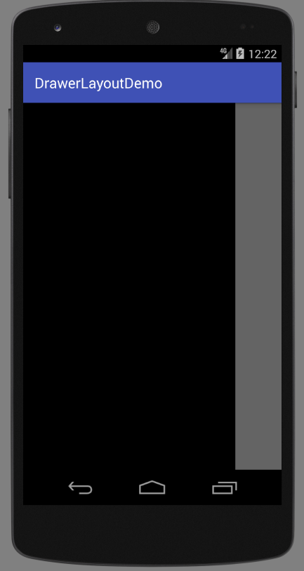
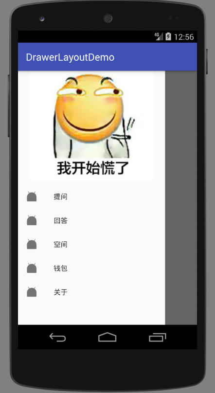
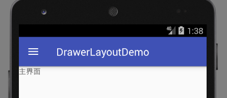
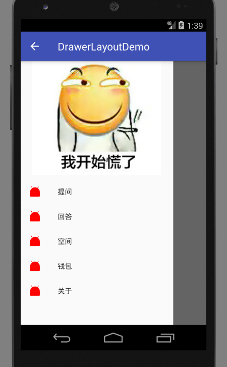

# DrawerLayout 侧滑面板

最初，Android中侧滑面板需要复杂的自定义控件实现，之后又出现了很多开源界面库可用。Android 5.0则直接提供了DrawLayout，使用它能够很方便的实现侧滑面板。低于Android5.0的系统下，可以使用support v4包中的DrawerLayout。

## 最简单的侧滑面板

最简单的侧滑面板只需要在布局文件中定义好xml即可实现侧滑。

```xml
<?xml version="1.0" encoding="utf-8"?>
<android.support.v4.widget.DrawerLayout
	xmlns:android="http://schemas.android.com/apk/res/android"
	android:layout_width="match_parent"
	android:layout_height="match_parent">

	<RelativeLayout
		android:layout_width="match_parent"
		android:layout_height="match_parent">

		<TextView
			android:layout_width="wrap_content"
			android:layout_height="wrap_content"
			android:text="主界面"/>
	</RelativeLayout>

	<RelativeLayout
		android:layout_width="match_parent"
		android:layout_height="match_parent"
		android:layout_gravity="left"
		android:background="#000000"/>

	<RelativeLayout
		android:layout_width="match_parent"
		android:layout_height="match_parent"
		android:layout_gravity="right"
		android:background="#000000"/>

</android.support.v4.widget.DrawerLayout>
```

实现侧滑面板的界面需要将`DrawerLayout`设为根节点。其下包含三个相对布局，其中`android:layout_gravity="left"`就是左侧滑面板的布局文件，`android:layout_gravity="right"`是右侧滑面板的布局文件，剩下的一个就是主界面了，如果我们不需要右侧滑面板，不写它即可。这里为了显示效果明显，把侧滑面板的背景色设为了黑色。

效果：



## 结合NavigationView填充侧滑面板

尽管DrawerLayout已经帮我们把最复杂的部分实现了，但是我们要把侧滑面板做的尽量美观，还是稍微有点麻烦，但是其实大多数侧滑面板都长得差不多，Android support design库提供了一个NavigationView，把侧滑面板也封装了一下，我们可以直接拿过来用。

activity_main.xml
```java
<?xml version="1.0" encoding="utf-8"?>
<android.support.v4.widget.DrawerLayout
	xmlns:android="http://schemas.android.com/apk/res/android"
	android:layout_width="match_parent"
	android:layout_height="match_parent"
	xmlns:app="http://schemas.android.com/apk/res-auto">

	<RelativeLayout
		android:layout_width="match_parent"
		android:layout_height="match_parent">

		<TextView
			android:layout_width="wrap_content"
			android:layout_height="wrap_content"
			android:text="主界面"/>
	</RelativeLayout>

	<android.support.design.widget.NavigationView
    android:id="@+id/nv_main"
		android:layout_width="match_parent"
		android:layout_height="match_parent"
		android:layout_gravity="left"
		app:headerLayout="@layout/navi_header"
		app:menu="@menu/navi_menu"/>
</android.support.v4.widget.DrawerLayout>
```

这里我们只保留左侧滑面板，注意NavigationView的属性，`app:headerLayout`和`app:menu`是侧滑面板的头布局和菜单项。

navi_header.xml
```xml
<?xml version="1.0" encoding="utf-8"?>
<LinearLayout xmlns:android="http://schemas.android.com/apk/res/android"
			  android:orientation="vertical"
			  android:layout_width="match_parent"
			  android:layout_height="match_parent">
<ImageView
	android:layout_width="match_parent"
	android:layout_height="match_parent"
	android:src="@drawable/background"/>
</LinearLayout>
```

头布局这里我们只是用了一张图片。

navi_menu.xml
```xml
<?xml version="1.0" encoding="utf-8"?>
<menu xmlns:android="http://schemas.android.com/apk/res/android">
	<item
		android:icon="@mipmap/ic_launcher"
		android:title="提问"/>
	<item
		android:icon="@mipmap/ic_launcher"
		android:title="回答"/>
	<item
		android:icon="@mipmap/ic_launcher"
		android:title="空间"/>
	<item
		android:icon="@mipmap/ic_launcher"
		android:title="钱包"/>
	<item
		android:icon="@mipmap/ic_launcher"
		android:title="关于"/>
</menu>
```

这里我们定义了几个菜单项，定义了id，图标和标题。

运行效果：



### 绑定点击事件

下面代码为菜单项绑定点击事件：

```java
navigationView.setNavigationItemSelectedListener(new NavigationView.OnNavigationItemSelectedListener() {
  @Override
  public boolean onNavigationItemSelected(@NonNull MenuItem item)
  {
    switch (item.getItemId())
    {
      case R.id.menu_ask:
        break;
      case R.id.menu_answer:
        break;
      case R.id.menu_space:
        break;
      case R.id.menu_wallet:
        break;
      case R.id.menu_about:
        break;
    }
    return true;
  }
});
```

上述代码中，我们通过MenuItem的资源id对选择的menu进行判断。

### 获取头布局View对象

如果头布局中有一些需要交互的组件，我们需要获得头布局的View对象引用：
```java
navigationView.getHeaderView(0);
```

## DrawerLayout和ActionBar联动

ActionBar上有一个HomeButton，出现DrawerLayout后，我们可以把这个按钮当做拉出侧滑面板的开关，而不用原来的Home功能。这需要v7包提供的`ActionBarDrawerToggle`把两者结合起来。

```java
package com.ciyaz.drawerlayoutdemo;

import android.content.res.Configuration;
import android.support.annotation.NonNull;
import android.support.annotation.Nullable;
import android.support.design.widget.NavigationView;
import android.support.v4.widget.DrawerLayout;
import android.support.v7.app.ActionBar;
import android.support.v7.app.ActionBarDrawerToggle;
import android.support.v7.app.AppCompatActivity;
import android.os.Bundle;
import android.view.MenuItem;

public class MainActivity extends AppCompatActivity
{

	private ActionBarDrawerToggle actionBarDrawerToggle;

	@Override
	protected void onCreate(Bundle savedInstanceState)
	{
		super.onCreate(savedInstanceState);
		setContentView(R.layout.activity_main);

		ActionBar actionBar = getSupportActionBar();
		actionBar.setDisplayHomeAsUpEnabled(true);

		DrawerLayout drawerLayout = (DrawerLayout) findViewById(R.id.dl_main);
		actionBarDrawerToggle = new ActionBarDrawerToggle(this, drawerLayout, R.string.drawer_open, R.string.drawer_close);
		drawerLayout.setDrawerListener(actionBarDrawerToggle);

		initNavigationView();
	}

	@Override
	protected void onPostCreate(@Nullable Bundle savedInstanceState)
	{
		super.onPostCreate(savedInstanceState);
		actionBarDrawerToggle.syncState();
	}

	@Override
	public void onConfigurationChanged(Configuration newConfig)
	{
		super.onConfigurationChanged(newConfig);
		actionBarDrawerToggle.onConfigurationChanged(newConfig);
	}

	@Override
	public boolean onOptionsItemSelected(MenuItem item)
	{
		if(actionBarDrawerToggle.onOptionsItemSelected(item))
		{
			return true;
		}
		else
		{
			return super.onOptionsItemSelected(item);
		}
	}

	private void initNavigationView()
	{
		NavigationView navigationView = (NavigationView) findViewById(R.id.nv_main);
		navigationView.setNavigationItemSelectedListener(new NavigationView.OnNavigationItemSelectedListener() {
			@Override
			public boolean onNavigationItemSelected(@NonNull MenuItem item)
			{
				switch (item.getItemId())
				{
					case R.id.menu_ask:
						break;
					case R.id.menu_answer:
						break;
					case R.id.menu_space:
						break;
					case R.id.menu_wallet:
						break;
					case R.id.menu_about:
						break;
				}
				return true;
			}
		});
	}
}
```

为了使ActionBarDrawerToggle正常工作，我们必须按ActionBarDrawerToggle的要求，重写Activity的`onPostCreate()`和`onConfigurationChanged()`，除此之外，还需要重写`onOptionsItemSelected()`，这个函数在ActionBar章节讲解过，`actionBarDrawerToggle.onOptionsItemSelected(item)`内部会判断被选中的`MenuItem`的id，当其时ActionBar的Home键时，执行侧滑面板的切换操作。

运行结果：




