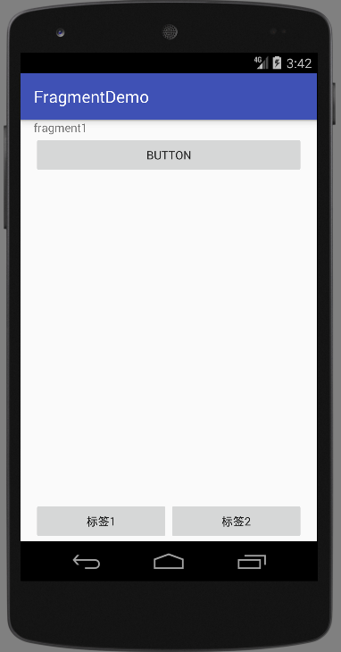
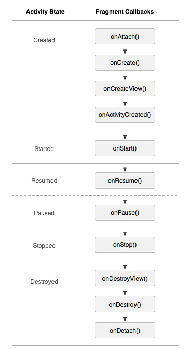

# Fragment UI片段

Fragment在设计之初，是为了解决大屏幕下，屏幕划分的问题，但是现在Fragment更多是作为类似标签页的形式存在。

微信底部的标签：


我们选择不同的标签按钮，上方的布局就会跳转到对应的内容。

下面我们看看如何使用Fragment实现这种标签的效果。

## Fragment实现标签页

这里我们使用Fragment实现两个标签页之间的切换。

主Activity的布局文件：activity_main.xml
```xml
<?xml version="1.0" encoding="utf-8"?>
<RelativeLayout xmlns:android="http://schemas.android.com/apk/res/android"
				android:layout_width="match_parent"
				android:layout_height="match_parent"
				android:paddingLeft="16dp"
				android:paddingRight="16dp">

	<LinearLayout
		android:id="@+id/ll"
		android:layout_width="match_parent"
		android:layout_height="match_parent"
		android:orientation="vertical"/>

	<LinearLayout
		android:layout_width="match_parent"
		android:layout_height="wrap_content"
		android:layout_alignParentBottom="true"
		android:orientation="horizontal">

		<Button
			android:id="@+id/btn_1"
			android:layout_width="0dp"
			android:layout_height="wrap_content"
			android:layout_weight="1"
			android:text="标签1"/>

		<Button
			android:id="@+id/btn_2"
			android:layout_width="0dp"
			android:layout_height="wrap_content"
			android:layout_weight="1"
			android:text="标签2"/>
	</LinearLayout>


</RelativeLayout>
```

这里我们创建了两个线性布局，第一个线性布局作为容器，容纳Fragment中动态创建的内容，第二个线性布局容纳两个按钮，作为切换标签页之间的标签。

Fragment的两个文件布局

fragment_1.xml
```xml
<?xml version="1.0" encoding="utf-8"?>
<LinearLayout xmlns:android="http://schemas.android.com/apk/res/android"
			  android:orientation="vertical"
			  android:layout_width="match_parent"
			  android:layout_height="match_parent">

	<TextView
		android:layout_width="wrap_content"
		android:layout_height="wrap_content"
		android:text="fragment1"/>

	<Button
		android:id="@+id/button"
		android:layout_width="match_parent"
		android:layout_height="wrap_content"
		android:text="Button"/>
</LinearLayout>
```

这里放了一个按钮，用来演示Fragment中，如何获取控件对象，这里我们就获取按钮对象，并为其添加事件监听器。

fragment_2.xml
```xml
<?xml version="1.0" encoding="utf-8"?>
<LinearLayout xmlns:android="http://schemas.android.com/apk/res/android"
			  android:orientation="vertical"
			  android:layout_width="match_parent"
			  android:layout_height="match_parent">

<TextView
	android:layout_width="wrap_content"
	android:layout_height="wrap_content"
	android:text="Fragment2"/>
</LinearLayout>
```

Fragment1.java
```java
package com.ciyaz.fragmentdemo;

import android.app.Fragment;
import android.os.Bundle;
import android.support.annotation.Nullable;
import android.view.LayoutInflater;
import android.view.View;
import android.view.ViewGroup;
import android.widget.Toast;

public class Fragment1 extends Fragment
{
	@Override
	public View onCreateView(LayoutInflater inflater, @Nullable ViewGroup container, Bundle savedInstanceState)
	{
		View view = inflater.inflate(R.layout.fragment_1, null);
		view.findViewById(R.id.button).setOnClickListener(new View.OnClickListener() {
			@Override
			public void onClick(View v)
			{
				Toast.makeText(getActivity(), "fragment1", Toast.LENGTH_SHORT).show();
			}
		});
		return view;
	}
}
```

`onCreateView()`是Fragment的生命周期函数之一，我们创建新的Fragment类必须重写这个方法，因为我们要在Fragment中加载布局文件。其参数有一个`LayoutInflater`，我们需要用这个参数来将布局文件填充成View对象，最终作为返回值返回。因此，我们就可以在这个View对象上使用`findViewById()`来获取xml布局文件中定义的控件对象。

Fragment2.java
```java
package com.ciyaz.fragmentdemo;

import android.app.Fragment;
import android.os.Bundle;
import android.support.annotation.Nullable;
import android.view.LayoutInflater;
import android.view.View;
import android.view.ViewGroup;

public class Fragment2 extends Fragment
{
	@Override
	public View onCreateView(LayoutInflater inflater, @Nullable ViewGroup container, Bundle savedInstanceState)
	{
		View view = inflater.inflate(R.layout.fragment_2, null);
		return view;
	}
}
```

MainActivity.java
```java
package com.ciyaz.fragmentdemo;

import android.app.FragmentManager;
import android.app.FragmentTransaction;
import android.support.v7.app.AppCompatActivity;
import android.os.Bundle;
import android.view.View;
import android.widget.Button;

public class MainActivity extends AppCompatActivity implements View.OnClickListener
{

	@Override
	protected void onCreate(Bundle savedInstanceState)
	{
		super.onCreate(savedInstanceState);
		setContentView(R.layout.activity_main);

		Button button1 = (Button) findViewById(R.id.btn_1);
		button1.setOnClickListener(this);
		Button button2 = (Button) findViewById(R.id.btn_2);
		button2.setOnClickListener(this);

	}

	@Override
	public void onClick(View v)
	{
		FragmentManager fragmentManager = getFragmentManager();
		FragmentTransaction fragmentTransaction = fragmentManager.beginTransaction();

		switch (v.getId())
		{
			case R.id.btn_1:
				fragmentTransaction.replace(R.id.ll, new Fragment1());
				break;
			case R.id.btn_2:
				fragmentTransaction.replace(R.id.ll, new Fragment2());
				break;
		}
		fragmentTransaction.commit();
	}
}
```

我们使用了一个`fragmentManager`对象，这个对象可以看做一个Activity的Fragment管理器，我们通过按钮的点击事件对Fragment进行操作。注意这里的写法，实际上我觉得比较怪异，居然和事务搭上了关系，我们要先获得一个`fragmentTransaction`对象，使用`replace()`方法修改Fragment对象，最终`commit`，实际上不需要搞得这么奇怪，不知道框架设计者是怎么想的，这里我们知道这么写就行了。

运行结果：



## Fragment的生命周期

首先我们要知道，Fragment为什么叫片段，因为它是依附于一个Activity的，上面例子中我们也看到了，使用Fragment，我们需要调用Activity的方法`getFragmentManager()`。因此，Fragment的生命周期也是依附于Activity的。

官网给出的Fragment的生命周期图：



Fragment比Activity多了几个生命周期函数。
