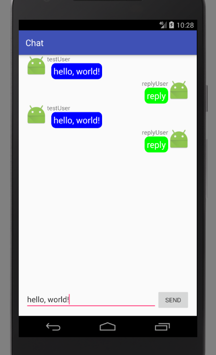

# ListView

以列表形式展示数据通常使用ListView，无论什么GUI框架，使用ListView，TreeView等控件始终是个比较复杂的问题。Android中使用ListView的流程：

1. 获得布局文件中的ListView
2. 设置适配器
3. 设置点击事件监听器

ListView的适配器有ArrayAdapter，SimpleAdapter，BaseAdapter。其中一般使用BaseAdapter，可以自己控制显示方式，更加灵活。适配器编写的代码比较多，且思路比较固定，下列代码实现了从数据库取出数据并显示在ListView上的一个最佳实践。

## 使用ListView的最佳实践之一

MainActivity.java
```java
public class MainActivity extends Activity
{
	private UserDao userDao = new UserDao(this);

	@Override
	protected void onCreate(Bundle savedInstanceState)
	{
		super.onCreate(savedInstanceState);
		setContentView(R.layout.activity_main);

		//查询数据库
		final List<User> userList = userDao.queryFromName("admin");

		//填充ListView
		ListView listView = (ListView) findViewById(R.id.lv);
		listView.setAdapter(
				new BaseAdapter()
		{
			@Override
			public int getCount()
			{
				return userList.size();
			}

			@Override
			public Object getItem(int position)
			{
				return userList.get(position);
			}

			@Override
			public long getItemId(int position)
			{
				return position;
			}

			/**
			 * 这个函数是一个利用缓存的最佳实践
			 * @param position 顺序Id
			 * @param convertView 缓存的View对象
			 * @return 将被系统显示的View
			 */
			@Override
			public View getView(int position, View convertView, ViewGroup parent)
			{
				//ViewHolder用于将控件绑定到view缓存,省去多次findViewById()的开销
				ViewHolder viewHolder;
				//如果view缓存存在就直接利用
				if(convertView != null)
				{
					viewHolder = (ViewHolder) convertView.getTag();
				}
				//如果view缓存不存在就创建这个view
				else
				{
					convertView = View.inflate(MainActivity.this, R.layout.listview_item, null);

					viewHolder = new ViewHolder();
					viewHolder.tv_id = (TextView) convertView.findViewById(R.id.tv_id);
					viewHolder.tv_birthday = (TextView) convertView.findViewById(R.id.tv_birthday);
					viewHolder.tv_username = (TextView) convertView.findViewById(R.id.tv_username);
					convertView.setTag(viewHolder);
				}

				User user = userList.get(position);
				viewHolder.tv_id.setText(String.valueOf(user.getId()));
				viewHolder.tv_birthday.setText(user.getBirthday().toString());
				viewHolder.tv_username.setText(user.getUsername());

				return convertView;
			}

			class ViewHolder
			{
				TextView tv_id;
				TextView tv_birthday;
				TextView tv_username;
			}
		});

		/**
		 * 设置点击事件监听器
		 */
		listView.setOnItemClickListener(new AdapterView.OnItemClickListener() {
			@Override
			public void onItemClick(AdapterView<?> parent, View view, int position, long id)
			{
				Toast.makeText(MainActivity.this, userList.get(position).toString(), Toast.LENGTH_SHORT).show();
			}
		});
	}
}
```

这里解释一下`getView()`方法。我们知道ListView里面包含了很多项数据，这些数据可能布局相同，使用的实体类也相同，只是实体类实例的不同。系统在绘制ListView的时候，显然不可能一下子把ListView包含的所有数据全部加载进内存（“所有数据”指界面绘制需要的数据），因此每次只加载界面可见个数的item。加入界面可见的item有10个，当ListView滚动时，有些数据需要销毁，有些数据需要初始化，那么我们能不能把待销毁的数据重新利用起来呢？这就是`convertView`的作用。

`convertView`是滑出可见区域的item数据，我们将需要初始化的实体类实例数据重新赋予这个缓存的item，这样开销比重新初始化一个item小很多。

## 使用ListView的最佳实践之二

当我们的ListView中，填充多种不同的布局时，上面的缓存利用策略会产生问题，因为`getView()`得到的缓存可能不是我们需要的那种item。我在做一个聊天界面时，发现了这个问题。

正确的实现结果：



其中，每句对话其实就是一个ListView的item，显然我们的ListView需要填充两种不同的布局文件。如果还按照上面代码的写法，就会出现布局串位的问题，即本该显示为自己发言的数据，显示到了别人发言的布局，别人发言的数据显示到了自己发言的布局。原因上面已经解释过了，这里我们直接看这个例子的完整代码。

主界面布局文件
activity_chat.xml
```xml
<?xml version="1.0" encoding="utf-8"?>
<LinearLayout xmlns:android="http://schemas.android.com/apk/res/android"
              android:layout_width="match_parent"
              android:layout_height="match_parent"
              android:orientation="vertical"
              android:paddingLeft="16dp"
              android:paddingRight="16dp">

	<ListView
		android:id="@+id/lv_chat"
		android:divider="@null"
		android:layout_width="wrap_content"
		android:layout_height="0dp"
		android:layout_weight="9">
	</ListView>

	<LinearLayout
		android:layout_weight="1"
		android:layout_width="match_parent"
		android:layout_height="0dp">
		<EditText
			android:id="@+id/et_chat_message"
			android:layout_weight="8"
			android:layout_width="0dp"
			android:layout_height="wrap_content"/>
		<Button
			android:id="@+id/btn_send_message"
			android:layout_weight="2"
			android:layout_width="0dp"
			android:layout_height="wrap_content"
			android:onClick="sendMessage"
			android:text="send"/>
	</LinearLayout>
</LinearLayout>
```

ListView填充的第一种布局 listview_item.xml
```xml
<?xml version="1.0" encoding="utf-8"?>
<RelativeLayout xmlns:android="http://schemas.android.com/apk/res/android"
                android:layout_width="match_parent"
                android:layout_height="match_parent"
                android:orientation="vertical">

	<ImageView
		android:id="@+id/iv_icon"
		android:layout_width="50dp"
		android:layout_height="50dp"/>

	<TextView
		android:id="@+id/tv_username"
		android:layout_width="wrap_content"
		android:layout_height="wrap_content"
		android:layout_toRightOf="@id/iv_icon"
		android:layout_alignParentTop="true"/>

	<TextView
		android:padding="5dp"
		android:id="@+id/tv_message"
		android:layout_width="wrap_content"
		android:layout_height="wrap_content"
		android:layout_below="@id/tv_username"
		android:layout_marginLeft="10dp"
		android:layout_toRightOf="@id/iv_icon"
		android:textColor="#ffffff"
		android:textSize="20sp"
		android:background="@drawable/talk_background"/>
</RelativeLayout>
```

ListView填充的第二种布局 listview_item2.xml
```xml
<?xml version="1.0" encoding="utf-8"?>
<RelativeLayout xmlns:android="http://schemas.android.com/apk/res/android"
                android:layout_width="match_parent"
                android:layout_height="match_parent"
                android:orientation="vertical">

	<ImageView
		android:layout_alignParentRight="true"
		android:id="@+id/iv_icon"
		android:layout_width="50dp"
		android:layout_height="50dp"/>

	<TextView
		android:id="@+id/tv_username"
		android:layout_width="wrap_content"
		android:layout_height="wrap_content"
		android:layout_toLeftOf="@id/iv_icon"
		android:layout_alignParentTop="true"/>

	<TextView
		android:padding="5dp"
		android:id="@+id/tv_message"
		android:layout_width="wrap_content"
		android:layout_height="wrap_content"
		android:layout_below="@id/tv_username"
		android:layout_marginLeft="10dp"
		android:layout_toLeftOf="@id/iv_icon"
		android:textColor="#ffffff"
		android:textSize="20sp"
		android:background="@drawable/talk_background2"/>
</RelativeLayout>
```

ChatActivity.java
```java
package com.ciyaz.chat;

import android.content.Context;
import android.support.v7.app.AppCompatActivity;
import android.os.Bundle;
import android.view.View;
import android.view.ViewGroup;
import android.widget.BaseAdapter;
import android.widget.EditText;
import android.widget.ImageView;
import android.widget.ListView;
import android.widget.TextView;

import com.ciyaz.chat.domain.ChatMessage;

import java.util.ArrayList;
import java.util.List;

public class ChatActivity extends AppCompatActivity
{

	private List<ChatMessage> chatMessageList;
	private ChatListViewAdapter chatListViewAdapter;

	@Override
	protected void onCreate(Bundle savedInstanceState)
	{
		super.onCreate(savedInstanceState);
		setContentView(R.layout.activity_chat);

		initChatMessageList();
	}

	private void initChatMessageList()
	{
		this.chatMessageList = new ArrayList<>();

		ListView chatListView = (ListView) findViewById(R.id.lv_chat);
		this.chatListViewAdapter = new ChatListViewAdapter(this.chatMessageList, this);
		chatListView.setAdapter(this.chatListViewAdapter);
	}

	public void sendMessage(View view)
	{
		EditText editText = (EditText) findViewById(R.id.et_chat_message);
		String chatMessageString = editText.getText().toString();

		ChatMessage chatMessage = new ChatMessage();
		chatMessage.setIconResourceId(R.mipmap.ic_launcher);
		chatMessage.setUsername("testUser");
		chatMessage.setChatMessage(chatMessageString);
		chatMessage.setSelf(true);

		this.chatMessageList.add(chatMessage);
		this.chatListViewAdapter.notifyDataSetChanged();

		replyMessage();
	}

	public void replyMessage()
	{
		ChatMessage chatMessage = new ChatMessage();
		chatMessage.setIconResourceId(R.mipmap.ic_launcher);
		chatMessage.setUsername("replyUser");
		chatMessage.setChatMessage("reply");
		chatMessage.setSelf(false);

		this.chatMessageList.add(chatMessage);
		this.chatListViewAdapter.notifyDataSetChanged();
	}
}
class ChatListViewAdapter extends BaseAdapter
{

	private List<ChatMessage> chatMessageList;
	private Context context;

	private static int TYPE_SELF = 0;
	private static int TYPE_OTHER = 1;

	ChatListViewAdapter(List<ChatMessage> chatMessageList, Context context)
	{
		this.chatMessageList = chatMessageList;
		this.context = context;
	}

	@Override
	public int getCount()
	{
		return chatMessageList.size();
	}

	@Override
	public Object getItem(int position)
	{
		return chatMessageList.get(position);
	}

	@Override
	public long getItemId(int position)
	{
		return position;
	}

	@Override
	public int getViewTypeCount()
	{
		return 2;
	}

	@Override
	public int getItemViewType(int position)
	{
		ChatMessage chatMessage = chatMessageList.get(position);
		if(chatMessage.isSelf())
		{
			return TYPE_SELF;
		}
		else
		{
			return TYPE_OTHER;
		}
	}

	@Override
	public View getView(int position, View convertView, ViewGroup parent)
	{
		ChatMessage chatMessage = chatMessageList.get(position);

		//ViewHolder用于将控件绑定到view缓存,省去多次findViewById()的开销
		ViewHolder viewHolder;

		//判断当前要绘制的对象的TYPE
		int targetType;
		if(chatMessage.isSelf())
		{
			targetType = TYPE_SELF;
		}
		else
		{
			targetType = TYPE_OTHER;
		}

		//如果view缓存存在，且类型相同（相同布局文件）就直接利用
		if (convertView != null && getItemViewType(position) == targetType)
		{
			viewHolder = (ViewHolder) convertView.getTag();
		}
		//如果view缓存不存在就创建这个view
		else
		{
			if(chatMessage.isSelf())
			{
				convertView = View.inflate(context, R.layout.listview_item, null);
			}
			else
			{
				convertView = View.inflate(context, R.layout.listview_item2, null);
			}

			viewHolder = new ViewHolder();
			viewHolder.iv_icon = convertView.findViewById(R.id.iv_icon);
			viewHolder.tv_username = convertView.findViewById(R.id.tv_username);
			viewHolder.tv_message = convertView.findViewById(R.id.tv_message);
			convertView.setTag(viewHolder);
		}


		viewHolder.iv_icon.setImageResource(chatMessage.getIconResourceId());
		viewHolder.tv_username.setText(chatMessage.getUsername());
		viewHolder.tv_message.setText(chatMessage.getChatMessage());

		return convertView;
	}

	private class ViewHolder
	{
		ImageView iv_icon;
		TextView tv_username;
		TextView tv_message;
	}
}
```

这里因为我们要刷新ListView的数据，需要调用`adapter.notifyDataSetChanged()`，因此自定义了一个类继承了BaseAdapter。注意这里我们为所有的item划分了两类：`TYPE_SELF`和`TYPE_OTHER`。利用缓存时，如果分类正确且缓存存在，才利用缓存，否则都是创建新的item。

总结一下解决这个问题的步骤：

1. 重写`getViewTypeCount()`，返回分类个数
2. 重写`getItemViewType()`，这个函数判断当前实体类属于哪个分类
3. 合理安排缓存策略

我们只要完全理解了ListView的缓存工作原理，实际上再遇到类似问题，解决起来都是一通百通的。
