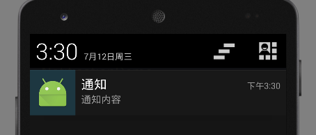

# 通知 Notification

Android系统有一个通知栏，任何一个应用都可以向通知栏发送通知，提醒用户一些事情，比如微信当有新消息时，就会发送一个通知，点击这个通知就可以跳转到聊天界面。除此之外，通知还有其他重要的使用场景：

* 音乐播放器中，可以使用一个Notification作为后台Service的控制条。
* 下载器，可以用一个Notification作为后台下载线程的进度条。
* 日程提醒工具，可以用通知结合声音、震动的方式，实现用户日程提醒。

下面我们就分别看看这几种使用场景下，该如何使用Notification。

## PendingIntent

在学习Notification之前，我们需要了解一下这个PendingIntent。我们学过Intent，知道如何使用一个Intent启动Activity或是Service。Intent一旦发出，那么对应的组件就会立即启动，而PendingIntent则是先将意图赋予一个对象（一般就是Notification），这个Notification可以脱离Activity或是Service存在。当满足某些条件的情况下，意图被触发时，Intent才被发送。

创建一个PendingIntent
```java
Intent intent = new Intent(this, ContentActivity.class);
PendingIntent pendingIntent = PendingIntent.getActivity(this, 0, intent, PendingIntent.FLAG_UPDATE_CURRENT);
```

我们首先需要一个Intent对象，这个Intent对象就是最终执行的意图，如果我们需要传递数据，就可以放在这个Intent中。

PendingIntent类有三个静态方法：

* `getActivity()`
* `getService()`
* `getBroadcast()`

分别对应打开Activity组件，Service组件，广播组件。

第一个参数Context，我们使用当前Activity即可。第二个参数是请求ID，现在已弃用，填0。第三个参数是待发送的Intent对象，我们需要事先准备好。第四个参数其实和第二个参数有关，是有相同请求ID的PendingIntent出现时的处理方式，由于第二个参数已经不用了，因此这里我们固定填`PendingIntent.FLAG_UPDATE_CURRENT`。

如何将PendingIntent赋予Notification，将在下面叙述。

## 简单提醒

简单提醒功能实现这样一种功能：应用在某个情况下，向通知栏发送了一个通知，用户点击这个通知后，就跳转到这个应用的一个Activity中。

activity_main.xml
```xml
<?xml version="1.0" encoding="utf-8"?>
<LinearLayout xmlns:android="http://schemas.android.com/apk/res/android"
			  android:layout_width="match_parent"
			  android:layout_height="match_parent"
			  android:paddingLeft="16dp"
			  android:paddingRight="16dp"
			  android:orientation="vertical" >
	<Button
		android:layout_width="match_parent"
		android:layout_height="wrap_content"
		android:text="发出一个通知"
		android:onClick="popNotification"/>
</LinearLayout>
```

activity_content.xml
```xml
<?xml version="1.0" encoding="utf-8"?>
<LinearLayout xmlns:android="http://schemas.android.com/apk/res/android"
			  android:layout_width="match_parent"
			  android:layout_height="match_parent"
			  android:paddingLeft="16dp"
			  android:paddingRight="16dp"
			  android:orientation="vertical" >
	<TextView
		android:layout_width="wrap_content"
		android:layout_height="wrap_content"
		android:text="内容Activity"/>
</LinearLayout>
```

MainActivity.java
```java
package com.ciyaz.notificationdemo;

import android.app.Notification;
import android.app.NotificationManager;
import android.app.PendingIntent;
import android.content.Context;
import android.content.Intent;
import android.support.v7.app.AppCompatActivity;
import android.os.Bundle;
import android.support.v7.app.NotificationCompat;
import android.view.View;

public class MainActivity extends AppCompatActivity
{

	@Override
	protected void onCreate(Bundle savedInstanceState)
	{
		super.onCreate(savedInstanceState);
		setContentView(R.layout.activity_main);
	}

	/**
	 * 发送通知
	 */
	public void popNotification(View view)
	{
		//获取通知构造器
		NotificationCompat.Builder builder = new NotificationCompat.Builder(this);
		//设置通知参数，这里设置的分别是图标，标题，内容，时间
		builder.setSmallIcon(R.mipmap.ic_launcher).setContentTitle("通知").setContentText("通知内容").setWhen(System.currentTimeMillis());
		//设置通知意图
		Intent intent = new Intent(this, ContentActivity.class);
		PendingIntent pendingIntent = PendingIntent.getActivity(this, 0, intent, PendingIntent.FLAG_UPDATE_CURRENT);
		builder.setContentIntent(pendingIntent);
		//构造通知，获得Notification对象
		Notification notification = builder.build();

		//发送通知
		NotificationManager manager = (NotificationManager) getSystemService(Context.NOTIFICATION_SERVICE);
    //第一个参数是通知ID，相同ID的通知只能有一个，想发送多个通知就要设置不同ID
		manager.notify(1, notification);

	}
}
```

ContentActivity.java
```java
package com.ciyaz.notificationdemo;

import android.support.v7.app.AppCompatActivity;
import android.os.Bundle;

public class ContentActivity extends AppCompatActivity
{

	@Override
	protected void onCreate(Bundle savedInstanceState)
	{
		super.onCreate(savedInstanceState);
		setContentView(R.layout.activity_content);
	}
}
```

这里为了简单起见，我们就在MainActivity中做了一个按钮，点击按钮就会发送一个通知，点击这个通知，就会跳转到ContentActivity。ContentActivity中只有一个TextView。

这里我们主要关注如何发送一个通知。首先我们需要一个`NotificationCompat.Builder`，它可以叫做通知对象的构造工具类。我们在其上设置了若干属性，最终调用`builder.build()`获得`Notification`对象。为了发送通知对象，我们还需要一个`NotificationManager`，这是一个系统服务，因此我们需要使用`getSystemService()`来获取。最终调用`manager.notify()`方法发送通知（不要和线程相关的那个`notify()`函数弄混，两个完全是不同意义的函数）。

总结Notification的使用步骤：获取构造工具类实例->设置Notification属性->使用NotificationManager发送该消息

运行效果：



## 一些常用的Notification属性用法

注：以下属性有关铃声，震动等，建议实机调试。属性值可以用或运算`|`连接，实现设置多个属性值。

设置消息发出时提示音和手机震动效果
```java
builder.setDefaults(Notification.DEFAULT_ALL)
```

* `DEFAULT_SOUND` 提示音，这个声音是系统自带的
* `DEFAULT_LIGHTS` 三色灯，具体效果视手机硬件而定，可能没有任何效果
* `DEFAULT_VIBRATE` 震动，需要VIBRATE权限（我使用我的红米Note手机时，并没有加上这个权限，但是也能震动）
* `DEFAULT_ALL` 以上三种效果都具备，我们默认使用这个属性就可以了

设置Notification的一些flag
```java
notification.flags = Notification.FLAG_AUTO_CANCEL
```

* `Notification.FLAG_SHOW_LIGHTS` 使用三色灯时必须加此标志
* `Notification.FLAG_ONGOING_EVENT` 发起正在运行的事件
* `Notification.FLAG_INSISTENT` 让声音、震动无限循环，直到用户响应这个Notification，实测是手机打开通知栏循环就停止了，可以用来作闹钟
* `Notification.FLAG_ONLY_ALERT_ONCE` 震动和提示音只执行一次
* `Notification.FLAG_AUTO_CANCEL` 用户响应该Notification后，自动关闭（默认即使响应该Notification后也不自动关闭，建议加上这个flag）
* `Notification.FLAG_NO_CLEAR` 无法清除的Notification，除非进程停止
* `Notification.FLAG_FOREGROUND_SERVICE` 表示正在运行的服务

设置震动方式
```java
builder.setVibrate(new long[]{1000, 1000, 1000, 2000})
```

上面代码表示震动方式是：延迟1s->震动1s->延迟1s->震动2s

主动关闭Notification
```java
manager.cancel(DOWNLOAD_NOTIFICATION_ID);
```

NotificationManager.cancel()可以主动关闭Notification，参数是NotificationID。

## 进度条Notification

这里在上一个例子基础上，我们在Notification中加一个进度条，然后使用后台Service控制进度条的进度。

DownloadService.java
```java
package com.ciyaz.notificationdemo;

import android.app.IntentService;
import android.app.Notification;
import android.app.NotificationManager;
import android.app.PendingIntent;
import android.content.Intent;
import android.content.Context;
import android.support.annotation.Nullable;
import android.support.v7.app.NotificationCompat;

public class DownloadService extends IntentService
{

	private static int DOWNLOAD_NOTIFICATION_ID = 1;

	public DownloadService()
	{
		super("Download Service");
	}

	@Override
	protected void onHandleIntent(@Nullable Intent intent)
	{

		//获取通知构造器
		NotificationCompat.Builder builder = new NotificationCompat.Builder(this);
		//设置通知参数，这里设置的分别是图标，标题，内容，时间
		builder
				.setSmallIcon(R.mipmap.ic_launcher)
				.setContentTitle("下载")
				.setWhen(System.currentTimeMillis());

		//设置通知意图
		Intent notificationIntent = new Intent(this, ContentActivity.class);
		PendingIntent pendingIntent = PendingIntent.getActivity(this, 0, notificationIntent, PendingIntent.FLAG_UPDATE_CURRENT);
		builder.setContentIntent(pendingIntent);


		for(int i = 0; i < 100; i++)
		{
			try
			{
				Thread.sleep(100);

				//设置进度
				builder.setContentText(i + "%").setProgress(100, i, false);
				sendNotification(builder);
			}
			catch (InterruptedException e)
			{
				e.printStackTrace();
			}
		}

		builder.setContentText("下载完成");
		sendNotification(builder);
	}

	private void sendNotification(NotificationCompat.Builder builder)
	{
		//构造通知，获得Notification对象
		Notification notification = builder.build();
		//发送通知
		NotificationManager manager = (NotificationManager) getSystemService(Context.NOTIFICATION_SERVICE);
		//第一个参数是通知ID，相同ID的通知只能有一个，想发送多个通知就要设置不同ID
		manager.notify(DOWNLOAD_NOTIFICATION_ID, notification);
	}
}
```

这里我们继承了一个IntentService实现一个后台下载服务，这里没有实际下载数据，而是用循环模拟的。每次循环都发送新的Notification，但是我们注意，Notification的ID都是相同的，这样旧的Notification就会不断被覆盖，呈现出进度条前进的效果。

注：`onHandleIntent()`方法是在新线程中调用的，执行完成后会自动关闭自己。
