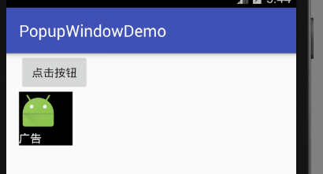

# PopupWindow 弹出窗口

PopupWindow和Dialog比较像，只不过Dialog就是用来给用户一些提示信息，让用户选择的，而弹出窗口则是可定制化程度更高。

## 弹出窗口例子

下面例子中，演示了最简单的弹出窗口，点击一下按钮显示一个弹出窗口。

popupwindow_content.xml
```xml
<?xml version="1.0" encoding="utf-8"?>
<LinearLayout xmlns:android="http://schemas.android.com/apk/res/android"
			  android:orientation="vertical"
			  android:layout_width="match_parent"
			  android:layout_height="match_parent"
	android:background="#000000">
<ImageView
	android:layout_width="wrap_content"
	android:layout_height="wrap_content"
	android:src="@mipmap/ic_launcher"/>
	<TextView
		android:layout_width="wrap_content"
		android:layout_height="wrap_content"
		android:textColor="#ffffff"
		android:text="广告"/>
</LinearLayout>
```

MainActivity.java
```java
public void showPopupWindow(View view)
{
  //填充弹出窗口的布局文件
  LinearLayout popupWindowContentView = (LinearLayout) getLayoutInflater().inflate(R.layout.popupwindow_content, null);
  //初始化弹出窗口
  PopupWindow popupWindow = new PopupWindow(popupWindowContentView, 200, 200);
  //作为参数组件的下拉组件显示
  popupWindow.showAsDropDown(findViewById(R.id.btn));
}
```

实例化PopupWindow对象时，第一个参数是填充弹出窗口布局的View对象，后两个参数是弹出窗口的宽和高。由于此时popupWindowContentView尚未进行绘制的大小尺寸初始化，因此无法得到其大小，我们自己指定一个就可以了。

* `showAsDropDown()` 以下拉组件的形式弹出窗口，弹出位置就是当前鼠标位置附近
* `showAtLocation()` 在指定位置弹出

上面例子的运行效果：


