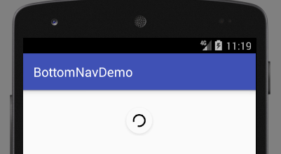

# SwipeRefreshLayout 下拉刷新

Google的Material Design Support Library中，包含了一个Material Design风格的下拉刷新控件，知乎APP似乎就是用的这个控件。下拉刷新功能以前通常需要自己实现或是使用第三方实现，这次官方扩展包中提供的SwipeRefreshLayout非常美观，如果APP界面是Material Design风格，非常适合直接拿来用。

## 添加gradle依赖

```java
compile 'com.android.support:design:26.+'
```

注意：design库版本要和compileSDK版本保持一致。

## 使用下拉刷新控件

我们直接看一个例子，看看如何使用这个SwipeRefreshLayout。

activity_refresh.xml
```xml
<?xml version="1.0" encoding="utf-8"?>
<RelativeLayout xmlns:android="http://schemas.android.com/apk/res/android"
				android:layout_width="match_parent"
				android:layout_height="match_parent"
				android:paddingLeft="16dp"
				android:paddingRight="16dp">

	<android.support.v4.widget.SwipeRefreshLayout
		android:id="@+id/srl_message_refresh"
		android:layout_width="match_parent"
		android:layout_height="wrap_content">

		<ListView
			android:id="@+id/lv_message"
			android:layout_width="match_parent"
			android:layout_height="wrap_content"/>

	</android.support.v4.widget.SwipeRefreshLayout>
</RelativeLayout>
```

注意：SwipeRefreshLayout控件要求内部必须包含一个可滑动的子控件，不过实际上下拉刷新按钮也就是用在这种地方上的。这里我们使用一个ListView来进行演示。

RefreshActivity.java
```java
package com.ciyaz.bottomnavdemo;

import android.os.Handler;
import android.os.Message;
import android.support.v4.widget.SwipeRefreshLayout;
import android.support.v7.app.AppCompatActivity;
import android.os.Bundle;

import java.util.Timer;
import java.util.TimerTask;

public class RefreshActivity extends AppCompatActivity
{

	@Override
	protected void onCreate(Bundle savedInstanceState)
	{
		super.onCreate(savedInstanceState);
		setContentView(R.layout.activity_refresh);

		final SwipeRefreshLayout swipeRefreshLayout = (SwipeRefreshLayout) findViewById(R.id.srl_message_refresh);

		final Handler handler = new Handler()
		{
			@Override
			public void handleMessage(Message msg)
			{
				if (msg.what == 0x1)
				{
					swipeRefreshLayout.setRefreshing(false);
				}
			}
		};

		swipeRefreshLayout.setOnRefreshListener(new SwipeRefreshLayout.OnRefreshListener()
		{
			@Override
			public void onRefresh()
			{
				final Timer timer = new Timer();
				TimerTask timerTask = new TimerTask()
				{
					@Override
					public void run()
					{
						timer.cancel();
						handler.sendEmptyMessage(0x1);
					}
				};
				timer.schedule(timerTask, 1000);
			}
		});
	}
}
```

这段代码不是很复杂，关键注意两个地方：

1. 设置`OnRefreshListener`，这个监听器监听的就是子可滑动组件的下拉事件，我们需要重写`onRefresh()`方法。
2. 一般需要刷新的地方，数据加载都是耗时的，比如从网络加载或从文件系统加载，耗时操作需要放在子线程中。这里我们为了演示，使用了一个定时计划任务，1秒后就向Handler发送消息，Handler得知耗时操作完成，就调用`swipeRefreshLayout.setRefreshing(false);`，界面上会显示一个下拉刷新控件消失的动画。

运行效果：



## 一些可配置的属性

设置进度条颜色，可变参数，可以设置多种颜色，进度条每转一圈就换一种颜色。

```java
swipeRefreshLayout.setColorSchemeResources(R.color.colorAccent);
```

设置控件的背景颜色。

```java
swipeRefreshLayout.setProgressBackgroundColorSchemeResource(R.color.colorPrimary);
```

判断是否正在刷新。

```java
swipeRefreshLayout.isRefreshing()
```

注：控件内部实现了当正在刷新时，不会重复触发刷新事件。
