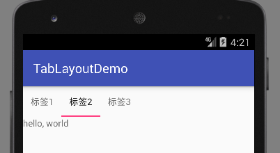

# TabLayout 标签页

这里说的TabLayout不是Android自带的表格布局(TableLayout)，而是google的Material Design support库的标签页控件。

桌面平台的GUI框架中，标签页是一个非常常用的控件。Android中却没有提供一个封装好的标签页控件，只能自己用Fragment或者ViewPager实现，如果想要自己实现的控件和其他控件美观、协调，工作量还真不小。Material Design support库中，给我们提供了一个符合Material Design风格的标签页控件，可以直接拿来用。

## Material Design support库

添加gradle依赖：
```java
compile 'com.android.support:design:24.2.1'
```

注意：后面的版本号请和其他support支持库保持一致。

## 结合ViewPager实现美观的标签页

这里我们直接给出一个例子，结合TabLayout和ViewPager，编写一个完整的基础标签页功能的最佳实践。

activity_main.xml
```xml
<?xml version="1.0" encoding="utf-8"?>
<RelativeLayout xmlns:android="http://schemas.android.com/apk/res/android"
				xmlns:app="http://schemas.android.com/apk/res-auto"
				android:layout_width="match_parent"
				android:layout_height="match_parent">

	<android.support.design.widget.TabLayout
		android:id="@+id/tl"
		android:layout_width="wrap_content"
		android:layout_height="wrap_content">
	</android.support.design.widget.TabLayout>

	<android.support.v4.view.ViewPager
		android:id="@+id/vp"
		android:layout_width="wrap_content"
		android:layout_height="wrap_content"
		android:layout_below="@id/tl">
	</android.support.v4.view.ViewPager>
</RelativeLayout>
```

上述代码中，我们直接放置了一个TabLayout控件和一个ViewPager控件，由于xml中没有能描述足够的信息，因此Android Studio的预览功能显示不出什么东西，这里尤其要注意：因为我们使用的是一个相对布局，不要忘了ViewPager的`android:layout_below`，否则两个两个控件重叠在一起，可能半天反应不过来哪里错了。

viewpager_content.xml
```xml
<?xml version="1.0" encoding="utf-8"?>
<LinearLayout xmlns:android="http://schemas.android.com/apk/res/android"
			  android:orientation="vertical"
			  android:layout_width="match_parent"
			  android:layout_height="match_parent">
<TextView
	android:layout_width="wrap_content"
	android:layout_height="wrap_content"
	android:text="hello, world"/>
</LinearLayout>
```

这里方便起见，我们准备设置三个标签页，但是内容都相同，都是包含一个`hello, world!`的线性布局。这个布局文件用来填充ViewPager。

MainActivity.java
```java
package com.ciyaz.tablayoutdemo;

import android.support.design.widget.TabLayout;
import android.support.v4.view.PagerAdapter;
import android.support.v4.view.ViewPager;
import android.support.v7.app.AppCompatActivity;
import android.os.Bundle;
import android.view.LayoutInflater;
import android.view.View;
import android.view.ViewGroup;
import android.widget.ImageView;

import java.util.ArrayList;
import java.util.List;

public class MainActivity extends AppCompatActivity
{

	@Override
	protected void onCreate(Bundle savedInstanceState)
	{
		super.onCreate(savedInstanceState);
		setContentView(R.layout.activity_main);

		init();
	}

	private void init()
	{
		TabLayout tabLayout = (TabLayout) findViewById(R.id.tl);
		ViewPager viewPager = (ViewPager) findViewById(R.id.vp);

		LayoutInflater layoutInflater = LayoutInflater.from(this);
		View view1 = layoutInflater.inflate(R.layout.viewpager_content, null);
		View view2 = layoutInflater.inflate(R.layout.viewpager_content, null);
		View view3 = layoutInflater.inflate(R.layout.viewpager_content, null);

		List<View> viewList = new ArrayList<>();
		viewList.add(view1);
		viewList.add(view2);
		viewList.add(view3);

		List<String> viewTitleList = new ArrayList<>();
		viewTitleList.add("标签1");
		viewTitleList.add("标签2");
		viewTitleList.add("标签3");

		viewPager.setAdapter(new TabViewPagerAdapter(viewList, viewTitleList));
		tabLayout.setupWithViewPager(viewPager);
	}

}
class TabViewPagerAdapter extends PagerAdapter
{

	private List<View> viewList;
	private List<String> viewTitleList;

	public TabViewPagerAdapter(List<View> viewList, List<String> viewTitleList)
	{
		this.viewList = viewList;
		this.viewTitleList = viewTitleList;
	}

	//item个数
	@Override
	public int getCount()
	{
		return viewList.size();
	}

	//复用判断逻辑，固定写法
	@Override
	public boolean isViewFromObject(View view, Object object)
	{
		return view == object;
	}

	//初始化item
	@Override
	public Object instantiateItem(ViewGroup container, int position)
	{
		View view = viewList.get(position);
		container.addView(view);
		return view;
	}

	//销毁item
	@Override
	public void destroyItem(ViewGroup container, int position, Object object)
	{
		container.removeView((View)object);
	}

	@Override
	public CharSequence getPageTitle(int position)
	{
		return viewTitleList.get(position);
	}
}
```

首先我们初始化了ViewPager的所有包含的页面List，注意我们同时初始化了一个标题List，在PagerAdapter中，我们除了重写必须的几个方法外，还重写了一个`getPageTitle()`方法，这个方法返回了对应标签页面的标题。TabLayout会读取这个返回的标题，自动设置标签字符串值。

最终，使用`tabLayout.setupWithViewPager(viewPager)`，关联TabLayout和ViewPager，这个方法很给力，提供了两者结合的一站式操作，否则要设置各种监听器，就十分麻烦了。

注：有关ViewPager的用法可以参考`ViewPager-可滑动轮播控件`章节。

运行效果：



我们可以点选标签，可以左右滑动ViewPager，同时标签也会联动。左右滑动有动画效果，十分美观。

## 滑动属性

如果标签页很多，屏幕一行放不下，标签页控件会自动压缩一个标签的大小，这会导致标签的文本被省略号代替，十分难看。我们可以设置标签页在水平方向上可滑动。

```xml
<android.support.design.widget.TabLayout
	android:layout_width="wrap_content"
	android:layout_height="wrap_content"
	app:tabMode="scrollable" />
```

标签页控件还提供了很多其他的可选的属性，可以改变颜色、大小等，这里就不详细叙述了，具体有需求时，查看文档即可。
