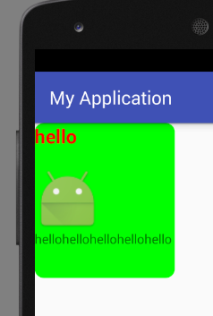

# TextView 高级用法

TextView是Android中最常用的控件，其基本用法在`Android开发基础/基础控件详解`中讲解过了。

TextView不仅仅是显示几个字符这么简单，这里我们看一些很常用的高级的用法。

## 自定义字体样式

我们看到的成品app里面，TextView的文字样式都是经过仔细调整的，默认字体样式大小、颜色、字体可能都不合适。

### 调整TextView大小和颜色

我们可以在布局文件xml中，定义TextView的属性。

```
android:textSize="50sp"
android:textColor="#000000"
```

TextView控件有很多属性，字体大小和颜色是最常用的。

### 调整TextView的样式

加粗，斜体，和正常字体使用如下属性：

```
android:textStyle="bold"
```

可选值有`bold`，`italic`，`normal`。

随意添加下划线很遗憾不能实现，但是TextView提供了`autoLink`属性，但是它只能实现为超链接，电话号码等自动添加下划线的效果。而且TextView能够渲染HTML，我们还可以使用HTML实现下划线的效果。

### 调整TextView字体

布局文件xml中，我们可以选用Android自带的Roboto几种字体。例子如下：

```
android:fontFamily="sans-serif"           // roboto regular
android:fontFamily="sans-serif-light"     // roboto light
android:fontFamily="sans-serif-condensed" // roboto condensed
android:fontFamily="sans-serif-black"     // roboto black
android:fontFamily="sans-serif-thin"      // roboto thin (android 4.2)
android:fontFamily="sans-serif-medium"    // roboto medium (android 5.0)
```

编程方法可以设置自定义字体：

```java
TextView tv = (TextView) findViewById(R.id.appname);
Typeface face = Typeface.createFromAsset(getAssets(), "fonts/epimodem.ttf");
tv.setTypeface(face);
```

## 使用TextView显示HTML

编写聊天工具时，TextView应该在包含文本的同时，还包含图片，文本的字体，大小都能随意调节，这显然是需要TextView渲染富文本。TextView能够渲染HTML。

下面例子中，使用TextView渲染HTML。

```java
TextView textView = (TextView) findViewById(R.id.tv_text);
Html.ImageGetter imageGetter = new Html.ImageGetter()
{

  public Drawable getDrawable(String source)
  {
    int resId = Integer.parseInt(source);
    Drawable drawable = getResources().getDrawable(resId);
    drawable.setBounds(0, 0, drawable.getIntrinsicWidth(), drawable.getIntrinsicHeight());
    return drawable;
  }
};
textView.setText(Html.fromHtml("<h1><font color=\"red\">hello</font></h1> <p> <br />hellohellohellohellohello</p>", imageGetter, null));
```

这里主要注意`ImageGetter`的使用，我们重写了它的`getDrawable()`方法，因为HTML中我们定义了图片的`src`属性，我们需要用一种方式从资源或是网络中加载图片。这里我们使用的方式是通过资源ID进行加载，从网络加载也是同理的。

注意：`drawable.setBounds()`必须写上，否则图片默认大小为0，显示不出来。

运行效果：



注：后面背景是xml中加的。
