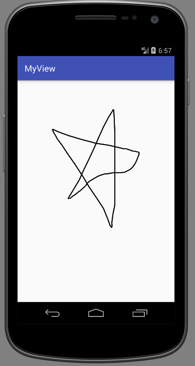

# View类

View是Android中所有控件的基类，表示屏幕上的一块绘图区域，所有控件都直接或间接的继承这个类，它包含控件如何绘制，响应哪些事件的基本方法。如果我们要编写一个自定义控件，我们就需要继承这个View类，并重写一些方法，实现我们自己需要的控件行为。除了自定义控件之外，由于我们能够自己控制View的绘图，我们也可以用View来编写游戏。

实际上，自定义控件和游戏是一个道理，只不过游戏一般就使用一个View，在上面绘制全部游戏画面，自定义控件则是作为一个独立的组件，包含到布局文件中。

ViewGroup继承于View，它能包含其他控件实现复杂的效果。

## 自定义控件例子

这里我们实现一个简单的绘图板控件。为了简单起见，这里使用的方法比较简单：鼠标按下，当鼠标移动事件发生时，就在屏幕上不停的绘制直线，鼠标抬起就不绘制。这样做代码比较简单，但是缺点就是CPU和内存占用都比较高。

PaintView.java
```java
package com.ciyaz.myview.ui;

import android.content.Context;
import android.graphics.Canvas;
import android.graphics.Color;
import android.graphics.Paint;
import android.support.annotation.Nullable;
import android.util.AttributeSet;
import android.view.MotionEvent;
import android.view.View;

import java.util.ArrayList;
import java.util.List;

public class PaintView extends View
{

	//画笔是否按下
	private boolean penState = false;

	//全部存在的点
	private List<Point> pointList = new ArrayList<>();

	//画笔对象
	private Paint paint;

	/**
	 * 用于从Java代码创建控件
	 * @param context 上下文对象，一般都使用当前Activity
	 */
	public PaintView(Context context)
	{
		super(context);
		initPaint();
	}

	/**
	 * 从xml创建控件
	 * @param context 上下文对象
	 * @param attrs xml属性
	 */
	public PaintView(Context context, @Nullable AttributeSet attrs)
	{
		super(context, attrs);
		initPaint();
	}

	/**
	 * 从xml创建
	 * @param context 上下文对象
	 * @param attrs xml属性
	 * @param defStyleAttr style属性
	 */
	public PaintView(Context context, @Nullable AttributeSet attrs, int defStyleAttr)
	{
		super(context, attrs, defStyleAttr);
		initPaint();
	}

	private void initPaint()
	{
		this.paint = new Paint();
		this.paint.setColor(Color.BLACK);//颜色
		this.paint.setStrokeWidth(5);//线宽
		this.paint.setAntiAlias(true);//抗锯齿
	}

	/**
	 * 指定控件宽高
	 */
	@Override
	protected void onMeasure(int widthMeasureSpec, int heightMeasureSpec)
	{
		super.onMeasure(widthMeasureSpec, heightMeasureSpec);
	}

	/**
	 * 自定义绘制
	 */
	@Override
	protected void onDraw(Canvas canvas)
	{
		int pointListSize = pointList.size();
		for(int i = 0; i < pointListSize; i++)
		{
			if(i + 1 < pointListSize)
			{
				canvas.drawLine(pointList.get(i).x, pointList.get(i).y, pointList.get(i + 1).x, pointList.get(i + 1).y, paint);
			}
		}
	}

	/**
	 * 重写触摸事件
	 */
	@Override
	public boolean onTouchEvent(MotionEvent event)
	{
		if(event.getAction() == MotionEvent.ACTION_MOVE)
		{
			if(penState)
			{
				this.pointList.add(new Point(event.getX(), event.getY()));
			}
		}
		else if(event.getAction() == MotionEvent.ACTION_DOWN)
		{
			this.penState = true;
		}
		else if(event.getAction() == MotionEvent.ACTION_UP)
		{
			this.penState = false;
		}
		invalidate();
		return true;
	}

	private class Point
	{
		float x;
		float y;

		Point(float x, float y)
		{
			this.x = x;
			this.y = y;
		}
	}
}
```

activity_main.xml
```xml
<?xml version="1.0" encoding="utf-8"?>
<RelativeLayout xmlns:android="http://schemas.android.com/apk/res/android"
				android:layout_width="match_parent"
				android:layout_height="match_parent"
				android:paddingLeft="16dp"
				android:paddingRight="16dp" >

	<com.ciyaz.myview.ui.PaintView
		android:layout_height="match_parent"
		android:layout_width="match_parent"/>
</RelativeLayout>
```

我们重写了三个构造函数：

* `PaintView(Context context)`：使用Java代码初始化控件时，我们经常调用这个函数
* `PaintView(Context context, @Nullable AttributeSet attrs)`：除了使用Java代码创建控件，我们最常用的方式是在xml布局文件中定义控件，此时这个构造函数就会自动调用
* `PaintView(Context context, @Nullable AttributeSet attrs, int defStyleAttr)`：这个构造函数多了一个defStyleAttr参数，这是xml布局文件中定义了`style`属性时使用的。

`void onMeasure(int widthMeasureSpec, int heightMeasureSpec)`：这个函数是用来设置该控件的宽和高的，两个参数值是根据父控件和其他控件自动计算出来的，我们也可以不用，比如制作定制的按钮控件时，我们需要按钮固定大小。

`void onDraw(Canvas canvas)`：这个函数里编写的就是在View内绘制的代码，参数是一个Canvas对象，因此我们在View初始化时，同时初始化了一个Paint对象。这里将所有直线的端点存储到了一个ArrayList中，每次onDraw()回调的时候，都会遍历这个数组，并把其表示的所有直线绘制出来。

注意`onTouchEvent()`中，最后调用了`invalidate()`，这个方法会触发View的重绘，也就是说`invalidate()`时会自动重新调用`onDraw()`。

运行效果：



## View和ViewGroup的绘制流程

ViewGroup绘制的顺序是：measure->layout->draw，View则是measure->draw。measure阶段会回调`onMeasure()`函数，确定View的大小，layout阶段则是用来确定子控件的摆放的，View没有子控件，因此不包含此阶段，draw阶段会进行最终的绘制，而且大多数情况下，都会反复调用`onDraw()`实现绘图区刷新的效果。

我们直到Activity有若干生命周期阶段，View的绘制是发生在Activity的resume之后的，因此我们在Activity的`onCreate()`内设置View的初始化属性是没有问题的，因为此时view尚未开始绘制。

## 自定义控件读取xml属性

我们使用xml定义控件时，会设置很多属性，比如`android:layout_height`等，我们自定义控件也可以设置自定义的属性。下面接着上面例子，我们演示一下如何定义并从xml读取属性值。

首先在values文件夹下，创建一个attrs.xml文件，用来定义我们自定义控件的属性：

attrs.xml
```xml
<?xml version="1.0" encoding="utf-8"?>
<resources>

	<declare-styleable name="PaintView">
		<attr name="bg_image" format="reference"/>
		<attr name="border" format="boolean" />
	</declare-styleable>

</resources>
```

这里是为了演示，添加了背景图属性和是否有边框属性（实际上View类已经提供了设置背景图片的函数）。

布局文件activity_main.xml
```xml
<?xml version="1.0" encoding="utf-8"?>
<RelativeLayout
	xmlns:android="http://schemas.android.com/apk/res/android"
	xmlns:ciyaz="http://schemas.android.com/apk/res-auto"
	android:layout_width="match_parent"
	android:layout_height="match_parent"
	android:padding="16dp">

	<com.ciyaz.paintview.ui.PaintView
		android:layout_width="match_parent"
		android:layout_height="match_parent"
		ciyaz:bg_image="@drawable/bg"
		ciyaz:border="true"/>
</RelativeLayout>
```

注意我们在RelativeLayout中，添加了自定义的命名空间`xmlns:ciyaz="http://schemas.android.com/apk/res-auto"`，命名空间的名字是自己定义的，值统一按上面写就行了。后面编写相关属性时，也要配合命名空间使用，如`ciyaz:bg_image="@drawable/bg"`。

自定义控件的代码如何取到xml中定义的值呢？下面我们看自定义控件的一个构造函数：
```java
public PaintView(Context context, @Nullable AttributeSet attrs, int defStyleAttr)
{
	super(context, attrs, defStyleAttr);
	initPaint();

	TypedArray typedArray = context.obtainStyledAttributes(attrs, R.styleable.PaintView, defStyleAttr, 0);
	int backgroundRes = typedArray.getResourceId(R.styleable.PaintView_bg_image, -1);
	boolean border = typedArray.getBoolean(R.styleable.PaintView_border, false);

	setBackgroundImage(backgroundRes);
	setBorder(border);
}
```

android提供了TypedArray可以用来存放xml定义的属性键值对，我们使用`context.obtainStyledAttributes()`取出即可。注意`defStyleAttr`，这里我们xml中没定义`style`属性，因此默认调用的构造函数是`PaintView(Context context, @Nullable AttributeSet attrs)`，但是`obtainStyledAttributes()`又要求我们传`defStyleAttr`，那这个构造函数就只好这样写了：

```java
public PaintView(Context context, @Nullable AttributeSet attrs)
{
	this(context, attrs, 0);
}
```

实际上，我们可以看看View源码，其`PaintView(Context context, @Nullable AttributeSet attrs)`函数做的唯一一件事也是向`PaintView(Context context, @Nullable AttributeSet attrs, int defStyleAttr)`的`defStyleAttr`传`0`，所以我们这样写是完全没有问题的。

```java
/**
 * Constructor that is called when inflating a view from XML. This is called
 * when a view is being constructed from an XML file, supplying attributes
 * that were specified in the XML file. This version uses a default style of
 * 0, so the only attribute values applied are those in the Context's Theme
 * and the given AttributeSet.
 *
 * <p>
 * The method onFinishInflate() will be called after all children have been
 * added.
 *
 * @param context The Context the view is running in, through which it can
 *        access the current theme, resources, etc.
 * @param attrs The attributes of the XML tag that is inflating the view.
 * @see #View(Context, AttributeSet, int)
 */
public View(Context context, @Nullable AttributeSet attrs) {
		this(context, attrs, 0);
}
```
