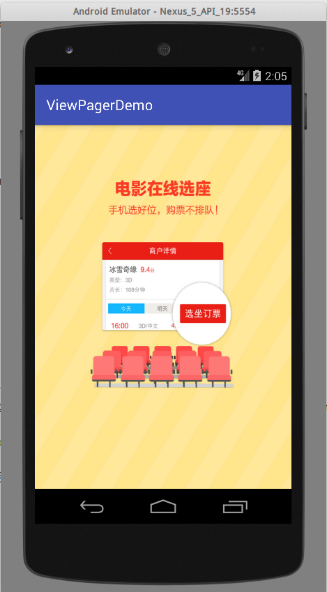

# ViewPager 可滑动轮播控件

网页前端开发中，轮播图几乎是入门必做的一个例子，当然要做的比较美观的话，写起来也是很复杂的，因为比较复杂，因此有JQuery插件这种东西，将控件封装起来，方便重用。

Android中提供了ViewPager这个控件可以直接实现轮播图，通过触屏滑动，切换图片。除此之外，还能实现滑动的标签页的效果。这里我们就介绍一下ViewPager如何使用。

注：标签页效果在Material Design提出后，支持包中有给出了一个控件TabLayout，可以配合ViewPager进行使用实现标签页。这方面的内容在`TabLayout-标签页`中介绍。

## 实现滑动轮播图

这里我们编写一个经常用在Splash的滑动轮播图。

activity_main.xml
```xml
<?xml version="1.0" encoding="utf-8"?>
<RelativeLayout xmlns:android="http://schemas.android.com/apk/res/android"
				android:layout_width="match_parent"
				android:layout_height="match_parent">

	<android.support.v4.view.ViewPager
		android:id="@+id/vp_guide"
		android:layout_width="wrap_content"
		android:layout_height="wrap_content">
	</android.support.v4.view.ViewPager>
</RelativeLayout>
```

注意：这个ViewPager控件在support v4包中，因此必须使用类全名`android.support.v4.view.ViewPager`。

MainActivity.java
```java
package com.ciyaz.viewpagerdemo;

import android.support.v4.view.PagerAdapter;
import android.support.v4.view.ViewPager;
import android.support.v7.app.AppCompatActivity;
import android.os.Bundle;
import android.view.View;
import android.view.ViewGroup;
import android.widget.ImageView;

import java.util.ArrayList;
import java.util.List;

public class MainActivity extends AppCompatActivity
{

	@Override
	protected void onCreate(Bundle savedInstanceState)
	{
		super.onCreate(savedInstanceState);
		setContentView(R.layout.activity_main);

    //加载所有资源到一个ArrayList，方便后边调用
		int[] guideImages = {R.drawable.guide_1, R.drawable.guide_2, R.drawable.guide_3};
		final List<ImageView> imageViews = new ArrayList<>();
		for(int i = 0; i < 3; i++)
		{
			ImageView imageView = new ImageView(this);
			imageView.setBackgroundResource(guideImages[i]);
			imageViews.add(imageView);
		}

    //初始化ViewPager的PagerAdapter适配器
		ViewPager viewPager = (ViewPager) findViewById(R.id.vp_guide);
		viewPager.setAdapter(new PagerAdapter() {

      //item个数
			@Override
			public int getCount()
			{
				return imageViews.size();
			}

			//复用判断逻辑，固定写法
			@Override
			public boolean isViewFromObject(View view, Object object)
			{
				return view == object;
			}

			//初始化item
			@Override
			public Object instantiateItem(ViewGroup container, int position)
			{
				ImageView imageView = imageViews.get(position);
				container.addView(imageView);
				return imageView;
			}

      //销毁item
			@Override
			public void destroyItem(ViewGroup container, int position, Object object)
			{
				container.removeView((View)object);
			}
		});
	}
}
```

我们使用ViewPager，需要设置一个PagerAdapter，我们必须重写四个方法：

* `int getCount()` 返回item总共有多少个。
* `boolean isViewFromObject(View view, Object object)` 这个方法用来判断，划到新条目又返回来，原来的初始化的item是否可以复用。ViewPager内部用一个item对象来表示轮播图的一页。这里实际上因为ViewPager会针对每个item初始化一些数据，能够复用原来的数据，对轮播切换时的性能会有些提升。默认情况下，ViewPager为了提高轮播图加载性能，会加载当前图片，和左右各1张图片（这个值是可以调的），加载这些图片时，会尽量复用以前初始化好的item。
* `Object instantiateItem(ViewGroup container, int position)` 这里初始化item的操作实际上就是将一个imageView填充进container。返回的是一个键值。我们直接返回填充的view作为键就行了，ViewPager内部会调用`isViewFromObject()`进行复用判断，实际上我们说的这个键用途就是一个内存地址，因为它唯一代表一个对象实例。
* `void destroyItem(ViewGroup container, int position, Object object)` 销毁一个item的回调。

乍一看`isViewFromObject()`的设计确实比较诡异，函数的文档也写的含糊，我觉得这个Adapter设计的不好，或者说Android应该提供一个更好懂的Adapter，而不是把这种令人费解的东西提供给用户。不过其实也不用管那么多了，实际上安卓文档里都推荐：在`instantiateItem()`返回填充的view，`isViewFromObject()`的函数体固定写`return view == object;`这种最佳实践，我们直接按照这种写法写就行了。

运行效果：




说明：为了简单起见，图片上面的三个点是图里画的，不是额外做的控件。

## ViewPager监听器

上面的例子比较偷懒，下面的三个小圆点直接画到了图上，那么如果向自己实现，我们需要直到当前ViewPager滑动到了第几页。我们可以使用`OnPageChangeListener`。

```java
viewPager.addOnPageChangeListener(new ViewPager.OnPageChangeListener() {
	@Override
	public void onPageScrolled(int position, float positionOffset, int positionOffsetPixels)
	{
		//滑动过程中回调
	}

	@Override
	public void onPageSelected(int position)
	{
		//新页面被选中时回调
	}

	@Override
	public void onPageScrollStateChanged(int state)
	{
		//滑动状态改变时回调，比如手指按住正在滑动，静止等
	}
});
```

* `void onPageScrolled(int position, float positionOffset, int positionOffsetPixels)`：position是滑动起始页的索引，这个值从0开始。
* `void onPageSelected(int position)`：滑动到新页面时被回调，position是新页面的索引。这个方法是最常用的。
* `void onPageScrollStateChanged(int state)` 滑动状态改变时回调，这个不太常用，具体参数意义用到时再查看文档，或者自己打印看看。

如果我们想要在上面例子中实现，轮播切换时，底部有指示器的状态改变，我们就可以在`onPageSelected()`中，编写改变指示器状态的代码。
