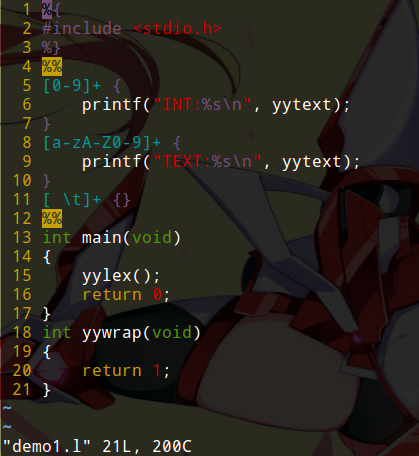
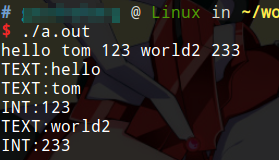

# lex词法分析器

将源代码分解为若干token的过程，叫做词法分析。本篇笔记记录入lex的基本用法，阅读本文需要正则表达式的前置知识。lex一般结合yacc使用，因此建议本文和yacc章节一同观看。我在写这篇文章之前，并未学过编译原理，但是数据库课程实验要求编写一个SQL的解析器，并实现逻辑查询计划树的优化，所以临时学习一下。本文以后可能还会补充。

lex（LEXical compiler），是一个词法分析工具，我们使用lex，就可以不用编写自己的词法分析器，只需按照lex的规则，像定义配置文件一样，定义好`.l`（或`.lex`）文件，然后执行lex程序，就能生成我们想要的词法分析器的C语言代码了。

Flex是lex的一个替代品，基本用法和lex是完全相同的，Flex最初由 Vern Paxson 于1987年用C语言写成。大多数Linux桌面发行版都预装了flex工具，我们直接使用它就好了。

我们可以查看flex工具的man手册，里面介绍了lex所有的命令行选项。
```
man flex
```

关于lex文件，建议使用vim作为编辑器，vim对lex的高亮支持良好。

## lex的使用

lex使用起来不复杂，但是比较难用文字描述。我们直接从例子入手，看看lex是如何使用的。

### 最简单的例子

我们使用lex编写一个最简单的例子，这个例子能够区分文本和int型数字。

我们定义纯数字为`INT`类型，带有英文字符的为`TEXT`类型，空格和制表符忽略，例如：输入`abc 123 ab1`，对应`TEXT INT TEXT`。

demo.l
```
%{
#include <stdio.h>
%}
%%
[0-9]+ {
	printf("INT:%s\n", yytext);
}
[a-zA-Z0-9]+ {
	printf("TEXT:%s\n", yytext);
}
[ \t]+ {}
%%
int main(void)
{
	yylex();
	return 0;
}
int yywrap(void)
{
	return 1;
}
```

编译为可执行文件并运行：
```
lex demo.l
gcc lex.yy.c
./a.out
```

由于我用的markdown渲染器不支持lex，上面代码没有高亮，我再发张图，以便观看：



首先我们要知道，执行lex程序，会把demo.l编译成lex.yy.c，然后我们使用gcc编译这个文件即可。

第1行和第3行，出现了`%{`和`%}`这两个标记，这部分的C语言代码lex会原样输出到`lex.yy.c`，这一部分可以写`include`语句，以及定义一些函数，全局变量等操作。

18行定义了yywrap()函数，我们只要知道把它加上就好了，在这里不对这个函数做深入分析，在后文有一些说明。

4行和12行，分别有一个`%%`，这个是lex文件的区块分隔符。lex文件分为三个区块：

* 定义区块：可以使用`%{`和`%}`放置C语言代码，为正则表达式命名等。
* 规则区块：用正则表达式描述token和对应操作。注意规则区块的写法要求：一个正则表达式，后面跟随空格，然后接上C语言代码，多行C语言代码需要使用`{}`包含。
* 用户代码区块：用户代码区块可以编写任意C代码，也会原样输出，与定义区块不同，用户代码区块无需使用`%{`和`%}`。

5~11行，我们定义了若干正则表达式和对应的操作，这里只是使用`prinf()`进行输出。注意：

1. yytext，这个就是当前token的字符串。
2. 观察5行和8行的正则表达式，我们可以发现，实际上`[a-zA-Z0-9]+`的结果是包含`[0-9]+`的，但是我们要记住，lex会识别正则表达式的定义顺序，我们先定义的`[0-9]+`，那么遇到`123`这种字符串，就会优先匹配。
3. 注意最后的`[ \t]+`，这个正则表达式实际上是用来匹配空格和制表符的，但是其后面的C语言代码是空的，这意味着我们的词法分析器会忽略空格和制表符。

13行，在用户代码区块中，我们定一了一个main函数，并调用yylex()，这个函数就代表整个lex词法分析器。

我们尝试运行一下：



这确实是我们想要的结果。但是运行一下就会发现，我们并没有编写`scanf`啊，这个程序为什么会接收输入？

这是lex的默认行为，从标准输入读取字符串，接着往后看就明白了。

### lex全局变量和函数

上面我们看到，实际上lex工具将`.l`文件编译成了一个C语言源文件，我们可以打开这个文件观看它都定义了哪些内容。

如果我们想在我们的程序中使用lex，该怎么办呢？lex在生成的`.c`文件中，定义了很多全局变量和函数。我们调用lex，或者向lex传递数据，实际上就是通过这些全局变量和函数。

#### 全局变量

* `FILE *yyin`和`FILE *yyout`：这两个文件句柄是lex的输入和输出流指针，如果用户未对齐进行定义，默认指向stdin和stdout。
* `char *yytext`：存放当前被识别的token。
* `ECHO`：lex预定义的宏，将当前识别的token输出到yyout，其实上面例子`printf()`就可以使用`ECHO`替代。


#### yylex

`int yylex(void)`：词法分析程序，它自动移动yyin和yyout。在定义匹配动作时，用户可用return语句结束yylex(),return 必须返回一整数。由于yylex()的运行环境都是以全局变量的方式保存，因此，在下一次调用yylex()时，yylex()可从上次扫描的断点处继续扫描，在语法分析时，可利用这一特性。若用户未定义相应的return语句，则yylex()继续分析被扫描的文件，直到碰到文件结束标志EOF。在读到EOF时，yylex()调用int yywrap()函数(该函数用户必须提供)，若该函数返回非0值，则yylex()返回0而结束。否则，yylex()继续对yyin指向的文件扫描。所以说，yywrap()可以用来实现扫描多个文件。

#### yymore

`yymore()`：将当前token保留在yytext中，分析器下次扫描识别的token将加追加在yytext中。例子：

```c
hello {printf(“%s!”,yytext);yymore();}
world {printf(“%s!”,yytext);}
```

当输入串为”helloworld”时，将输出`hello!helloworld!`

#### yyless

`yyless(int n)`：回退当前识别的token中n个字符到输入中，也就是说，下次扫描还会扫到刚刚回退的token。

#### unput

`unput(char c)`：回退字符c到输入，下次会扫描到字符c。

#### input

`input()`：让分析器从输入缓冲区中读取当前字符，并将yyin指向下一字符

#### yyterminate

`yyterminate()`：中断对当前文件的分析，将yyin指向EOF。

#### yyrestart

`yyrestart(FILE * file)`：重新设置分析器的扫描文件为file
