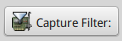
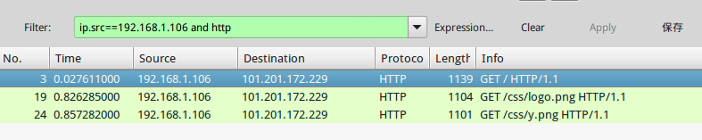

# wireshark 抓包工具

wireshark是一个基于libpcap的抓包工具，我们知道libpcap工作在数据链路层，wireshark能捕获从以太网帧到应用层协议的各种数据包，通常用于网络数据包分析。本篇笔记记录wireshark的几个常用的重要功能。

## 安装wireshark

使用apt包管理器安装：
```
sudo apt-get install wireshark
```

我们知道运行捕包程序需要root权限，因此wireshark需要以root权限运行。但是这比较麻烦，我们可以通过以下方式使用当前登入的用户运行wireshark：

```
sudo groupadd wireshark
sudo chgrp wireshark /usr/bin/dumpcap
sudo chmod 4755 /usr/bin/dumpcap
sudo gpasswd -a ciyaz wireshark
```

我们创建用户组`wireshark`赋予`dumpcap`程序，并将自己的用户添加进去，对`dumpcap`程序添加`s`权限，表示运行该程序时可以取得root权限。这样我们默认使用当前用户运行`wireshark`时，进程`euid`就会变成root，因此能够在网卡上捕包了。

注：可能新版本Ubuntu在安装wireshark时，会自动创建wireshark用户组，如果是那样，我们只需要把当前用户添加进用户组，并赋予`dumpcap`的`s`权限。

启动wireshark如图所示


## 开始捕包

### 网卡列表

点击`Interface List`，会出现这个对话框：


我们可以观察到当前计算机中，活动的网卡，图中，我的笔记本电脑通过eth0连接了局域网，因此因此显示了其对应的IP地址，和数据包（packet）流量相关信息。

### 捕包选项

选择一个我们要捕包的网卡，点击Options按钮：


这里我们主要配置两个部分，分别是`Capture Options`和`Capture Files`。

#### 伯克利封包过滤器 BPF（Berkeley Packet Filter）

BPF就是一个表达式，专门用来描述网络数据包的过滤器，我们捕包时肯定要设置过滤器，这样收集的数据才是我们想要的。使用libpcap编程时，就会用到BPF做过滤器，wireshark也是基于libpcap的。下面就简单介绍一下BPF的语法。

BPF表达式有三种过滤类型限定词：

* 过滤类型：包括 主机`host`，端口`port`
* 传输方向：包括 `src`，`dst`，`src or dst`，`src and dst`
* 协议类型：常用的有`ip`，`tcp`等

多个过滤表达式可以通过`and`，`or`，`not`进行连接。

wireshark中，点击`Capture filter`按钮，可以提供给我们几个例子BPF，我们可以直接拿来修改。



我们看几个常用的例子加深理解。

只捕获arp协议的数据包：
```
arp
```

捕获指定IP地址80端口的HTTP数据包
```
ip dst host 101.201.172.229 and tcp port 80
```

注意BPF中是没有HTTP的描述的，我们指定`tcp port 80`就可以，wireshark可以对HTTP数据进行解析。

#### 将捕包的数据保存为文件

wireshark可以将捕获的数据保存为文件，以供日后分析，我们指定文件名就可以了。不过开始捕包时没指定，最后退出时也会提示我们是否保存。

打开一个数据包文件，使用`File->Open`即可。


## 数据包分析

wireshark提供了强大的图形界面工具，如图所示，我们以分析一个HTTP数据包为例，这些数据包是访问CSDN首页产生的。


### 数据包列表


在这个列表中，我们可以选择我们需要分析的数据包，列表的列给出了`Time`，`Protocol`等十分重要的信息。

### 协议栈树型列表


wireshark是链路层捕包工具，在这个窗口中，我们能看到从以太网帧，到应用层HTTP协议的全部数据。

### 原始二进制数据


在树型列表中，我们点击一个数据，右侧的原始二进制数据就会高亮对应的数据。一些wireshark解析不了的协议，我们也可能需要在这个窗口中继续研究。

## 分析过滤器

抓包开始指定的BPF是传递给libpcap用的，libpcap会决定保留哪些数据包，忽略哪些数据包。分析过滤器是指定给wireshark的，在已经捕获的数据包基础上，进行过滤，选出我们需要的数据包。


这个filter比较人性化，具体语法就不多说了，wireshark还有自动提示，直接看几个例子。

过滤出所有http数据包
```
http
```


选出源IP地址为192.168.1.106的所有HTTP数据包
```
ip.src==192.168.1.106 and http
```


