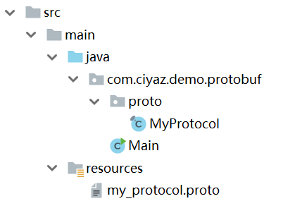

# protoBuf

Protocol Buffers（后文简称protoBuf），是Google编写的一个序列化库。我们通过定义一个标准的`.proto`文件，就可以生成常见编程语言中该数据结构的序列化、反序列化的相关代码，用起来非常方便，因此protoBuf在应用程网络协议的制定上应用很广泛。

除此之外，Google推出了基于protoBuf的远程调用解决方案gRPC，在微服务架构中应用很多。

## 入门使用

### 安装protoc编译器

使用protoBuf需要一个`protoc`编译器，把我们编写的`.proto`文件编译成对应平台的代码，对于Windows系统，我们可以在Github仓库中的releases下，找到预编译的`protoc`编译器：

[https://github.com/protocolbuffers/protobuf](https://github.com/protocolbuffers/protobuf)


Linux下，我们可以直接从软件源中安装，或者下载一个预编译的最新版，这里就不多做介绍了。

### 一个例子

下面，我们基于Java编写一个protoBuf的序列化、反序列化例子。工程目录结构如下：



其中，`MyProtocol`是`protoc`编译输出的结果，`my_protocol.proto`是我们定义的报文结构。

my_protocol.proto
```
syntax = "proto3";

option java_outer_classname = "MyProtocol";
option java_package = "com.ciyaz.demo.protobuf.proto";

message User {
	int64 id = 1;
	string name = 2;
	string email = 3;
}
```

* `syntax`定义该文件使用protoBuf3的语法，默认为版本2
* `java_outer_classname`：生成的Java类名
* `java_package`：生成的Java包名
* `message`：消息报文结构

Main.java
```java
package com.ciyaz.demo.protobuf;

import com.ciyaz.demo.protobuf.proto.MyProtocol;
import com.google.protobuf.InvalidProtocolBufferException;

/**
 * @author CiyaZ
 */
public class Main
{
	public static void main(String[] args)
	{
		// 使用builder方法生成user对象
		MyProtocol.User.Builder userBuilder = MyProtocol.User.newBuilder();
		userBuilder.setId(1L);
		userBuilder.setName("Tom");
		userBuilder.setEmail("tom@ciyaz.com");
		MyProtocol.User user = userBuilder.build();
		// 序列化为二进制
		byte[] data = user.toByteArray();

		try
		{
			// 反序列化并输出
			MyProtocol.User srcUser = MyProtocol.User.parseFrom(data);
			System.out.println(srcUser.getId());
			System.out.println(srcUser.getName());
			System.out.println(srcUser.getEmail());
		}
		catch (InvalidProtocolBufferException e)
		{
			e.printStackTrace();
		}
	}
}
```

上面代码中，我们将一个`MyProtocol.User`对象序列化为二进制数据，又反序列化回来，输出其内容。

## protoBuf语法

下面我们简单介绍一下protoBuf3的常用语法，具体详细内容参考官方文档。

[https://developers.google.com/protocol-buffers/docs/proto3](https://developers.google.com/protocol-buffers/docs/proto3)

### 定义消息结构

还是以之前的例子作为说明（去掉了和语法关系不大的两个Java的option）：

```
syntax = "proto3";

message User {
	int64 id = 1;
	string name = 2;
	string email = 3;
}
```

消息定义格式为`数据类型 字段名 = 标识号`。每个消息字段都要分配一个唯一的标识号，它用于在二进制格式中标识字段。

关于标识号，标识号从1开始定义，1至15号占用1字节，16至2047占用2字节，因此我们一般将最常出现的那些字段设置到1至15号。除此之外，有些标识号如19000至19999这个区间，是protoBuf预留的，我们不能使用这些预留的标识号。

#### 枚举类型

protoBuf中可以定义枚举类型，它比直接定义`int32`或`string`更直观，Java代码也会生成对应的枚举类型。

例子：
```
message User {
	int64 id = 1;               // 用户ID
	string name = 2;            // 用户名
	string email = 3;           // 用户邮箱
	enum UserType {             // 枚举定义
		GOOD_USER = 0;
		BAD_USER = 1;
	}
	UserType userType = 4;      // 用户类型
}
```

注意：protoBuf3的枚举类型定义中，标号必须从`0`开始。

#### repeated

如果某个字段是可以有多个元素的（类似数组），可以用`repeated`修饰。例子：

```
message User {
	int64 id = 1;
	string name = 2;
	string email = 3;
	repeated string hobby = 4;
}
```

#### 注释

`proto`文件中，使用双斜线注释`//`即可。

```
message User {
	int64 id = 1;               // 用户ID
	string name = 2;            // 用户名
	string email = 3;           // 用户邮箱
	repeated string hobby = 4;  // 用户爱好
}
```

### 数据类型

下面表格是官方文档中，有关protoBuf数据类型和对应平台数据类型的说明。

<table style="width: 110%;">
<tbody><tr><th>.proto Type</th><th>Notes</th><th>C++ Type</th><th>Java Type</th><th>Python Type<sup>[2]</sup></th><th>Go Type</th><th>Ruby Type</th><th>C# Type</th><th>PHP Type</th><th>Dart Type</th></tr>
<tr><td>double</td><td></td><td>double</td><td>double</td><td>float</td><td>float64</td><td>Float</td><td>double</td><td>float</td><td>double</td></tr>
<tr><td>float</td><td></td><td>float</td><td>float</td><td>float</td><td>float32</td><td>Float</td><td>float</td><td>float</td><td>double</td></tr>
<tr><td>int32</td><td>变长编码的整形，适合正值</td><td>int32</td><td>int</td><td>int</td><td>int32</td><td>Fixnum or Bignum (as required)</td><td>int</td><td>integer</td><td>int</td></tr>
<tr><td>int64</td><td>变长编码的长整型，适合正值</td><td>int64</td><td>long</td><td>int/long<sup>[3]</sup></td><td>int64</td><td>Bignum</td><td>long</td><td>integer/string<sup>[5]</sup></td><td>Int64</td></tr>
<tr><td>uint32</td><td>无符号变长编码的整形</td><td>uint32</td><td>int<sup>[1]</sup></td><td>int/long<sup>[3]</sup></td><td>uint32</td><td>Fixnum or Bignum (as required)</td><td>uint</td><td>integer</td><td>int</td></tr>
<tr><td>uint64</td><td>无符号变长编码的长整形</td><td>uint64</td><td>long<sup>[1]</sup></td><td>int/long<sup>[3]</sup></td><td>uint64</td><td>Bignum</td><td>ulong</td><td>integer/string<sup>[5]</sup></td><td>Int64</td></tr>
<tr><td>sint32</td><td>变长编码的整形，适合负值</td><td>int32</td><td>int</td><td>int</td><td>int32</td><td>Fixnum or Bignum (as required)</td><td>int</td><td>integer</td><td>int</td></tr>
<tr><td>sint64</td><td>变长编码的长整形，适合负值</td><td>int64</td><td>long</td><td>int/long<sup>[3]</sup></td><td>int64</td><td>Bignum</td><td>long</td><td>integer/string<sup>[5]</sup></td><td>Int64</td></tr>
<tr><td>fixed32</td><td>定长整形</td><td>uint32</td><td>int<sup>[1]</sup></td><td>int/long<sup>[3]</sup></td><td>uint32</td><td>Fixnum or Bignum (as required)</td><td>uint</td><td>integer</td><td>int</td></tr>
<tr><td>fixed64</td><td>定长长整型</td><td>uint64</td><td>long<sup>[1]</sup></td><td>int/long<sup>[3]</sup></td><td>uint64</td><td>Bignum</td><td>ulong</td><td>integer/string<sup>[5]</sup></td><td>Int64</td></tr>
<tr><td>sfixed32</td><td>定长整形</td><td>int32</td><td>int</td><td>int</td><td>int32</td><td>Fixnum or Bignum (as required)</td><td>int</td><td>integer</td><td>int</td></tr>
<tr><td>sfixed64</td><td>定长长整型</td><td>int64</td><td>long</td><td>int/long<sup>[3]</sup></td><td>int64</td><td>Bignum</td><td>long</td><td>integer/string<sup>[5]</sup></td><td>Int64</td></tr>
<tr><td>bool</td><td></td><td>bool</td><td>boolean</td><td>bool</td><td>bool</td><td>TrueClass/FalseClass</td><td>bool</td><td>boolean</td><td>bool</td></tr>
  <tr><td>string</td><td>必须为UTF-8编码或7位ASCII码</td><td>string</td><td>String</td><td>str/unicode<sup>[4]</sup></td><td>string</td><td>String (UTF-8)</td><td>string</td><td>string</td><td>String</td></tr>
<tr><td>bytes</td><td>长度最大值为2<sup>32</sup></td><td>string</td><td>ByteString</td><td>str</td><td>[]byte</td><td>String (ASCII-8BIT)</td><td>ByteString</td><td>string</td><td>List&lt;int&gt;</td></tr>
 </tbody></table>

### 消息嵌套定义

尽管数据包是相对“扁平”的一个个二进制位，但我们代码中的类定义一般都不是这样，好在`proto`文件中支持报文的嵌套定义。

例子：
```
message Hobby {
	int64 id = 1;               // 爱好ID
	string name = 2;            // 爱好名
}

message User {
	int64 id = 1;               // 用户ID
	string name = 2;            // 用户名
	string email = 3;           // 用户邮箱
	repeated Hobby hobby = 4;   // 用户爱好
}
```

上面代码中，我们在`User`中嵌套了`Hobby`。

### 文件导入

我们定义的`proto`文件可以分割成多个文件，以便于代码组织。引用另一个文件中的内容可以使用`import`关键字。

my_protocol.proto
```
syntax = "proto3";

option java_outer_classname = "MyProtocol";
option java_package = "com.ciyaz.demo.protobuf.proto";

import "my_protocol2.proto";

message User {
	int64 id = 1;               // 用户ID
	string name = 2;            // 用户名
	string email = 3;           // 用户邮箱
	repeated Hobby hobby = 4;   // 用户爱好
}
```

my_protocol2.proto
```
syntax = "proto3";

option java_outer_classname = "MyProtocol2";
option java_package = "com.ciyaz.demo.protobuf.proto";

message Hobby {
	int64 id = 1;               // 爱好ID
	string name = 2;            // 爱好名
}
```

注意：每个`.proto`文件都会生成一个Java类，两个文件都需要编译。如果我们只编译了`my_protocol.proto`，Java代码中有关引用另一个文件中类的地方就会报错。
