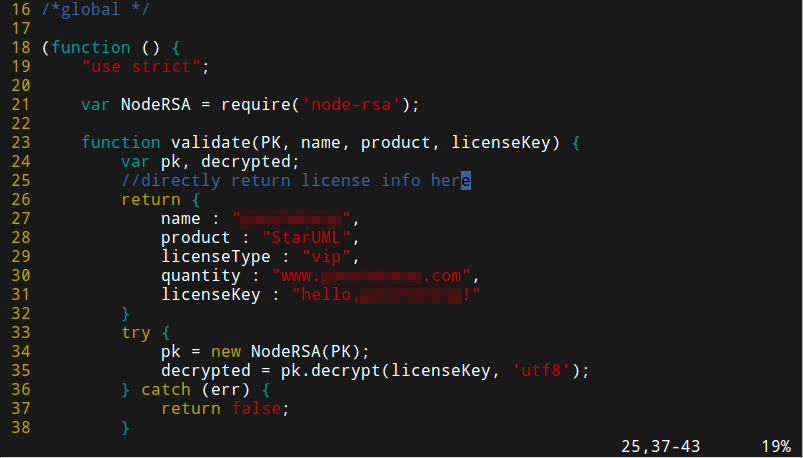
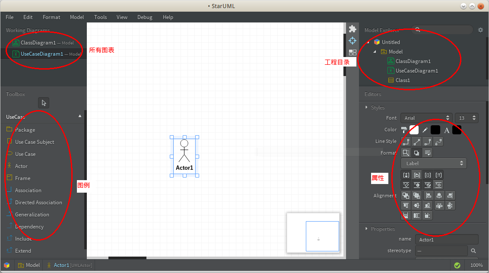

# starUML

starUML是一个开放源代码的跨平台UML建模工具，支持Linux。

## 破解

starUML可以无限期试用，如果不想每次打开看到输入许可证的提示，也可以修改源码进行“破解”。如果觉得软件好用，还请多多支持作者！

1. 找到`/opt/staruml/www/license/node/LicenseManagerDomain.js`
2. 修改成如下代码：

3. 打开starUML，找到help->enter license，输入name和licenseKey即可。

## 使用

