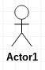

# 用例图

用例图是指由参与者（Actor）、用例（Use Case）以及它们之间的关系构成的用于描述系统功能的视图。用例图（User Case）是被称为参与者的外部用户所能观察到的系统功能的模型图，呈现了一些参与者和一些用例，以及它们之间的关系，主要用于对系统、子系统或类的功能行为进行建模。

用例图有四个部分：用例（Use Case）， 参与者（Actor），系统边界，关系。

# 图例

## 参与者

参与者是与系统交互的人或物。包括我们的用户，和与我们开发的系统有关联的其他系统。用小人表示参与者。

## 用例

用例是参与者可以感受到的系统服务或功能单元。任何用例都不能在缺少参与者的情况下独立存在，同样，任何参与者也必须要有与之关联的用例。我们用椭圆表示用例。

## 系统边界

指系统与系统之间的界限。用矩形表示系统边界。

## 关系

关系有：关联、泛化、包含、扩展。

### 关联关系

表示参与者和用例之间的交互，代表其通信途径，任何一方都可发送或可接收消息。如果有箭头，箭头指向消息接收方。

### 泛化关系

泛化指的是一个父用例可以被特化形成多个子用例，用我们熟悉的语言来说就是继承关系。泛化关系用空心箭头表示，箭头指向父用例。

### 包含关系

包含关系用来把一个较复杂的用例所表示的功能分解成较小的步骤。包含关系的优势是可以复用。包含关系用带箭头的虚线和<<include>>表示。

### 扩展关系

扩展关系是指用例功能的延伸。和包含关系区别：扩展的用例功能是可选的，而包含关系下，用例缺失就会造成功能的不完整。扩展关系用带箭头的虚线和<<extend>>表示，箭头从扩展用例指向基本用例。

注：starUML还提供了用例图的依赖关系，但是感觉用例图并不是很需要这种关系，可能实际上也不会用到。
