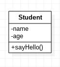
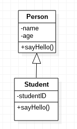
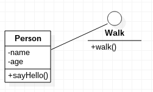
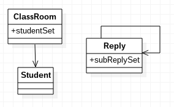
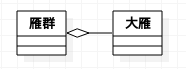
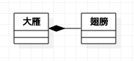
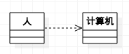

# 类图

类图是UML中最重要的一种图，类图显示了模型的静态结构，主要体现了：类，类的内部结构，类之间的关系。

# 类

如上图所示，是最简单的一个类。类用一个矩形表示，其中标注了属性和方法，其中属性和方法前，用`-`表示`private`，用'#'表示`protected`，用`+`表示public（这些符号不用记住，也不用手动敲，在StarUML中选择对应选项就行了）。

# 类之间关系

UML最重要的一点就是能体现类和类之间的关系，这对系统设计十分有帮助。

## 泛化（继承，Generalization）

实际上泛化关系就是继承，我不知道为什么要这么叫，可能是为了保持语言间的通用性，英文直译的缘故吧。

泛化关系如图表示，注意，箭头是指向父类的。

## 实现（Realization）

实现是类和接口之间的关系。这里要注意实现和泛化的区别，泛化是子类继承父类，比如“学生”继承“人类”，人类也是一个实体。而接口代表一组行为，比如“人类”实现“行走”接口，表示人类有“行走”这个行为，继承某个接口意味着这个实体类实现了该接口的方法，具有该接口定义的行为。

实现的画法如图，这里注意StarUML和老式的画法不太一样，StarUML用一个圈表示接口，默认不显示其方法，如果想要显示方法，右键接口->format->Suppress Operations即可。

实现的老式画法应该是虚线+空心三角，StarUML中直接就是直线。我觉得不要纠结这些图例，能看懂，简洁好用才是真的有用。

## 关联

关联是一种拥有关系，最常见的地方是数据库对应的实体类，比如：班级类中有学生集合，集合中可以存放多个学生类。

关联关系如图所示，ClassRoom类中关联多个Student类，而Reply（论坛回复）类则是自包含，因为回复会有子回复集合，子回复又会有多个子回复。

和数据库之间关系十分相似，关联关系也有一对一，一对多，多对多关系，如果有需要，可以使用1和n在关联箭头上标注。

## 聚合

组合关系是一种特殊的关联关系，例如大雁和雁群的关系，一只大雁脱离了雁群单独存在，雁群也是雁群。聚合表达has-a关系。

如图，聚合使用尾端带空心菱形的线或箭头。

## 组合

聚合比组合表达了更强的关联关系，比如大雁和翅膀，大雁不能脱离翅膀存在。组合表达了contains-a关系。

如图，组合使用尾端带实心菱形的线或见箭头。

## 依赖

依赖是一种使用的关系，例如人使用计算机，代码上体现在局部变量，方法参数，或静态方法调用。

如图，依赖用虚线箭头表示。

# 关于UML的箭头指向

我觉得，UML的箭头指向表示的是“依赖于”的反向。对于泛化和实现，子类依赖于父类（或接口），因为父类（或接口）是先构造的，它的改动会影响子类（或实现类）。

对于关联，聚合，组合，也是如此理解，例如：雁群依赖于大雁，因为雁群就是大雁聚合形成的（这里要注意，菱形是尾端，因为如果不画箭头可能会误以为菱形是朝向方向，其实恰恰相反）。

## 关于关联、聚合、组合

这三个概念实际上十分相似，我认为它们的区别是表达的依赖强弱关系不同。组合&gt;聚合&gt;关联。我认为，在系统设计时，如果没有地方体现出这种明显的强弱关系区别，混用也不影响。
