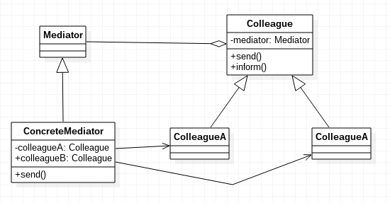

# 中介者模式

中介者模式，用一个中介对象来封装一系列的对象交互。中介者使各对象不需要显式的相互作用，从而使其耦合松散，而且可以独立的改变他们之间的交互。

## 中介者模式示例代码

Mediator.java
```java
public abstract class Mediator
{
	public abstract void send(String message, Colleague colleague);
}
```

ConcreteMediator.java
```java
public class ConcreteMediator extends Mediator
{

	private Colleague colleagueA;
	private Colleague colleagueB;

	public void setColleagueA(Colleague colleagueA)
	{
		this.colleagueA = colleagueA;
	}

	public void setColleagueB(Colleague colleagueB)
	{
		this.colleagueB = colleagueB;
	}

	@Override
	public void send(String message, Colleague colleague)
	{
		if(colleague == colleagueA)
		{
			colleagueB.inform(message);
		}
		else
		{
			colleagueA.inform(message);
		}
	}
}
```

Colleague.java
```java
public abstract class Colleague
{
	protected Mediator mediator;

	public Colleague(Mediator mediator)
	{
		this.mediator = mediator;
	}

	public abstract void send(String message);

	public abstract void inform(String message);
}
```

ColleagueA.java
```java
public class ColleagueA extends Colleague
{

	public ColleagueA(Mediator mediator)
	{
		super(mediator);
	}

	@Override
	public void send(String message)
	{
		mediator.send(message, this);
	}

	@Override
	public void inform(String message)
	{
		System.out.println("colleagueA" + message);
	}
}
```

ColleagueB.java
```java
public class ColleagueB extends Colleague
{

	public ColleagueB(Mediator mediator)
	{
		super(mediator);
	}

	@Override
	public void send(String message)
	{
		mediator.send(message, this);
	}

	@Override
	public void inform(String message)
	{
		System.out.println("colleagueB" + message);
	}
}
```

Main.java
```java
public class Main
{
	public static void main(String[] args)
	{
		ConcreteMediator mediator = new ConcreteMediator();

		Colleague colleagueA = new ColleagueA(mediator);
		Colleague colleagueB = new ColleagueB(mediator);

		mediator.setColleagueA(colleagueA);
		mediator.setColleagueB(colleagueB);

		colleagueA.send("hello1");
		colleagueB.send("hello2");
	}
}
```

上述代码演示了使用一个Mediator作为中介者，负责为两个Colleague类传递信息。其实现是，两个Colleague包含了同一个Mediator属性，因此调用Mediator中的方法就行了。

中介者模式UML类图



## 中介者模式的优缺点

中介者的出现减少了系统各个实体之间的耦合，但是中介者使得系统的控制变得集中化，交互的复杂性变为了中介者的复杂性，中介者可能再次变得难以维护。

中介者模式一般应用于一组对象，以定义良好但是复杂的方式进行通信的场合，以及想定制一个分布在多个类中的行为，而又不想生成太多子类的场合。
