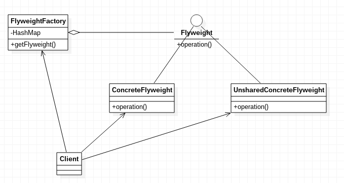

# 享元模式

享元模式，运用共享技术有效的支持大量细粒度的对象。

实现享元模式非常简单，实际上就是对象的复用，我们通常结合工厂模式，利用工厂保存对象或实例化新对象。

## 享元模式示例代码

Flyweight.java
```java
public interface Flyweight
{
	public void operation(int extrinsicState);
}
```

ConcreteFlyweight.java
```java
public class ConcreteFlyweight implements Flyweight
{
	@Override
	public void operation(int extrinsicState)
	{
		System.out.println("concreteFlyWeight:" + extrinsicState);
	}
}
```

UnsharedConcreteFlyweight.java
```java
public class UnsharedConcreteFlyweight implements Flyweight
{
	@Override
	public void operation(int extrinsicState)
	{
		System.out.println("UnsharedFlyWeight:" + extrinsicState);
	}
}
```

FlyweightFactory.java
```java
import java.util.HashMap;

public class FlyweightFactory
{
	private HashMap<String, Flyweight> hashMap = new HashMap<>();

	public FlyweightFactory()
	{
		hashMap.put("A", new ConcreteFlyweight());
		hashMap.put("B", new ConcreteFlyweight());
		hashMap.put("C", new ConcreteFlyweight());
	}

	public Flyweight getFlyweight(String key)
	{
		return hashMap.get(key);
	}
}
```

Main.java
```java
public class Main
{
	public static void main(String[] args)
	{
		//代码的外部状态
		int extrinsicState = 22;
		FlyweightFactory flyweightFactory = new FlyweightFactory();

		Flyweight flyweight1 = flyweightFactory.getFlyweight("A");
		flyweight1.operation(--extrinsicState);

		Flyweight flyweight2 = flyweightFactory.getFlyweight("B");
		flyweight2.operation(--extrinsicState);

		Flyweight flyweight3 = flyweightFactory.getFlyweight("C");
		flyweight3.operation(--extrinsicState);

		UnsharedConcreteFlyweight unsharedConcreteFlyweight = new UnsharedConcreteFlyweight();
		unsharedConcreteFlyweight.operation(--extrinsicState);
	}
}
```

上述代码为共享对象定义了统一的接口，同时使用了一个工厂，工厂预先实例化了三个对象。通常情况下，工厂需要根据需求，决定是预先实例化几个对象，还是需要时再实例化，或者预先实例化的对象不够用时再实例化。

享元模式不要求实现共享接口的类必须是共享的，上面代码中UnsharedConcreteFlyweight就不是共享的，它由客户端自行管理。

虽然使用享元模式复用了对象，但是实际上大多数时候我们的需求会使这些类内部有不同的数据，所以在设计类时，应该考虑到客户端传入数据的接口。

享元模式UML类图



## 享元模式的应用场景

Java的字符串对象就是使用了享元模式，如果两个字符串的内容完全相同，JVM很可能只分配一个字符串对象实例，而两个字符串引用指向同一个对象。

但是享元模式本身需要维护一个记录系统所有共享对象的列表，也会造成一定的系统开销，同时使用享元模式会导致系统的复杂度增大，因此只有在有大量细粒度相似对象时，才应该考虑使用享元模式。
