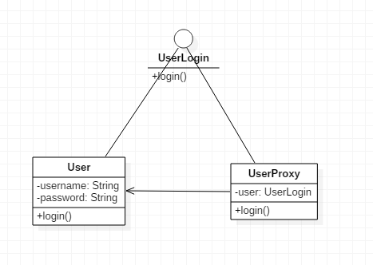
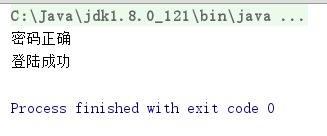

# 代理模式

代理模式，即为其他对象提供一种代理，以控制对这个对象的访问。

也就是说，我们在本应直接访问的对象上包装了一层，提供给用户访问的都是代理类，实际上代理类可以和委托类实现相同的接口，用户调用代理类里的方法，然后代理类经过一定处理并调用委托类的方法。

代理模式用于拦截方法调用，更进一步就是实现“面向切面编程”。

## 实现代理

通过上述分析，实际上代理模式非常简单。我们编写一个使用代理模式进行方法调用拦截的例子：

UserLogin.java
```java
public interface UserLogin
{
	public void login();
}
```

User.java
```java
public class User implements UserLogin
{

	private String username;
	private String password;

	public User(String username, String password)
	{
		this.username = username;
		this.password = password;
	}

	public String getUsername()
	{
		return username;
	}

	public String getPassword()
	{
		return password;
	}

	@Override
	public void login()
	{
		LoginService loginService = new LoginService();
		loginService.doLogin();
	}
}
```

UserProxy.java
```java
public class UserProxy implements UserLogin
{

	private UserLogin user;

	public UserProxy(UserLogin user)
	{
		this.user = user;
	}

	@Override
	public void login()
	{
		if(!((User)user).getPassword().equals("123"))
		{
			System.out.println("密码错误");
		}
		else
		{
			System.out.println("密码正确");
			user.login();
		}
	}
}
```

Main.java
```java
public class Main
{
	public static void main(String[] args)
	{
		UserLogin userLogin = new UserProxy(new User("Tom", "123"));
		userLogin.login();
	}
}
```

UML图



运行结果



从运行结果可知，拦截确实起作用了，其实原理非常简单，就是代理类对委托类进行了一层包装，用户调用代理类的方法，代理类经过一些处理后，再调用委托类的方法（或者根本就是拦截下来不调用）。

## 和装饰模式区别

编写上面代理模式代码时，有种似曾相识的感觉。其实，上述代理模式实现和装饰模式的代码结构是一样的。但是，我们一定要分清楚，代理模式和装饰模式解决的不是同一种问题。

* 装饰模式：提供多个装饰器给用户自由组合，这些装饰器能够修饰原来的操作
* 代理模式：提供一个代理类，可以对委托类方法调用进行拦截

# 动态代理模式

Java提供了强大的反射机制，我们可以使用Java提供的动态代理`java.lang.reflect.Proxy`实现更好的代理写法。相应的，上述基于接口的代理模式可以称为静态代理模式。

## 静态代理模式有什么不足？

1. 一个静态代理类只服务于一种接口
2. 接口类一旦修改，委托类和代理类都要修改，这比较麻烦

## 使用动态代理

我们编写一个最简单的动态代理。

SayHello.java
```java
public interface SayHello
{
	void sayHello();
}
```

ProxyHandler.java
```java
import java.lang.reflect.InvocationHandler;
import java.lang.reflect.Method;

public class ProxyHandler implements InvocationHandler
{

	private Object target;

	public ProxyHandler(Object target)
	{
		this.target = target;
	}

	@Override
	public Object invoke(Object proxy, Method method, Object[] args) throws Throwable
	{
		System.out.println("代理方法被调用");
		return method.invoke(target, args);
	}
}
```

Student.java
```java
public class Student implements SayHello
{
	private String name;
	public Student(String name)
	{
		this.name = name;
	}
	public void sayHello()
	{
		System.out.println("Hello, " + this.name);
	}
}

```

Main.java
```java
import java.lang.reflect.InvocationHandler;
import java.lang.reflect.Proxy;

public class Main
{
	public static void main(String[] args)
	{
		Student tom = new Student("Tom");
		InvocationHandler ih = new ProxyHandler(tom);
		Class[] interfaces = {SayHello.class};
		Object proxy = Proxy.newProxyInstance(SayHello.class.getClassLoader(), interfaces, ih);
		((SayHello)proxy).sayHello();
	}
}
```

上述代码中，我们通过InvocationHandler，使用反射API对Java方法调用进行拦截，调用`Proxy.newProxyInstance()`传入需要使用的接口数组，返回代理对象。使用代理对象，就像静态代理一样了。

动态代理将上文提到的静态代理的缺点都克服了。实际上，不是一遇到代理模式就要用动态代理，反射API是一组比较难用好的接口，大量使用可能程序就变得比较难懂（至少是对初级程序员来说）。所以一般程序建议先考虑静态代理模式，对于面向切面编程，通常有Spring这种框架帮我们实现动态代理。
