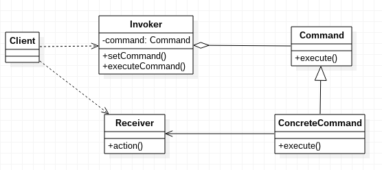

# 命令模式

命令模式，将一个请求封装为一个对象，从而使你可用不同的请求对客户进行参数化；对请求排队或记录请求日志，以及支持可撤销的操作。

命令模式的实现：命令模式具有一个调用者，和命令接受者，以及若干命令实体类。客户端实例化命令，并传入命令调用者，命令调用者通过命令实体间接调用命令接受者的方法。

## 命令模式的好处

1. 命令模式能够容易的设计一个命令队列
2. 在需要的情况下能够方便的将命令计入日志
3. 接受请求的一方否决命令也很容易实现
4. 便于对命令撤销和重做
5. 命令和执行者解耦，添加命令十分容易

## 命令模式示例代码

Receiver.java
```java
public class Receiver
{
	public void action()
	{
		System.out.println("执行请求");
	}
}
```

Command.java
```java
public abstract class Command
{
	protected Receiver receiver;

	public Command(Receiver receiver)
	{
		this.receiver = receiver;
	}

	abstract public void execute();
}
```

ConcreteCommand.java
```java
public class ConcreteCommand extends Command
{

	public ConcreteCommand(Receiver receiver)
	{
		super(receiver);
	};

	@Override
	public void execute()
	{
		receiver.action();
	}
}
```

Invoker.java
```java
public class Invoker
{
	private Command command;

	public void setCommand(Command command)
	{
		this.command = command;
	}

	public void executeCommand()
	{
		this.command.execute();
	}
}
```

Main.java
```java
public class Main
{
	public static void main(String[] args)
	{
		Receiver receiver = new Receiver();
		Command command = new ConcreteCommand(receiver);
		Invoker invoker = new Invoker();
		invoker.setCommand(command);
		invoker.executeCommand();
	}
}
```

命令模式UML类图


