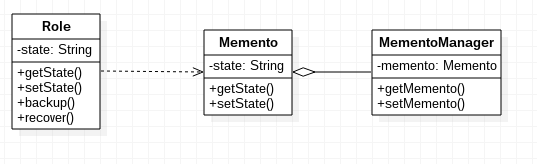

# 备忘录模式

备忘录：在不破坏封装性的前提下，捕获一个对象的内部状态，并在该对象之外保存这个状态。这样以后就可将该对象恢复到原先保存的状态。

备忘录模式涉及的角色：

1. 发起人：负责创建备忘记录自身的状态，可以选择保存全部还是部分信息
2. 备忘录：保存发起人的自身状态
3. 管理者：管理一个或多个备忘录，但不能对备忘录内部进行操作

## 备忘录模式示例

Role.java
```java
public class Role
{
	private String state;

	public String getState()
	{
		return state;
	}

	public void setState(String state)
	{
		this.state = state;
	}

	public Memento backup()
	{
		Memento memento = new Memento();
		memento.setState(this.state);
		return memento;
	}

	public void recover(Memento memento)
	{
		this.setState(memento.getState());
	}
}
```

Memento.java
```java
public class Memento
{
	private String state;

	public String getState()
	{
		return state;
	}

	public void setState(String state)
	{
		this.state = state;
	}
}
```

MementoManager.java
```java
public class MementoManager
{
	private Memento memento;

	public Memento getMemento()
	{
		return memento;
	}

	public void setMemento(Memento memento)
	{
		this.memento = memento;
	}
}
```

Main.java
```java
public class Main
{
	public static void main(String[] args)
	{
		Role role = new Role();
		role.setState("stateA");

		System.out.println(role.getState());

		MementoManager mementoManager = new MementoManager();
		mementoManager.setMemento(role.backup());

		role.setState("stateB");
		System.out.println(role.getState());

		role.recover(mementoManager.getMemento());
		System.out.println(role.getState());
	}
}
```

上述代码其实结构十分简单，角色使用保存功能时，创建了一个备忘录对象，由客户端放入备忘录管理器保存，角色状态恢复时，从管理器中取出备忘录，传入角色对象即可。

备忘录模式UML类图


