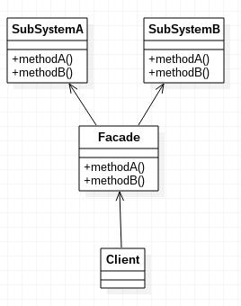

# 外观模式

外观模式，为子系统中的一组接口提供一个一致的界面，此模式定义了一个高层接口，这个接口使得这个子系统更加容易使用。

## 示例代码

SubSystemA.java
```java
public class SubSystemA
{
	public void methodA()
	{
		System.out.println("A-A");
	}
	public void methodB()
	{
		System.out.println("A-B");
	}
}
```

SubSystemB.java
```java
public class SubSystemB
{
	public void methodA()
	{
		System.out.println("B-A");
	}
	public void methodB()
	{
		System.out.println("B-B");
	}
}
```

Facade.java
```java
public class Facade
{
	private SubSystemA subSystemA = new SubSystemA();
	private SubSystemB subSystemB = new SubSystemB();

	public void methodA()
	{
		subSystemA.methodA();
		subSystemB.methodA();
	}

	public void methodB()
	{
		subSystemA.methodB();
		subSystemB.methodB();
	}
}
```

Main.java
```java
public class Main
{
	public static void main(String[] args)
	{
		Facade facade = new Facade();
		facade.methodA();
		facade.methodB();
	}
}
```

上述代码非常简单，Facade封装了两个子系统的调用，用户只需要了解Facade就行了。实际上我们写代码时，很多情况下都使用了这种结构，只是没有意识到这是一种设计模式而已。

外观模式UML类图



## 外观模式的使用场景

实际上我们天天都在使用外观模式，例如：编写Web应用时，Service层接口其实就是Facade，Dao层是一组子系统，Service对这些子系统根据业务需求进行调用。

层与层之间实现了解耦，这使得开发阶段的分工比较明确，后期维护时，子系统越来越复杂，但由于实现了松耦合，并不会影响上层结构。
